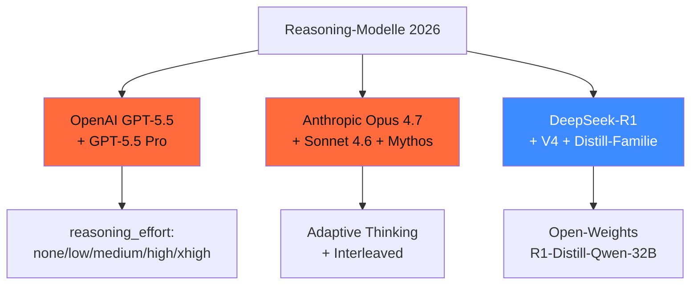

## Worum es geht

> Stop hand-rolling Self-Consistency when GPT-5.5 has it built-in. — 2026 sind die produktiv-reifen Reasoning-Modelle Standard für anspruchsvolle Tasks. Diese Lektion zeigt OpenAI GPT-5.5, Anthropic Extended Thinking und DeepSeek-R1 im Vergleich.

## Voraussetzungen

- Lektion 16.01 (TTC-Patterns)
- Phase 11.05 (Anbieter-Pricing-Vergleich)

## Konzept

### Stand 04/2026 — drei Familien



### OpenAI GPT-5.5 (24.04.2026)

URL: <https://developers.openai.com/api/docs/models/gpt-5.5> | <https://openai.com/index/introducing-gpt-5-5/>

Stand 04/2026 ist die o-Series (o3, o4-mini) **deprecated** — Reasoning ist in GPT-5.5 integriert.

**Pricing GPT-5.5** (Stand 28.04.2026):

| Token-Typ | $/1M |
|---|---|
| Input | $ 5,00 |
| Cached Input | $ 0,50 |
| Output (inkl. Reasoning-Tokens) | $ 30,00 |

**Reasoning-Tokens**: **versteckt** — der Inhalt wird nicht zurückgegeben, aber die Tokenanzahl wird voll als Output abgerechnet. Sichtbar in `response.usage.output_tokens_details.reasoning_tokens`.

**Effort-Levels**:

| Level | Use-Case |
|---|---|
| `none` | Standard-Inferenz, keine Reasoning-Tokens |
| `low` | leichte Reasoning-Tasks, ~ 100–500 Reasoning-Tokens |
| `medium` (Default) | mittlere Komplexität, ~ 500–3.000 Tokens |
| `high` | komplexe Math/Code, ~ 3.000–10.000 Tokens |
| `xhigh` | härteste async-Tasks, > 10.000 Tokens |

```python
from openai import OpenAI

client = OpenAI()
response = client.chat.completions.create(
    model="gpt-5.5",
    messages=[
        {"role": "user", "content": "Beweise: für jede natürliche Zahl n ≥ 1 gilt 1+2+...+n = n(n+1)/2"}
    ],
    reasoning={"effort": "high"},
)
print(response.choices[0].message.content)
print(f"Reasoning-Tokens: {response.usage.output_tokens_details.reasoning_tokens}")
print(f"Visible Tokens: {response.usage.output_tokens_details.completion_tokens}")
```

> **GPT-5.5 Pro**: ~ 6× teurer als GPT-5.5. Empfehlung in OpenAI-Doku: bei tool-heavy Workflows reduzieren sich Reasoning-Tokens gegenüber älteren Modellen.

### Anthropic Extended Thinking

URL: <https://platform.claude.com/docs/en/build-with-claude/extended-thinking>

Stand 04/2026: Opus 4.7 (16.04.2026), Sonnet 4.6, Mythos Preview unterstützen **Adaptive Thinking**. Für Haiku 4.5 ist Extended-Thinking-Support nicht eindeutig belegbar.

**Pricing Opus 4.7** (Stand 28.04.2026):

| Token-Typ | $/1M |
|---|---|
| Input | $ 5,00 |
| Output (inkl. Thinking) | $ 25,00 |
| Cache Read | $ 0,50 (10 % von Input) |

**Adaptive Thinking** ist Standard auf Opus 4.6+/Sonnet 4.6+. Der `effort`-Parameter ersetzt das alte `budget_tokens` (deprecated).

```python
import anthropic

client = anthropic.Anthropic()
response = client.messages.create(
    model="claude-opus-4-7",
    max_tokens=4096,
    thinking={"type": "adaptive", "effort": "high"},
    messages=[
        {"role": "user", "content": "..."}
    ],
)

# Output: Liste von Blocks — TextBlock + summarized ThinkingBlock
for block in response.content:
    if block.type == "thinking":
        print(f"[Summary]: {block.summary}")
    else:
        print(f"[Text]: {block.text}")
```

**Persistenz**: auf Opus 4.5+/Sonnet 4.6+ bleiben Thinking-Blöcke per Default im Kontext (zählen als Input-Tokens in Folgeturns). Auf Opus 4.7 ist **Interleaved Thinking** automatisch aktiv; Sonnet 4.6 braucht Beta-Header `interleaved-thinking-2025-05-14`.

### DeepSeek-R1 + V4 (Stand 04/2026)

URL: <https://huggingface.co/deepseek-ai>

**DeepSeek-V4** (April 2026): hybride Attention (Compressed Sparse + Heavily Compressed), 1M Kontext, > 32T Trainings-Tokens. R1 bleibt eigenständige Reasoning-Linie.

**Open-Weights-Distill (MIT)**:

| Modell | Größe | VRAM Q4 |
|---|---|---|
| R1-Distill-Qwen-1.5B | 1,5B | ~ 1 GB |
| R1-Distill-Qwen-7B | 7,6B | ~ 5 GB |
| R1-Distill-Qwen-14B | 14,7B | ~ 9 GB |
| **R1-Distill-Qwen-32B** | 32,5B | ~ 20 GB |
| R1-Distill-Llama-8B | 8B | ~ 5 GB |
| R1-Distill-Llama-70B | 70B | ~ 42 GB |

> **R1-Distill-Qwen-32B** schlägt laut DeepSeek Tech Report **o1-mini** auf mehreren Benchmarks — bei lokaler Ausführung auf 24-GB-GPU.

**Cost (CN-API, hochgradig DSGVO-kritisch)**: ~ $ 0,55 / 1M Input, $ 2,19 / 1M Output. Self-Censorship-Bedenken für DACH-Use-Cases (siehe Phase 18.08).

**Lokale Inferenz** (Ollama):

```bash
ollama pull deepseek-r1:32b
ollama run deepseek-r1:32b "Was ist die 100. Fibonacci-Zahl mod 1024?"
```

### Wann welches Modell?

| Aufgabe | Empfehlung 2026 |
|---|---|
| Math / Code mit Verifier | **DeepSeek-R1-Distill-32B lokal** (kostenfrei) oder **GPT-5.5 (xhigh)** |
| Recht / Compliance-Analyse | **Claude Opus 4.7 mit Adaptive Thinking** (München-Office, EU-Datazone) |
| Long-Context-Reasoning (> 200k Tokens) | **DeepSeek-V4** (1M Kontext, lokal oder OVHcloud) |
| Production-Multi-Step-Agent | **Claude Sonnet 4.6 mit Interleaved Thinking** + Pydantic AI |
| Lokal auf RTX 4090 | **R1-Distill-Qwen-32B Q4_K_M** |
| Cost-sensitive | **R1-Distill** lokal — keine API-Kosten |

### Production-Pattern: gestaffeltes Reasoning

```python
async def gestaffeltes_reasoning(frage: str):
    # Tier 1: Klassifikation mit Haiku 4.5 (günstig)
    klassifikation = await haiku_agent.run(
        f"Klassifiziere Komplexität: {frage}",
        output_type=KomplexitaetsKlasse,
    )

    if klassifikation.output.einfach:
        # Standard-Inferenz, kein Reasoning
        return await sonnet_agent.run(frage)

    if klassifikation.output.mittel:
        # Sonnet mit Adaptive Thinking
        return await sonnet_thinking_agent.run(
            frage,
            thinking={"type": "adaptive", "effort": "medium"},
        )

    # Tier 3: Opus mit hohem Reasoning-Effort
    return await opus_thinking_agent.run(
        frage,
        thinking={"type": "adaptive", "effort": "high"},
    )
```

> Das Pattern senkt Cost um 60–80 % gegenüber „immer Opus mit high effort".

### Eval-Realität: was sind die Modelle wirklich gut?

Stand 04/2026 ([LiveBench](https://livebench.ai), [ARC-AGI-2](https://arcprize.org/arc-agi/2)):

| Benchmark | GPT-5.5 (xhigh) | Opus 4.7 (adaptive high) | R1-Distill-32B Q4 |
|---|---|---|---|
| AIME (Math) | ~ 89 % | ~ 86 % | ~ 79 % |
| LiveCodeBench | top-3 | top-3 | top-10 |
| MMLU-Pro | ~ 84 % | ~ 86 % | ~ 79 % |
| GerBenchmark (DE) | sehr gut | sehr gut | gut |
| ARC-AGI-2 | < 10 % | < 10 % | < 5 % |

> **ARC-AGI-2-Realität**: alle Modelle liegen 2026 noch **massiv unter Mensch-Baseline** (> 95 %). Reasoning ist weiter ein offenes Forschungs-Problem.

### Cost-Tracking-Pflicht

Reasoning-Tokens sind teuer + versteckt. Audit-Pattern:

```python
def log_reasoning_call(response, user_pseudonym):
    logging.info(
        "reasoning_call",
        extra={
            "user": user_pseudonym,
            "model": response.model,
            "input_tokens": response.usage.prompt_tokens,
            "output_visible": response.usage.completion_tokens,
            "reasoning_tokens": getattr(
                response.usage.output_tokens_details, "reasoning_tokens", 0
            ),
            "total_cost_eur": calc_cost_eur(response.usage),
            "ts": datetime.now(UTC).isoformat(),
        }
    )
```

## Hands-on

1. Vergleiche GPT-5.5 mit `effort=low/medium/high/xhigh` auf einer Mathe-Aufgabe — Cost vs. Accuracy
2. Anthropic Extended Thinking auf Opus 4.7 — wann liefert Adaptive sinnvoll mehr?
3. R1-Distill-Qwen-32B lokal via Ollama vs. DeepSeek-R1-API — Self-Censorship-Vergleich
4. Gestaffeltes Reasoning-Pattern (Haiku → Sonnet → Opus) — Cost-Ersparnis-Bench

## Selbstcheck

- [ ] Du erklärst die drei Reasoning-Familien und ihre Pricing-Tiers.
- [ ] Du wählst Reasoning-Effort je nach Task-Komplexität.
- [ ] Du loggst Reasoning-Tokens für Cost-Audit.
- [ ] Du nutzt R1-Distill lokal als kosten-freie Alternative.
- [ ] Du implementierst gestaffeltes Reasoning für Production.

## Compliance-Anker

- **Cost-Transparenz (AI-Act Art. 13)**: Reasoning-Tokens dem User transparent machen
- **Cost-Cap (Art. 13)**: max-tokens + recursion_limit pflicht
- **Transparenz (Art. 50)**: bei Reasoning-Heavy-Antworten Hinweis „erweiterte Analyse" im UI

## Quellen

- OpenAI GPT-5.5 — <https://developers.openai.com/api/docs/models/gpt-5.5>
- Anthropic Extended Thinking — <https://platform.claude.com/docs/en/build-with-claude/extended-thinking>
- DeepSeek-R1 — <https://huggingface.co/deepseek-ai/DeepSeek-R1>
- DeepSeek-V4 — <https://huggingface.co/deepseek-ai/DeepSeek-V4-Pro>
- LiveBench — <https://livebench.ai/livebench.pdf>
- ARC-AGI-2 — <https://arcprize.org/arc-agi/2>

## Weiterführend

→ Lektion **16.03** (DeepSeek-R1 — Architektur und Training)
→ Lektion **16.04** (GRPO-Mathematik)
→ Lektion **16.05** (R1-Distillation in kleinere Modelle)
