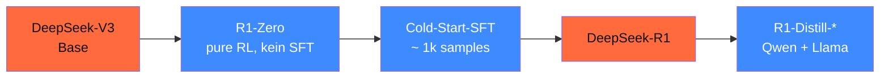

## Worum es geht

> Stop treating R1 as „just another open model". — DeepSeek-R1 (Nature 08/2025) hat 2025 die Reasoning-Forschung neu definiert: pures RL ohne SFT-Bootstrap, GRPO statt PPO, MIT-Lizenz für Distill-Modelle. Diese Lektion zeigt, wie es trainiert wurde — und was du daraus lernst.

## Voraussetzungen

- Lektion 16.01 (TTC)
- Lektion 16.02 (Reasoning-Modelle 2026)

## Konzept

### Die R1-Trainings-Pipeline



### Kern-Innovation: pures RL ohne SFT-Bootstrap

Klassisches RLHF: Pretraining → SFT → Reward Modeling → PPO. Vier Stufen, viele kuratierte Daten.

DeepSeek-R1-Zero: Pretraining → **direkt RL** mit verifizierbaren Rewards (Math-Endergebnis, Code-Tests). Kein SFT zwischen den Schritten.

Das funktionierte überraschend gut für Reasoning, brach aber bei „Lesbarkeit" ein (Modell switchte zwischen Sprachen, redete chaotisch). Lösung: kleine Cold-Start-SFT (~ 1.000 sauberen CoT-Beispielen) vor dem RL.

### Reward-Signal: verifizierbare Tasks

Statt Menschen-Präferenzen (teuer, subjektiv) hat DeepSeek **objektive Verifier** verwendet:

| Domain | Verifier | Reward |
|---|---|---|
| Math | Final-Answer-Match (regex, Wolfram) | 1 wenn richtig |
| Code | pytest in Sandbox | 1 wenn alle Tests grün |
| Logik | Constraint-Solver | 1 wenn konsistent |

Plus ein **Format-Reward**: Antwort muss in `<think>...</think>` + finaler Antwort strukturiert sein.

### GRPO statt PPO

Group Relative Policy Optimization (GRPO) — die Kern-Innovation. Statt einem Critic-Modell (PPO) generiert GRPO **N Samples pro Prompt** und nutzt deren **gruppen-relative** Advantages:

```text
A_i = (r_i - mean(r_1..r_N)) / std(r_1..r_N)
```

Vorteile:

- **Kein Critic-Modell** — spart 50 % Memory beim Training
- **Stabiler** als PPO (kein Critic-Drift)
- Funktioniert ohne menschliche Präferenzen

Detail in Lektion 16.04. Stand TRL v1.3.0: `GRPOTrainer` ist produktiv ([huggingface.co/docs/trl/grpo_trainer](https://huggingface.co/docs/trl/grpo_trainer)).

### DeepSeek-V4 (April 2026) — die nächste Stufe

URL: <https://huggingface.co/deepseek-ai/DeepSeek-V4-Pro>

**Architektur-Updates**:

- **Hybride Attention**: Compressed Sparse (lokal) + Heavily Compressed (global)
- **1M Context** — vs. 128k bei V3
- **> 32T Trainings-Tokens** — neue Datenquellen + synthetisch
- MoE mit FP8-Training-Stack

V4 ist primär als **Non-Reasoning-Default** gedacht; R1 bleibt eigenständige Reasoning-Linie.

### Distill-Familie (MIT-Lizenz!)

Was DeepSeek geteilt hat: **Distillation von R1 in kleinere Modelle**:

| Distill | Basis | Größe | Lizenz | Use-Case |
|---|---|---|---|---|
| R1-Distill-Qwen-1.5B | Qwen2.5 | 1,5B | MIT | Edge / Mobile |
| R1-Distill-Qwen-7B | Qwen2.5 | 7,6B | MIT | Lokale Reasoning-Pipelines |
| R1-Distill-Qwen-14B | Qwen2.5 | 14,7B | MIT | Mid-Range-RTX |
| **R1-Distill-Qwen-32B** | Qwen2.5 | 32,5B | MIT | RTX 4090 Q4_K_M |
| R1-Distill-Llama-8B | Llama-3 | 8B | MIT | Llama-Familien-Stack |
| R1-Distill-Llama-70B | Llama-3 | 70B | MIT | H100 Single-GPU |

> **MIT-Lizenz** = kommerziell frei nutzbar. R1-Distill-32B + Self-Hosting auf STACKIT/IONOS = DSGVO-konformer Reasoning-Stack ohne Cloud-API.

### Performance: was R1-Distill-32B kann

Aus dem DeepSeek Tech Report (Nature 08/2025):

| Benchmark | R1-Distill-32B | o1-mini | GPT-4 |
|---|---|---|---|
| AIME 2024 | 79.8 % | 63.6 % | 9.3 % |
| MATH-500 | 94.3 % | 90.0 % | 64.2 % |
| LiveCodeBench | 57.2 % | 53.8 % | 32.9 % |
| Codeforces-ELO | 1691 | 1820 | — |

> R1-Distill-32B schlägt o1-mini auf AIME, MATH-500 und LiveCodeBench. **Bei lokaler Ausführung** auf einer 24-GB-GPU. 2026 das beste Reasoning-Modell, das du frei deployen kannst.

### Lizenz-Disziplin

| Komponente | Lizenz | Kommerziell |
|---|---|---|
| **R1-Distill-Familie** | MIT | ja, frei |
| DeepSeek-R1 (Original) | MIT | ja, frei |
| DeepSeek-V3 | DeepSeek License | check Restrictions |
| DeepSeek-V4 | DeepSeek License | check Restrictions |

> **Empfehlung 2026**: bei kommerziellem DACH-Einsatz **nur R1 + R1-Distill** verwenden (MIT-Lizenz). V3/V4 brauchen eigene Lizenz-Prüfung.

### DSGVO + Self-Censorship-Disclaimer

> ⚠️ **DACH-Compliance-Hinweis** (Stand 04/2026):
>
> - **Lokale Inferenz** (R1-Distill auf eigener / EU-Hardware) ist DSGVO-konform — keine Daten verlassen die Umgebung
> - **Offizielle DeepSeek-API** (deepseek.com) ist DSGVO-problematisch — kein EU-Vertreter, kein durchsetzbares Auskunfts-/Löschrecht
> - **Self-Censorship**: R1 zensiert ~ 88 % geopolitischer CN-Fragen (Tiananmen, Taiwan, Xinjiang). Bei lokaler Inferenz **schwächer** (Filter-Layer fehlt), aber RLHF-Prägung bleibt
> - Für B2B-Math/Code/RAG meist unproblematisch — für News/Politik/Geschichte/Journalismus **inakzeptabel** ohne Eval-Audit (Phase 18.08)

### Wann R1-Distill, wann GPT-5.5 / Opus?

| Faktor | R1-Distill (Self-Hosted) | GPT-5.5 / Opus |
|---|---|---|
| **DSGVO** | absolut sauber | mit AVV ok |
| **Cost** | nur GPU-Strom | $ 5–30 / 1M |
| **Self-Censorship** | mittel (RLHF-Prägung) | gering |
| **Reasoning-Qualität** | sehr gut bei Math/Code | Top-of-the-Line |
| **Multi-Sprache** | sehr gut, deutsch ok | exzellent |
| **Ecosystem** | Open-Weights, viele Tools | API + DPA |
| **Compliance Drittland** | kein Transfer | EU-Datazone |

> Pattern 2026: **R1-Distill-32B als Default** für Reasoning-Tasks ohne externes API-Budget. **Opus 4.7** für anspruchsvolle Compliance-Tasks (Recht, AI-Act).

## Hands-on

1. R1-Distill-Qwen-32B lokal via Ollama: `ollama pull deepseek-r1:32b`
2. Eigene Math-Frage testen — Reasoning-Output (im `<think>`-Block) prüfen
3. Self-Censorship-Test: 5 deutsche Geopolitik-Fragen — wieviele werden geblockt?
4. Vergleich gegen GPT-5.5-medium-effort auf gleicher Frage — Qualität + Cost

## Selbstcheck

- [ ] Du erklärst die R1-Trainings-Pipeline (V3 → R1-Zero → SFT → R1 → Distill).
- [ ] Du verstehst „pure RL ohne SFT-Bootstrap" als Innovation.
- [ ] Du kennst die R1-Distill-Lizenz (MIT, kommerziell frei).
- [ ] Du wählst R1-Distill vs. GPT-5.5 / Opus je nach Compliance-Tier.
- [ ] Du dokumentierst den Self-Censorship-Disclaimer für DACH-Einsatz.

## Compliance-Anker

- **Daten-Residenz (DSGVO Art. 44)**: R1-Distill lokal auf EU-Hardware = sauber
- **Bias-Audit (AI-Act Art. 15)**: Self-Censorship-Test pflicht (Phase 18.08)
- **Logging (Art. 12)**: Reasoning-Tokens als separater Span loggen

## Quellen

- DeepSeek-R1 Tech Report (Nature 08/2025) — <https://www.nature.com/articles/s41586-025-08000-x>
- DeepSeek-R1 HF — <https://huggingface.co/deepseek-ai/DeepSeek-R1>
- DeepSeek-V4 HF — <https://huggingface.co/deepseek-ai/DeepSeek-V4-Pro>
- DeepSeek-Prover-V2 — <https://huggingface.co/deepseek-ai/DeepSeek-Prover-V2-7B>
- Ollama R1 — <https://ollama.com/library/deepseek-r1>
- Enkrypt-AI Bias-Studie — <https://www.enkryptai.com/blog/deepseek-r1-redteaming>

## Weiterführend

→ Lektion **16.04** (GRPO-Mathematik im Detail)
→ Lektion **16.05** (R1-Distillation Hands-on)
→ Phase **18.08** (Self-Censorship-Audit asiatischer Modelle)
