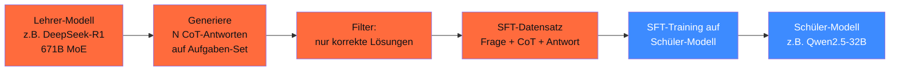

## Worum es geht

> Stop deploying 70B reasoning models when 7B can do it. — Distillation überträgt das Reasoning-Verhalten eines großen Modells in ein kleines durch SFT auf Lehrer-Outputs. Diese Lektion zeigt, wie DeepSeek das mit R1 gemacht hat — und wie du's für deinen Use-Case nachmachst.

## Voraussetzungen

- Lektion 16.03 (R1-Architektur)
- Lektion 16.04 (GRPO)
- Phase 12.05 (Trainings-Stack)

## Konzept

### Distillation-Pattern



### DeepSeek's R1-Distill-Pattern (das was sie gemacht haben)

1. **Lehrer**: DeepSeek-R1 (671B MoE, 37B aktiv)
2. **Aufgaben-Set**: 800k kuratierte Math/Code/Reasoning-Aufgaben
3. **Generation**: R1 generiert pro Aufgabe **mehrere** CoT-Antworten mit `<think>...</think>`-Format
4. **Filter**: nur Antworten mit **korrekter Endlösung** (Verifier)
5. **SFT** auf Schüler-Modellen (Qwen2.5-1.5B/7B/14B/32B + Llama-3-8B/70B)
6. **Output**: R1-Distill-Familie (MIT-Lizenz)

### Was geht ins Distill-Datensatz?

```python
# Format pro Sample
{
    "messages": [
        {"role": "user", "content": "Was ist 12 % von 3.700.000?"},
        {"role": "assistant", "content": (
            "<think>\n"
            "Ich muss 12 % von 3.700.000 berechnen.\n"
            "12 / 100 = 0.12\n"
            "0.12 × 3.700.000 = 444.000\n"
            "</think>\n"
            "**Antwort**: 12 % von 3.700.000 sind **444.000**."
        )}
    ]
}
```

Das `<think>`-Format ist Teil des Trainings-Signals — der Schüler lernt, **explizit Reasoning-Schritte zu verbalisieren**.

### Eigenes Distill-Setup

#### Schritt 1: Aufgaben-Set kuratieren

Quellen für deutsche Math/Reasoning-Aufgaben:

- **MMLU-DE Math-Subset** ([bjoernpl/GermanBenchmark](https://github.com/bjoernpl/GermanBenchmark))
- **GSM8K-DE-Übersetzung** (community, prüfen)
- **Steuer-Aufgaben** aus Berufsausbildung (eigene)
- **MATH-500-DE** (Übersetzung von MATH-500)

Mindestens 1.000 verifizierbare Aufgaben mit Endlösung.

#### Schritt 2: Lehrer-Inferenz

```python
import asyncio
from openai import AsyncOpenAI

# Lehrer: GPT-5.5 (xhigh) oder R1-API oder lokales R1-Distill-70B
client = AsyncOpenAI()

async def generate_cot(aufgabe: str, k: int = 4) -> list[str]:
    """Generiere k CoT-Antworten pro Aufgabe."""
    tasks = [
        client.chat.completions.create(
            model="gpt-5.5",
            messages=[
                {"role": "system", "content": (
                    "Du bist Math-Tutor. Strukturiere Reasoning in <think>...</think>, "
                    "danach finale Antwort als **Antwort**: <Wert>."
                )},
                {"role": "user", "content": aufgabe},
            ],
            reasoning={"effort": "high"},
            temperature=0.7,
        )
        for _ in range(k)
    ]
    results = await asyncio.gather(*tasks)
    return [r.choices[0].message.content for r in results]
```

#### Schritt 3: Filter mit Verifier

```python
import re

def extract_answer(text: str) -> str | None:
    match = re.search(r"\*\*Antwort\*\*:\s*(.+?)(?:\.|$)", text)
    if match:
        return match.group(1).strip()
    return None

def filter_korrekt(aufgabe: dict, antworten: list[str]) -> list[str]:
    gold = aufgabe["loesung"]
    return [a for a in antworten if extract_answer(a) == gold]
```

#### Schritt 4: Datensatz aufbauen

Pro Aufgabe **eine** korrekte Antwort behalten (oder mehrere für Diversität):

```python
distill_dataset = []
for aufgabe in aufgaben:
    antworten = await generate_cot(aufgabe["frage"], k=4)
    korrekt = filter_korrekt(aufgabe, antworten)
    if korrekt:
        # Wähle die kürzeste korrekte Antwort (Lesbarkeit)
        beste = min(korrekt, key=len)
        distill_dataset.append({
            "messages": [
                {"role": "user", "content": aufgabe["frage"]},
                {"role": "assistant", "content": beste},
            ]
        })
```

Yield-Rate: typisch 40–70 % (R1) oder 60–85 % (GPT-5.5 mit xhigh).

#### Schritt 5: SFT auf Schüler-Modell

Standard SFT (Lektion 12.05):

```python
from unsloth import FastLanguageModel
from trl import SFTTrainer
from datasets import Dataset

modell, tokenizer = FastLanguageModel.from_pretrained(
    model_name="unsloth/Qwen2.5-7B-Instruct-bnb-4bit",
    max_seq_length=4096,  # längere Sequenzen für CoT
    load_in_4bit=True,
)

modell = FastLanguageModel.get_peft_model(
    modell, r=64, lora_alpha=128,  # höherer Rank für Verhaltens-Änderung
    target_modules=["q_proj", "k_proj", "v_proj", "o_proj",
                    "gate_proj", "up_proj", "down_proj"],
    lora_dropout=0.05, bias="none",
    use_gradient_checkpointing="unsloth",
)

trainer = SFTTrainer(
    model=modell,
    tokenizer=tokenizer,
    train_dataset=Dataset.from_list(distill_dataset),
    dataset_text_field="text",
    max_seq_length=4096,
    args=TrainingArguments(
        per_device_train_batch_size=2,  # CoT ist lang
        gradient_accumulation_steps=8,
        num_train_epochs=2,            # weniger Epochen, sonst Mode-Collapse
        learning_rate=1e-4,            # konservativer für Distill
        bf16=True,
        optim="adamw_8bit",
        warmup_ratio=0.1,
        seed=42,
    ),
)
trainer.train()
```

> **Wichtig**: für Distillation ist **rank höher** (64 statt 16) und **Trainings-Daten länger** (CoT mit 1.000+ Tokens) — beide Faktoren erhöhen VRAM-Bedarf.

### Eval: Hat das Modell tatsächlich Reasoning gelernt?

```python
import promptfoo
# Eval gegen MMLU-DE-Math-Test (200 Aufgaben)
# Vergleich: Basis-Modell vs. Distill-Variante
# KPI: Accuracy + durchschnittliche Reasoning-Token-Länge
```

Erwartung bei 1.000 Trainings-Samples:

- Accuracy +10–25 % (je nach Aufgaben-Schwierigkeit)
- Durchschnittliche CoT-Länge: 200–800 Tokens
- Bei zu starker Verlängerung: Mode-Collapse (Modell labert)

### Quality vs. Cost: wann Distill, wann nicht?

**Pro Distill**:

- Wiederholt benötigte Reasoning-Tasks (1.000+ Calls/Tag)
- Kosten-sensible Anwendung
- Lokaler Deployment-Wunsch
- DSGVO-Pflicht (kein Cloud-API)

**Contra Distill**:

- < 100 Calls/Tag → API-Reasoning-Modell günstiger
- Aufgaben-Domain wechselt häufig → Re-Training-Aufwand
- Top-of-the-Line-Reasoning nötig → APIs schlagen Distill

### Distillation und Urheberrecht

**Wichtige Frage** für DACH 2026:

- **OpenAI-API-Outputs als Trainings-Daten** für eigenes kommerzielles Modell: laut OpenAI-ToS oft **verboten**. Vorab Vertrag prüfen.
- **R1-Outputs** (MIT-Lizenz, Open-Weights): erlaubt — auch kommerziell
- **Anthropic API**: ähnliche Restriktionen — Enterprise-Vertrag nötig
- **Mistral**: prüfen je nach Tier

> **Pattern 2026**: für **kommerzielle Distillation** R1 als Lehrer + R1-Distill-32B als Schüler. Lizenz-Pfad sauber.

### Lerne von R1-Distill — was hat funktioniert?

Aus dem DeepSeek Tech Report:

1. **Größerer Lehrer hilft**: R1 (671B) → 7B Schüler bringt mehr als 32B → 7B
2. **Format-Konsistenz**: `<think>...</think>` als Format-Anker hilft Schüler
3. **Mindestens 800k Samples** für stabile Reasoning-Übertragung
4. **Mix von Math + Code + Logik** — generalisiert besser als reines Math
5. **2 Epochen** sind oft optimal — bei 3+ Mode-Collapse

## Hands-on

1. Lade ein kleines Math-Set (100 Aufgaben aus MMLU-DE)
2. Generiere 4 CoT-Antworten pro Aufgabe mit GPT-5.5 (xhigh) oder R1
3. Filter mit Verifier
4. SFT auf Qwen2.5-1.5B (RTX 4090, ~ 1 h)
5. Eval gegen Basis-Modell — wie viel Accuracy gewonnen?

## Selbstcheck

- [ ] Du erklärst Distillation als Lehrer-Schüler-Pattern.
- [ ] Du nutzt einen Verifier zur Filterung der Lehrer-Outputs.
- [ ] Du wählst Rank, Epochen, Sequenzen-Länge passend für Distillation.
- [ ] Du kennst die Lizenz-Implikationen (R1 erlaubt, OpenAI prüfen).
- [ ] Du eval-quantifizierst die Reasoning-Übertragung.

## Compliance-Anker

- **Urheberrecht / Lizenz**: bei API-Lehrer ToS prüfen (kommerzielle Distillation oft verboten)
- **Reproduzierbarkeit (AI-Act Art. 12)**: Lehrer-Modell + Datensatz + Filter dokumentiert
- **Robustness (Art. 15)**: Distillation kann Bias des Lehrers übernehmen — Eval pflicht

## Quellen

- DeepSeek-R1 Tech Report — <https://www.nature.com/articles/s41586-025-08000-x>
- R1-Distill-Familie auf HF — <https://huggingface.co/deepseek-ai>
- Hinton et al. „Distilling the Knowledge in a Neural Network" (2015) — <https://arxiv.org/abs/1503.02531>
- TRL SFTTrainer — <https://huggingface.co/docs/trl/sft_trainer>
- Awesome-Knowledge-Distillation — <https://github.com/dkozlov/awesome-knowledge-distillation>

## Weiterführend

→ Lektion **16.06** (Verifier-Loops Math/Code)
→ Lektion **16.07** (Hands-on GRPO-Mini auf Qwen2.5-1.5B)
→ Phase **12** (LoRA-Adapter-Mathematik für effizientes Distill)
