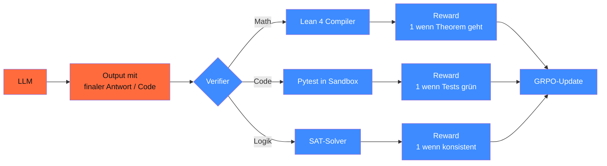

## Worum es geht

> Stop training reward models when you can compile the answer. — Reinforcement Learning with Verifiable Rewards (RLVR) ist 2026 der Goldstandard für Math + Code: Lean 4 oder Pytest als objektiver Verifier statt teurem Reward-Modell.

## Voraussetzungen

- Lektion 16.04 (GRPO)
- Phase 14.08 (Sandboxing für Code-Execution)

## Konzept

### Was ist RLVR?



Vorteil gegenüber klassischem RLHF:

- Reward objektiv + reproduzierbar
- Kein Reward-Modell-Drift
- Skaliert mit Compute (mehr Verifier-Aufrufe = besseres Training)
- Funktioniert mit GRPO ohne Critic

### Lean 4 als Math-Verifier

[Lean 4](https://leanprover.github.io/) ist ein Theorem-Prover + Programmiersprache. Mathe-Beweise werden zu Code, der vom Compiler validiert wird.

#### Beispiel: ein einfaches Theorem

```lean
-- Theorem: für alle natürlichen Zahlen n gilt n + 0 = n
theorem n_add_zero (n : ℕ) : n + 0 = n := by
  rfl  -- "reflexivity" — folgt aus Definition
```

Wenn der Lean-Compiler das akzeptiert: Reward = 1. Wenn nicht: 0.

#### Lean als Reward in TRL

```python
import subprocess
import tempfile
from pathlib import Path

def lean_verify(theorem: str, proof: str, timeout: int = 30) -> bool:
    """Compile Lean-Beweis in Subprocess. Reward = 1 wenn akzeptiert."""
    code = f"theorem proof_check : {theorem} := by\n  {proof}\n"
    with tempfile.NamedTemporaryFile(suffix=".lean", delete=False) as f:
        f.write(code.encode())
        path = Path(f.name)
    try:
        result = subprocess.run(
            ["lake", "env", "lean", str(path)],
            capture_output=True, timeout=timeout, check=False,
        )
        return result.returncode == 0
    except subprocess.TimeoutExpired:
        return False
    finally:
        path.unlink()


def lean_reward(completions: list[str], prompts: list[str], **kwargs) -> list[float]:
    """Reward-Funktion für GRPO."""
    rewards = []
    for completion, prompt in zip(completions, prompts):
        theorem = extract_theorem(prompt)
        proof = extract_proof(completion)
        if not proof:
            rewards.append(0.0)
            continue
        ok = lean_verify(theorem, proof)
        rewards.append(1.0 if ok else 0.0)
    return rewards
```

#### Produktive Math-Verifier-Repos 2026

- **DeepSeek-Prover-V2** ([huggingface.co/deepseek-ai/DeepSeek-Prover-V2-7B](https://huggingface.co/deepseek-ai/DeepSeek-Prover-V2-7B)) — 7B-Modell + Lean-Reward + ProverBench-Datensatz (325 Probleme)
- **Goedel-Prover** ([goedel-lm.github.io](https://goedel-lm.github.io/)) — community-maintained mit Kimina-Lean-Server
- **Lean Math Library mathlib4** ([github.com/leanprover-community/mathlib4](https://github.com/leanprover-community/mathlib4)) — ~ 1.4M Definitionen + Theoreme als Trainings-Korpus

### Pytest als Code-Verifier

Für Code-Reasoning ist Pytest in Sandbox der Standard:

```python
# In E2B oder Daytona-Sandbox (siehe Phase 14.08)
def pytest_reward(completions: list[str], prompts: list[str], **kwargs) -> list[float]:
    rewards = []
    for completion, prompt in zip(completions, prompts):
        code = extract_code(completion)
        tests = extract_tests(prompt)

        with sandbox.create() as sbx:
            sbx.write_file("solution.py", code)
            sbx.write_file("test_solution.py", tests)
            result = sbx.run_command("pytest test_solution.py -v --json-report")
            if result.exit_code == 0:
                rewards.append(1.0)
            elif result.exit_code == 1:
                # einige Tests grün — partial reward
                report = sbx.read_json("/tmp/report.json")
                pass_rate = report["summary"]["passed"] / report["summary"]["total"]
                rewards.append(pass_rate)
            else:
                rewards.append(0.0)
    return rewards
```

> **Pflicht**: Sandbox (E2B / Daytona / Modal) — niemals `exec()` direkt im Trainings-Prozess. Code-Injection-Risiko + Modell könnte Verifier manipulieren.

### Format-Reward als Stabilisierer

Reine Accuracy-Reward führt schnell zu Reward-Hacking. Pattern: zusätzlicher Format-Reward, der **exakt** den `<think>`-Block + finale Antwort einfordert:

```python
import re

def format_reward(completions: list[str], **kwargs) -> list[float]:
    """0.5 wenn Format eingehalten (Think-Block + finale Antwort), 0 sonst."""
    rewards = []
    for c in completions:
        has_think = bool(re.search(r"<think>.*?</think>", c, re.DOTALL))
        has_answer = bool(re.search(r"\\boxed\{.+?\}", c))
        rewards.append(0.5 if (has_think and has_answer) else 0.0)
    return rewards
```

Mit GRPO: `reward_funcs=[lean_reward, format_reward, length_penalty]` — sum.

### Length-Penalty gegen verbose Outputs

```python
def length_penalty(completions: list[str], **kwargs) -> list[float]:
    """-0.1 wenn > 4096 Tokens — verhindert Mode-Collapse zu langen Outputs."""
    return [-0.1 if len(c.split()) > 4096 else 0.0 for c in completions]
```

### Verifier-Loop in TRL GRPOTrainer

```python
from trl import GRPOTrainer, GRPOConfig

trainer = GRPOTrainer(
    model="Qwen/Qwen2.5-Math-1.5B",
    reward_funcs=[lean_reward, format_reward, length_penalty],
    args=GRPOConfig(
        output_dir="outputs/lean-grpo",
        num_generations=8,
        max_completion_length=2048,
        learning_rate=5e-7,
        beta=0.04,
        per_device_train_batch_size=2,
        gradient_accumulation_steps=8,
        num_train_epochs=2,
        bf16=True,
    ),
    train_dataset=load_dataset("DeepSeek-Prover-V2-Bench", split="train"),
)
trainer.train()
```

### Performance-Realität 2026

- **DeepSeek-Prover-V2** (7B + Lean-Reward) bewältigt 56 % der ProverBench-Aufgaben (vs. ~ 30 % bei reinem SFT-Modell gleicher Größe)
- **AlphaProof / FunSearch** (DeepMind, Forschung) erreichen IMO-Silbermedaillen-Niveau auf ausgewählten Problemen
- **Code-RLVR** (z. B. ReSt-EM von Google): + 10–15 % auf LiveCodeBench gegenüber SFT-Only

### Wann Verifier-Loops bauen?

| Kriterium | RLVR ja | RLVR nein |
|---|---|---|
| Verifier verfügbar (kostenlos) | ✓ | ✗ |
| Aufgaben verifizierbar (Math, Code) | ✓ | freitext: nein |
| Compute > 100 GPU-Stunden | ✓ | < 50 h: SFT besser |
| Eval-Set außerhalb Trainings-Verteilung | ✓ | sonst Reward-Hacking-Risiko |
| Production-Use mit > 1.000 Calls/Tag | ✓ | < 100 Calls/Tag: API genügt |

### Sandbox-Disziplin

Aus Phase 14.08:

- **E2B**: Cloud-Sandbox, Firecracker-microVM — Standard für Cloud-Training
- **Daytona**: Self-Hosted, EU-tauglich
- **Modal**: generischer Sandbox-Compute

Pflicht-Pattern:

```python
# Niemals direkt — RCE-Risiko
exec(generated_code)  # ❌

# Stattdessen
sandbox.run_code(generated_code, timeout=10)  # ✅
```

## Hands-on

1. Lean 4 auf macOS oder Linux installieren ([leanprover.github.io](https://leanprover.github.io/))
2. Eine einfache Theorem-Verifier-Funktion schreiben (z. B. `n + 0 = n`)
3. E2B-Account oder Daytona-Local aufsetzen für Pytest-Sandbox
4. GRPO-Mini-Run auf Qwen2.5-Math-1.5B mit lean_reward + format_reward (~ 4 h auf RTX 4090)
5. Eval gegen MATH-500-DE — Accuracy vor / nach RLVR

## Selbstcheck

- [ ] Du verstehst RLVR als Reward-Modell-Ersatz.
- [ ] Du implementierst eine Lean-Reward-Funktion.
- [ ] Du nutzt Pytest in Sandbox (E2B/Daytona/Modal) für Code-Reward.
- [ ] Du kombinierst Multi-Reward (Verifier + Format + Length).
- [ ] Du erkennst Reward-Hacking (Modell „beweist" trivial korrekte Theoreme).

## Compliance-Anker

- **Sandbox-Pflicht (DSGVO Art. 32 TOM)**: Code-Execution nur in Sandbox
- **Reproduzierbare Rewards (AI-Act Art. 15)**: Verifier-Version + Konfiguration committet
- **Audit-Trail**: Reward-Komponenten pro Step loggen

## Quellen

- DeepSeek-Prover-V2 — <https://huggingface.co/deepseek-ai/DeepSeek-Prover-V2-7B>
- Goedel-Prover — <https://goedel-lm.github.io/>
- Lean 4 — <https://leanprover.github.io/>
- mathlib4 — <https://github.com/leanprover-community/mathlib4>
- E2B — <https://e2b.dev/docs>
- TRL GRPOTrainer — <https://huggingface.co/docs/trl/grpo_trainer>
- Awesome-RLVR — <https://github.com/opendilab/awesome-RLVR>

## Weiterführend

→ Lektion **16.07** (Hands-on GRPO-Mini auf Qwen2.5)
→ Phase **14.08** (Sandboxing-Pattern)
