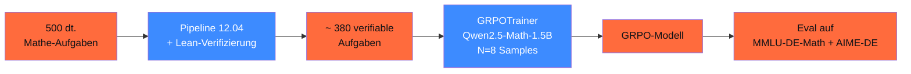

## Worum es geht

> Stop reading about GRPO, run it. — diese Lektion baut **end-to-end** ein GRPO-Mini auf Qwen2.5-Math-1.5B mit 500 deutschen Mathe-Aufgaben. Auf RTX 4090 in ~ 4 h, danach Eval-Vergleich gegen Basis-Modell.

## Voraussetzungen

- Lektion 16.04 (GRPO)
- Lektion 16.06 (Verifier)
- Phase 12.05 (TRL-Stack)
- NVIDIA-GPU mit ≥ 24 GB VRAM (RTX 4090 / 5090 / H100)

## Konzept

### Pipeline-Übersicht



### Schritt 1 — Aufgaben-Set kuratieren

```python
# 500 dt. Mathe-Aufgaben mit Endlösung
import json
from pathlib import Path

aufgaben_quellen = [
    "datasets/mmlu-de-math.jsonl",
    "datasets/gsm8k-de.jsonl",
    "datasets/abi-mathe-2024.jsonl",  # Übersetzte Abi-Klausuren
]

aufgaben = []
for q in aufgaben_quellen:
    aufgaben.extend(json.loads(z) for z in Path(q).read_text().splitlines())

# Pflicht-Format pro Aufgabe
# {
#   "frage": "Was ist 12 % von 3.700.000?",
#   "loesung": "444000",   # exakt — für Verifier
#   "schwierigkeit": "leicht" / "mittel" / "schwer"
# }
print(f"Aufgaben: {len(aufgaben)}")
```

### Schritt 2 — Verifier definieren

```python
import re

def extract_answer(text: str) -> str | None:
    """Extrahiert finale Antwort aus \\boxed{...} oder **Antwort**: ..."""
    # Bevorzugt LaTeX-boxed
    m = re.search(r"\\boxed\{([^}]+)\}", text)
    if m:
        return m.group(1).strip().replace(",", "").replace(".", "")

    # Fallback: **Antwort**: ...
    m = re.search(r"\*\*Antwort\*\*:\s*([\d,.]+)", text)
    if m:
        return m.group(1).strip().replace(",", "").replace(".", "")

    return None


def antwort_match_reward(completions: list[str], prompts: list[str], **kwargs) -> list[float]:
    """1.0 wenn extrahierte Antwort = Gold-Lösung, 0 sonst."""
    rewards = []
    for completion, prompt in zip(completions, prompts):
        gold = extract_gold_from_prompt(prompt)
        guess = extract_answer(completion)
        rewards.append(1.0 if guess == gold else 0.0)
    return rewards


def format_reward(completions: list[str], **kwargs) -> list[float]:
    """0.5 wenn <think>-Format eingehalten."""
    rewards = []
    for c in completions:
        has_think = bool(re.search(r"<think>.*?</think>", c, re.DOTALL))
        has_boxed = bool(re.search(r"\\boxed\{.+?\}", c))
        rewards.append(0.5 if (has_think and has_boxed) else 0.0)
    return rewards
```

### Schritt 3 — Datensatz vorbereiten

```python
from datasets import Dataset

def to_chatml(aufgabe: dict) -> dict:
    return {
        "prompt": [
            {
                "role": "system",
                "content": (
                    "Du bist Mathe-Tutor. Strukturiere dein Reasoning in "
                    "<think>...</think>, danach finale Antwort als \\boxed{...}."
                ),
            },
            {"role": "user", "content": aufgabe["frage"]},
        ],
        "loesung": aufgabe["loesung"],
    }


dataset = Dataset.from_list([to_chatml(a) for a in aufgaben])
print(f"Trainings-Dataset: {len(dataset)}")
```

### Schritt 4 — GRPO-Training

```python
from trl import GRPOTrainer, GRPOConfig
from unsloth import FastLanguageModel

# Basis-Modell laden
modell, tokenizer = FastLanguageModel.from_pretrained(
    model_name="unsloth/Qwen2.5-Math-1.5B-Instruct",
    max_seq_length=2048,
    load_in_4bit=False,  # GRPO braucht FP16 für stabile Gradienten
    dtype="bfloat16",
)

# LoRA für Memory-Effizienz
modell = FastLanguageModel.get_peft_model(
    modell,
    r=64,                # höher für Verhaltens-Änderung
    lora_alpha=128,
    target_modules=["q_proj", "k_proj", "v_proj", "o_proj",
                    "gate_proj", "up_proj", "down_proj"],
    lora_dropout=0.0,    # in RL kein Dropout
    bias="none",
    use_gradient_checkpointing="unsloth",
)

config = GRPOConfig(
    output_dir="outputs/qwen2.5-math-grpo-de",
    num_generations=8,            # N samples pro Prompt
    max_completion_length=1024,
    max_prompt_length=512,
    temperature=0.7,
    learning_rate=5e-7,           # niedrig — Stabilität
    beta=0.04,                    # KL zur ref-policy
    per_device_train_batch_size=2,
    gradient_accumulation_steps=8,
    num_train_epochs=2,
    bf16=True,
    logging_steps=5,
    save_strategy="epoch",
    seed=42,
    optim="adamw_8bit",
)

trainer = GRPOTrainer(
    model=modell,
    reward_funcs=[antwort_match_reward, format_reward],
    args=config,
    train_dataset=dataset,
)

# Training läuft ~ 4 h auf RTX 4090
trainer.train()

# Speichern
modell.save_pretrained("adapters/qwen2.5-math-grpo-de-v1")
tokenizer.save_pretrained("adapters/qwen2.5-math-grpo-de-v1")
```

### Schritt 5 — Eval gegen Basis-Modell

```python
from datasets import load_dataset

# MMLU-DE-Math-Test-Set (200 Aufgaben)
test = load_dataset("path/to/mmlu-de-math", split="test")

def eval_modell(modell_path: str) -> dict:
    """Lade Modell + lauf 200 Test-Aufgaben + Accuracy berechnen."""
    # ... Inferenz-Loop ...
    accuracy = ...
    avg_think_len = ...
    return {"accuracy": accuracy, "avg_reasoning_tokens": avg_think_len}


basis = eval_modell("Qwen/Qwen2.5-Math-1.5B-Instruct")
grpo = eval_modell("adapters/qwen2.5-math-grpo-de-v1")

print(f"Basis: {basis['accuracy']:.1%} (avg tokens: {basis['avg_reasoning_tokens']})")
print(f"GRPO:  {grpo['accuracy']:.1%} (avg tokens: {grpo['avg_reasoning_tokens']})")
print(f"Verbesserung: +{(grpo['accuracy'] - basis['accuracy']) * 100:.1f} pp")
```

Erwartung bei 500 Trainings-Aufgaben + 2 Epochen:

- Accuracy +5–15 pp (je nach Schwierigkeit)
- Avg Reasoning-Length: 200–600 Tokens
- Format-Adherence: ≥ 95 %

### Schritt 6 — Reproduzierbarkeits-Manifest

```yaml
# manifests/qwen2.5-math-grpo-de-v1.yaml
basis_modell: "unsloth/Qwen2.5-Math-1.5B-Instruct"
methode: "GRPO"

datensatz:
  pfad: "datasets/mathe-aufgaben-2026-04.jsonl"
  sha256: "abc123..."
  samples: 500
  quellen: ["mmlu-de-math", "gsm8k-de", "abi-mathe-2024"]

reward_funcs:
  - "antwort_match_reward"  # 1.0 bei Match, sonst 0.0
  - "format_reward"          # 0.5 bei <think> + \boxed

hyperparameter:
  num_generations: 8
  max_completion_length: 1024
  beta: 0.04
  learning_rate: 5e-7
  num_epochs: 2
  seed: 42

eval:
  basis_acc: 0.42
  grpo_acc: 0.55
  delta_pp: 13.0

trainings_dauer_h: 4.5
gpu: "RTX 4090"
eur_kosten: 3.60
```

### Häufige Fehler

| Problem | Ursache | Fix |
|---|---|---|
| Loss stagniert / oszilliert | Learning-Rate zu hoch | LR auf 1e-7 reduzieren |
| Modell labert ohne Reasoning | Format-Reward zu schwach | Format-Reward auf 1.0 hochsetzen |
| Reward stabil bei 0 | Verifier zu strikt | Tolerance einbauen (z. B. ≤ 0.001 als Match) |
| Mode-Collapse zu langen Outputs | Length-Penalty fehlt | -0.1 pro 1000 extra Tokens |
| GPU-Out-of-Memory | N zu groß für VRAM | num_generations=4, batch_size=1 |
| Reward-Hacking | nur Final-Answer-Match | Multi-Reward + Eval außerhalb Training |

## Hands-on (4–8 h)

1. Aufgaben-Set kuratieren (mind. 500 dt. Mathe-Aufgaben mit Endlösung)
2. Verifier + Format-Reward implementieren
3. GRPO-Training auf RTX 4090 (~ 4 h)
4. Eval gegen Basis-Modell auf 200 Test-Aufgaben
5. Manifest committen mit Reproduzierbarkeits-Hashes
6. Optional: Adapter mergen + nach vLLM deployen (Phase 12.06/12.07)

## Selbstcheck

- [ ] Du baust eine End-to-End-GRPO-Pipeline.
- [ ] Du kombinierst Multi-Reward (Verifier + Format).
- [ ] Du erkennst Reward-Hacking-Pattern + bist robust dagegen.
- [ ] Du dokumentierst Trainings-Run im Manifest.
- [ ] Du eval-quantifizierst Reasoning-Verbesserung.

## Compliance-Anker

- **Reproduzierbarkeit (AI-Act Art. 12)**: Manifest mit Daten-Hash + Hyperparametern + Eval-Scores
- **Robustness (Art. 15)**: Multi-Reward + Eval-Set außerhalb Training schützt vor Reward-Hacking
- **Trainings-Daten-Compliance**: bei Übersetzungen Lizenz prüfen (z. B. GSM8K original ist MIT)

## Quellen

- TRL GRPOTrainer — <https://huggingface.co/docs/trl/grpo_trainer>
- TRL Cookbook GRPO — <https://huggingface.co/docs/trl/main/en/example_overview>
- Unsloth GRPO-Notebooks — <https://github.com/unslothai/notebooks>
- DeepSeek-Math-Paper — <https://arxiv.org/abs/2402.03300>
- MMLU-DE-Math — <https://github.com/bjoernpl/GermanBenchmark>

## Weiterführend

→ Phase **17.07** (LiteLLM-Proxy für gestaffeltes Reasoning)
→ Phase **18.05** (GRPO im Alignment-Kontext)
