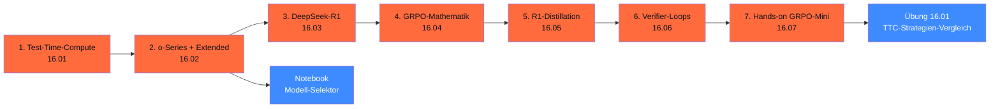

# Phase 16 · Reasoning & Test-Time-Compute

> **Stop assuming bigger model = better.** — länger nachdenken kann mehr bringen als mehr Parameter. Test-Time-Compute ist 2026 die zweite Skalierungsachse neben Modell-Größe. Diese Phase zeigt: wann lohnt sich TTC, wann ist es Token-Verbrennung, und wie du selbst ein Reasoning-Modell trainierst.

**Status**: ✅ vollständig ausgearbeitet · **Dauer**: ~ 12 h · **Schwierigkeit**: fortgeschritten

## 🎯 Was du in diesem Modul lernst

- **TTC-Patterns**: Best-of-N, Self-Consistency, Tree-of-Thought, MCTS, eingebaute Reasoning-Tokens
- **Reasoning-Modelle 2026**: GPT-5.5 (effort), Opus 4.7 (Adaptive Thinking), DeepSeek-R1 + V4
- **DeepSeek-R1-Architektur**: pure RL ohne SFT, GRPO-Training, R1-Distill-Familie (MIT)
- **GRPO-Mathematik**: gruppen-relative Advantages, Multi-Reward-Funktionen, Reward-Hacking-Mitigation
- **R1-Distillation**: Lehrer-Schüler-Pattern auf eigenem Datenset
- **Verifier-Loops**: Lean 4 für Math, Pytest in Sandbox für Code
- **End-to-End-Hands-on**: GRPO-Mini auf Qwen2.5-Math-1.5B (~ 4 h auf RTX 4090)

## 🧭 Wie du diese Phase nutzt



## 📚 Inhalts-Übersicht

| Lektion | Titel | Dauer | Datei |
|---|---|---|---|
| 16.01 | Test-Time-Compute (Best-of-N, Self-Consistency, MCTS) | 60 min | [`lektionen/01-test-time-compute.md`](lektionen/01-test-time-compute.md) ✅ |
| 16.02 | **o-Series + Extended Thinking** (GPT-5.5, Opus 4.7, R1) | 60 min | [`lektionen/02-o-series-extended-thinking.md`](lektionen/02-o-series-extended-thinking.md) ✅ |
| 16.03 | DeepSeek-R1 — Architektur und Training | 60 min | [`lektionen/03-deepseek-r1-architektur.md`](lektionen/03-deepseek-r1-architektur.md) ✅ |
| 16.04 | **GRPO-Mathematik** (vs. PPO/DPO) | 75 min | [`lektionen/04-grpo-mathematik.md`](lektionen/04-grpo-mathematik.md) ✅ |
| 16.05 | R1-Distillation in kleine Modelle | 60 min | [`lektionen/05-r1-distillation.md`](lektionen/05-r1-distillation.md) ✅ |
| 16.06 | Verifier-Loops (Lean 4 + Pytest) | 60 min | [`lektionen/06-verifier-loops.md`](lektionen/06-verifier-loops.md) ✅ |
| 16.07 | **Hands-on GRPO-Mini auf Qwen2.5** | 240 min | [`lektionen/07-hands-on-grpo-mini.md`](lektionen/07-hands-on-grpo-mini.md) ✅ |

## 💻 Hands-on-Projekt

**Reasoning-Modell-Selektor**: Marimo-Notebook, das basierend auf Task-Typ, Compliance-Tier, Volume und Verifizierbarkeit das passende Reasoning-Modell empfiehlt. Pricing-Daten Stand 28.04.2026.

[](https://colab.research.google.com/github/s-a-s-k-i-a/ki-engineering-werkstatt/blob/main/dist-notebooks/phasen/16-reasoning-und-test-time/code/01_reasoning_modell_selektor.ipynb)

```bash
uv run marimo edit phasen/16-reasoning-und-test-time/code/01_reasoning_modell_selektor.py
```

Plus die [Übung 16.01](uebungen/01-aufgabe.md): Self-Consistency vs. Reasoning-Modell vs. GRPO-Mini auf 200 dt. Mathe-Aufgaben — Cost / Accuracy / Latenz-Vergleich ([Lösungs-Skelett](loesungen/01_loesung.py)).

## 🧱 Reasoning-Wahl 2026 (Faustregel)

| Use-Case | Empfohlener Stack |
|---|---|
| Math / Code mit Verifier, viele Calls | **Lokales R1-Distill-32B** + GRPO-Training (16.07) |
| Math / Code, < 1.000 Calls/Tag | **GPT-5.5 mit effort=high** |
| Recht / Compliance (DSGVO-strict) | **Claude Opus 4.7 mit Adaptive Thinking** (München-Office) |
| Long-Context-Reasoning (> 200k) | **DeepSeek-V4** lokal oder OVHcloud |
| KRITIS-relevant | **R1-Distill** lokal — keine API |
| Multi-Step-Agent | **Sonnet 4.6 mit Interleaved Thinking** + Pydantic AI |
| Cost-sensitive / Forschung | **R1-Distill-Qwen-32B Q4** lokal — kostenfrei |

## ✅ Voraussetzungen

- Phase 11 (LLM-Engineering — Pricing, Eval, Caching)
- Phase 12 (LoRA + Trainings-Stack)
- Phase 14.08 (Sandboxing für Code-Verifier)
- Optional: NVIDIA-GPU mit ≥ 24 GB VRAM (RTX 4090 / 5090) oder EU-Cloud-Account

## ⚖️ DACH-Compliance-Anker

→ [`compliance.md`](compliance.md): Cost-Transparenz für Reasoning-Tokens (AI-Act Art. 13), Reproduzierbarkeit für Trainings-Manifeste (Art. 12), Robustness via Multi-Reward + OOD-Eval (Art. 15).

Phasen-spezifisch:

- **Reasoning-Token-Tracking** — versteckt aber bezahlt; Audit-Logging pflicht
- **Self-Censorship-Disclaimer** für DeepSeek-/Qwen-Modelle (siehe Phase 18.08)
- **Sandbox-Pflicht** für Code-Verifier (DSGVO Art. 32 TOM, Phase 14.08)
- **Lizenz-Disziplin** bei Distillation: API-Outputs als Trainings-Daten oft restriktiv (siehe 16.05)

## 📖 Quellen (Auswahl)

- DeepSeek-R1 Tech Report — <https://www.nature.com/articles/s41586-025-08000-x>
- GRPO-Paper — <https://arxiv.org/abs/2402.03300>
- TRL GRPOTrainer — <https://huggingface.co/docs/trl/grpo_trainer>
- OpenAI GPT-5.5 — <https://developers.openai.com/api/docs/models/gpt-5.5>
- Anthropic Extended Thinking — <https://platform.claude.com/docs/en/build-with-claude/extended-thinking>
- Self-Consistency-Paper — <https://arxiv.org/abs/2203.11171>
- Vollständig in [`weiterfuehrend.md`](weiterfuehrend.md).

## 🔄 Wartung

Stand: 29.04.2026 · Reviewer: Saskia Teichmann ([@s-a-s-k-i-a](https://github.com/s-a-s-k-i-a)) · Nächster Review: 07/2026 (Reasoning-Modell-Pricing-Refresh, GRPO-Library-Update). **Reasoning-Modelle entwickeln sich quartalsweise** — bei Production-Einsatz Versions-Pinning Pflicht.
