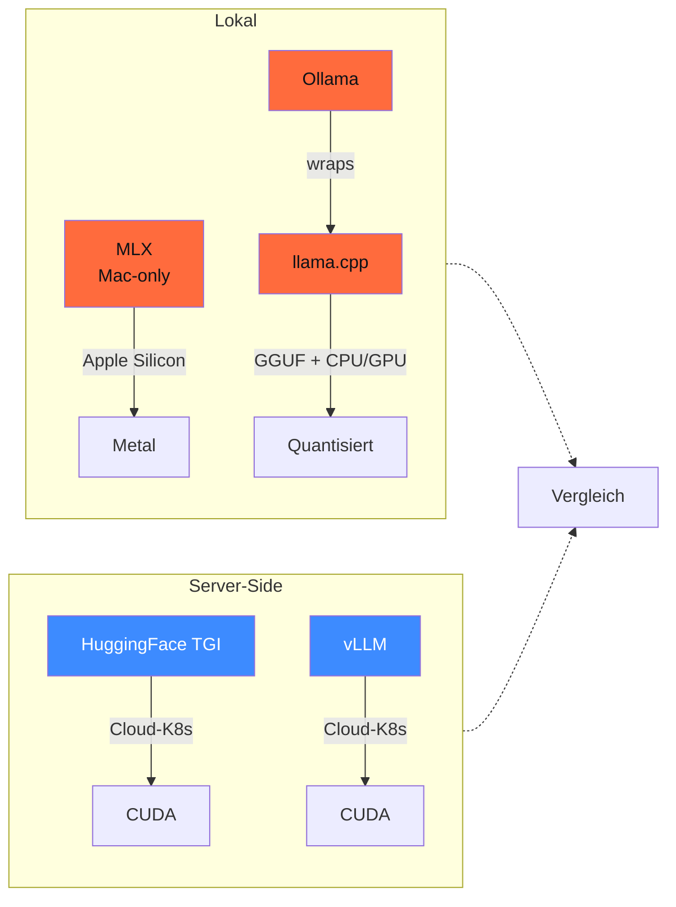

<!-- colab-badge:begin -->
[](https://colab.research.google.com/github/s-a-s-k-i-a/ki-engineering-werkstatt/blob/main/dist-notebooks/phasen/17-production-und-eu-hosting/code/01_eu_hosting_selector.ipynb)
<!-- colab-badge:end -->

## Worum es geht

> Stop sending PII to cloud APIs when your laptop can do it. — 70 % der RAG- und Klassifikations-Tasks laufen 2026 lokal auf Mac mini M4 oder NVIDIA L4. Was du brauchst: ein Modell, eine Engine, GGUF/SafeTensors. Was du nicht brauchst: einen Cloud-Account.

## Voraussetzungen

- Phase 00.01 (Hardware-Matrix) — du kennst dein VRAM-/RAM-Budget.
- Phase 11.05 (Anbieter-Vergleich) — du kennst die EUR-Kosten der Cloud-Alternative.

## Konzept

### Die vier Engines im Überblick



| Engine | Stärke | Schwäche | Wann nutzen |
|---|---|---|---|
| **Ollama** | One-liner-Setup, schöne API, Auto-Updates | wrapt llama.cpp, weniger Kontrolle | Dev-Maschine, Quick-Demos, Mac/Linux-User |
| **llama.cpp** | maximale Kontrolle, alle Quant-Formate, Embeddings, GPU+CPU | manuelles Setup, C++ kompilieren | Production-Single-Box, Edge-Devices |
| **MLX** | natives Apple Silicon (Metal-API), 4-bit-Quant out-of-the-box | nur Mac, kleinere Community | Mac-only-Stack, Rapid-Prototyping |
| **TGI** (HuggingFace) | Hub-Integration, Continuous Batching, Helm-Chart | Java/Rust/Python-Mix, Cloud-fokussiert | wenn HF-Hub-zentriert + K8s |

### Quantisierung — VRAM-Realitäts-Check

Das wichtigste Konzept für lokale Inferenz: **Quantisierung** verkleinert Modell-Gewichte von FP16 auf 4 oder 8 Bit. Damit passt ein 70B-Modell auf eine 48-GB-RTX-PRO-6000.

| Quant-Stufe | Bits | VRAM-Bedarf 70B | Qualitäts-Verlust | Empfehlung |
|---|---|---|---|---|
| FP16 / BF16 | 16 | ~ 140 GB | 0 % (Baseline) | nur Server-GPU |
| Q8_0 | 8 | ~ 70 GB | < 1 % | beste Quant für Mac M3 Ultra |
| Q5_K_M | 5 | ~ 49 GB | ~ 1–2 % | Sweet-Spot 70B auf RTX 6000 |
| **Q4_K_M** | 4 | ~ 42 GB | ~ 2–4 % | Standard 2026 für lokale Production |
| Q3_K_M | 3 | ~ 32 GB | ~ 5–8 % | Notnagel bei 32 GB VRAM |

> Faustregel: für DACH-Mittelstand-Use-Cases (RAG, Klassifikation, Übersetzung) ist **Q4_K_M auf 70B** qualitativ ausreichend und 5–10× günstiger als Cloud-Inferenz.

### Ollama — der Standard für Schritt 1

Stand 04/2026: Ollama v0.22.0 (verifiziert in `phasen/00-werkzeugkasten/lektionen/01-hardware-matrix.md`).

```bash
# Installation
brew install ollama          # macOS
curl https://ollama.com/install.sh | sh   # Linux

# Modell ziehen + serven
ollama pull llama3.3:70b-instruct-q4_K_M
ollama serve  # läuft auf :11434

# OpenAI-kompatible API
curl http://localhost:11434/v1/chat/completions \
  -H "Content-Type: application/json" \
  -d '{
    "model": "llama3.3:70b-instruct-q4_K_M",
    "messages": [{"role":"user","content":"Was ist DSGVO Art. 5?"}]
  }'
```

**Ollama-Modell-Library** ist Stand 04/2026 mit allen 2025/26-Familien synchron: Llama 3.3, Mistral Nemo, Qwen3, DeepSeek-R1-distill, Phi-4, Pharia-1 (manuell als GGUF importierbar).

### llama.cpp — wenn du Kontrolle brauchst

Wenn Ollama zu viel abstrahiert (z. B. für Embedding-Server, Multi-User-Production):

```bash
git clone https://github.com/ggerganov/llama.cpp
cd llama.cpp && make GGML_CUDA=1   # CUDA-Build
./llama-server \
    -m models/llama-3.3-70b-instruct-Q4_K_M.gguf \
    --port 8080 --ctx-size 32768 \
    --n-gpu-layers 99 --parallel 4
```

Vorteile gegenüber Ollama:

- Eigener `--system-prompt`-File pro Worker
- Granulare GPU-Layer-Aufteilung (`--n-gpu-layers`)
- Feinkontrolle über Sampling, RoPE-Skalierung
- Eingebauter Embedding-Endpoint (`/embedding`)

### MLX — Apple Silicon Native

Falls du auf einem M3 Ultra oder M4 Max arbeitest:

```bash
pip install mlx-lm

# 4-bit auf der Apple Neural Engine
python -m mlx_lm.generate \
    --model mlx-community/Llama-3.3-70B-Instruct-4bit \
    --prompt "Was ist DSGVO Art. 5?"
```

**MLX vs. llama.cpp auf Mac**: MLX ist 10–20 % schneller bei Token-Generation auf M3/M4, aber llama.cpp hat das größere Quant-Format-Spektrum und CPU-Fallback. Für Production: meistens llama.cpp, weil portabler.

### TGI — wenn der Stack HuggingFace-zentriert ist

Text Generation Inference (HuggingFace) ist die offizielle Production-Engine im HF-Ökosystem. Stand 04/2026: TGI v3.x mit Continuous Batching und Helm-Chart.

```bash
# Docker-Beispiel
docker run --gpus all --shm-size 1g -p 8080:80 \
  -v $PWD/data:/data \
  ghcr.io/huggingface/text-generation-inference:latest \
  --model-id meta-llama/Llama-3.3-70B-Instruct \
  --quantize bitsandbytes-nf4
```

**Wann TGI**: wenn dein Team mit HF-Inference-Endpoints arbeitet und du auf Self-Hosted migrierst. Sonst meistens vLLM (Lektion 17.02) für reine Performance.

### Wann lokal vs. EU-Cloud — Entscheidungs-Tabelle

| Anforderung | Lokal | EU-Cloud |
|---|---|---|
| Token-Volumen | < 10M Tokens/Monat | > 50M Tokens/Monat |
| Latenz-Budget | 200 ms+ ok (lokale GPU) | 100 ms p95 (gehostet) |
| Skalierung | 1–10 Concurrent | 100+ Concurrent |
| Compliance | absolute Daten-Residenz, Forschung, Gesundheit | DSGVO + AVV mit EU-Hoster ok |
| Kosten | 1× CapEx (GPU-Box ~ 5–8 k€), dann nur Strom | OpEx ~ 0,5–10 € / 1M Tokens |

**Faustregel 2026**: für ≤ 10 Mitarbeiter + ≤ 5M Tokens/Monat ist eine Mac mini M4 Pro (64 GB) mit Llama-3.3-70B-Q4 schon genug. Ab dem Punkt: vLLM auf STACKIT/IONOS/OVH (Lektionen 17.02 + 17.04).

## Hands-on

Setze 3 Mini-Tests auf deiner Maschine:

1. **Ollama-Quickstart**: `ollama run llama3.3:70b-instruct-q4_K_M` und stelle 5 deutsche Fragen. Latenz messen.
2. **VRAM-Check**: lade ein 70B-Q4 und ein 70B-Q5_K_M, dokumentiere VRAM-Differenz.
3. **API-Test**: rufe `localhost:11434/v1/chat/completions` aus Python — strukturiertes JSON zurück.

## Selbstcheck

- [ ] Du erklärst den Unterschied zwischen Ollama, llama.cpp, MLX und TGI.
- [ ] Du wählst die richtige Quant-Stufe für dein VRAM-Budget.
- [ ] Du hast Ollama lokal laufen mit OpenAI-kompatibler API.
- [ ] Du kennst die Entscheidungs-Tabelle „lokal vs. EU-Cloud".

## Compliance-Anker

- **Drittland-Transfer (DSGVO Art. 44)**: lokale Inferenz heißt **kein** Datentransfer in Drittländer — DSGVO-Risiko entfällt für PII-haltige Prompts.
- **Daten-Residenz**: bei sensiblen Mandaten (Gesundheit, Recht) ist lokale Inferenz oft die einzig saubere Option.
- **TOM (Art. 32)**: GPU-Box gehört in den abgeschlossenen Server-Raum, mit Audit-Logging am Endpoint.

## Quellen

- Ollama Library — <https://ollama.com/library> (Zugriff 2026-04-28)
- llama.cpp GitHub — <https://github.com/ggerganov/llama.cpp>
- MLX Examples — <https://github.com/ml-explore/mlx-examples>
- HuggingFace TGI — <https://github.com/huggingface/text-generation-inference>
- GGUF-Spec — <https://github.com/ggerganov/ggml/blob/master/docs/gguf.md>

## Weiterführend

→ Lektion **17.02** (vLLM für Server-Side-Production)
→ Lektion **17.04** (EU-Cloud-Stack — wann es sich lohnt zu skalieren)
→ Phase **00.01** (Hardware-Matrix mit konkreten Mac- und PC-Konfigurationen)
