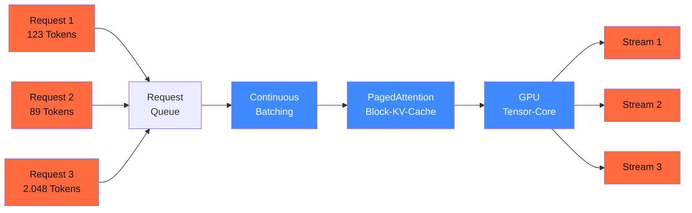

## Worum es geht

> Stop running your 8B-model with 5 % GPU-utilization. — vLLM ist 2026 der Production-Standard für Self-Hosted-Inferenz. Continuous Batching und PagedAttention zusammen geben dir 3–5× Throughput gegenüber naivem `transformers.generate()`. Die offizielle Stable-Version Stand 28.04.2026 ist **v0.20.0** ([Release-Notes](https://github.com/vllm-project/vllm/releases)).

## Voraussetzungen

- Lektion 17.01 (lokale Engines, Quantisierung, GGUF)
- NVIDIA-GPU mit CUDA 12.4+ (alternativ ROCm 6.x für AMD)

## Konzept

### Was vLLM eigentlich macht



#### 1. Continuous Batching

Naive Inferenz: ein Request wird komplett abgearbeitet, dann der nächste. GPU-Utilization: oft < 30 %.

vLLM: **jeder Token-Generation-Step** prüft, ob neue Requests in den Batch passen. Ein 5-Token-Request kann mit einem 2.000-Token-Request parallel laufen, beide nutzen die GPU optimal. Ergebnis: 60–90 % Utilization, 3–5× Throughput.

#### 2. PagedAttention

Naiver KV-Cache: alloziert die maximale Sequenzlänge pro Request. Verschwendung, wenn Requests kürzer sind.

vLLM: KV-Cache wird in **Pages à 16 Tokens** aufgeteilt. Pages werden dynamisch zugewiesen wie Memory-Pages im OS. Plus: gemeinsame Prefixes (System-Prompt) werden **nur einmal** im KV-Cache gespeichert — Sharing zwischen parallelen Requests.

#### 3. Automatic Prefix Caching

Stand v0.20.0 als Default aktiv: identische Prompt-Prefixes werden beim ersten Treffen ge-cached. Folge-Requests mit demselben System-Prompt sparen 80–95 % der Prefill-Compute.

### Installation + Quickstart

```bash
# CUDA-Setup (NVIDIA)
uv pip install "vllm==0.20.0"

# OpenAI-kompatibler Server
uv run python -m vllm.entrypoints.openai.api_server \
    --model meta-llama/Llama-3.3-70B-Instruct \
    --quantization awq \
    --max-model-len 32768 \
    --gpu-memory-utilization 0.92 \
    --tensor-parallel-size 1 \
    --port 8000
```

Wichtigste Flags:

| Flag | Zweck |
|---|---|
| `--quantization` | `awq`, `gptq`, `fp8`, `bitsandbytes`, `compressed-tensors` |
| `--max-model-len` | Context-Length-Limit (RAM-Schutz) |
| `--gpu-memory-utilization` | wie viel VRAM vLLM reservieren darf (0.92 = 92 %) |
| `--tensor-parallel-size` | für Multi-GPU-Setups (= Anzahl GPUs) |
| `--enable-lora` | aktiviert LoRA-Adapter-Hot-Swap |
| `--enable-prefix-caching` | aktiv per Default seit v0.20.0 |
| `--speculative-config` | Speculative Decoding mit Draft-Modell |

### Quantisierungs-Pfade in vLLM v0.20.0

| Quantisierung | Bits | Geschwindigkeit | Qualität | Use-Case |
|---|---|---|---|---|
| **FP8** (NVIDIA H100/H200) | 8 | sehr hoch | nahe FP16 | Hopper-GPUs, beste TCO |
| **AWQ** | 4 | hoch | gut | Llama-Familie, viele HF-Models |
| **GPTQ** | 4 | hoch | gut | breites Modell-Spektrum |
| **INT4** | 4 | hoch | mittel | knappes VRAM |
| **TurboQuant 2-bit KV-Cache** | 2 (KV) | sehr hoch | sehr gut | NEU in 0.20.0 — KV-Cache halbiert |
| **Bitsandbytes-NF4** | 4 | mittel | mittel | dynamisch, kein Pre-Quantize |

> **TurboQuant** (Speculative-Decoder-2-bit-KV-Cache, neu in v0.20.0) ist das größte Throughput-Update 2026: bei prefix-heavy Workloads (RAG, Multi-Turn) verdoppelt sich der effektive Batch-Größe.

### LoRA Hot-Swap

Wenn du mehrere Fine-Tunes derselben Basis hast (z. B. ein Fachsprachen-LoRA für Recht, eines für Medizin):

```bash
uv run python -m vllm.entrypoints.openai.api_server \
    --model mistralai/Mistral-7B-Instruct-v0.3 \
    --enable-lora \
    --lora-modules \
        recht=./loras/recht-de \
        medizin=./loras/medizin-de \
    --max-loras 4
```

Pro Request:

```bash
curl http://localhost:8000/v1/chat/completions \
  -d '{
    "model": "recht",
    "messages": [{"role":"user","content":"DSGVO Art. 5 erklären."}]
  }'
```

Vorteil: ein einziger 7B-Server kann beliebig viele LoRA-Spezialisierungen bedienen, ohne pro Adapter eine eigene GPU zu brauchen.

### vLLM Production Stack — der offizielle Helm-Chart

Stand 04/2026 gibt es den **offiziellen** Helm-Chart `vllm-project/production-stack` ([github.com/vllm-project/production-stack](https://github.com/vllm-project/production-stack)). Was er mitbringt:

- **Multi-Replica vLLM** mit Round-Robin oder Session-Routing
- **LMCache**-Integration: KV-Cache-Offload auf RAM/Disk/Distributed
- **Prometheus + Grafana**-Dashboard out-of-the-box
- **Autoscaling** über HPA (CPU/GPU-Util, Token-Throughput)

```yaml
# values.yaml — Beispiel-Skelett
servingEngineSpec:
  modelSpec:
    - name: "llama33-70b-awq"
      model: "meta-llama/Llama-3.3-70B-Instruct"
      quantization: "awq"
      replicaCount: 2
      resources:
        gpuCount: 2  # 2× H100
      envFromSecret: "hf-token"
```

Das Chart läuft auf jedem K8s mit NVIDIA GPU-Operator — **auch auf STACKIT Kubernetes Engine (SKE)** und OVHcloud Managed K8s ([SKE GPU-Doku](https://docs.stackit.cloud/products/runtime/kubernetes-engine/how-tos/use-nvidia-gpus/), Stand 04/2026).

### Performance-Faustregel 2026

Bei einer NVIDIA H100 (80 GB) mit Llama-3.3-70B-AWQ:

- **Single-Stream-Latency**: ~ 30–50 Tokens/s
- **Concurrent Throughput**: ~ 1.500–2.500 Tokens/s aggregiert (16 Concurrent)
- **TTFT** (Time to First Token): ~ 200–400 ms p50

Bei H200 (141 GB): Throughput nochmal +25 %, plus full-context Llama-3.3 ohne Quantisierung möglich.

### Beobachtbarkeit

vLLM exposed `/metrics` als Prometheus-Endpoint. Wichtigste Metriken:

| Metrik | Bedeutung |
|---|---|
| `vllm:gpu_cache_usage_perc` | KV-Cache-Auslastung — wenn > 90 %, drohen Out-of-Memory-Errors |
| `vllm:num_requests_running` | aktive Requests |
| `vllm:num_requests_waiting` | Backlog (wenn > 0 dauerhaft → mehr Replicas) |
| `vllm:time_to_first_token_seconds` | TTFT-Histogramm |
| `vllm:time_per_output_token_seconds` | Token-Latenz-Histogramm |

In Lektion 17.08 binden wir diese an Phoenix / Langfuse für full GenAI-Observability.

## Hands-on

Setze vLLM auf einer NVIDIA-GPU oder via Docker auf:

1. Llama-3.3-8B mit AWQ starten, OpenAI-API testen
2. Benchmark: `vllm.entrypoints.api_server` mit 16 parallelen Requests — Throughput messen
3. LoRA-Adapter laden (z. B. ein deutsch-feinjustiertes 8B), Adapter-Switch live verifizieren
4. `/metrics` an Prometheus anbinden, GPU-Cache-Usage über 5 Minuten plotten

## Selbstcheck

- [ ] Du erklärst Continuous Batching, PagedAttention und Prefix Caching.
- [ ] Du wählst die richtige Quantisierung für dein VRAM und deine Modellfamilie.
- [ ] Du startest vLLM v0.20.0 mit OpenAI-kompatibler API.
- [ ] Du nutzt LoRA-Hot-Swap für mehrere Spezialisierungen.
- [ ] Du kennst den offiziellen `production-stack`-Helm-Chart.

## Compliance-Anker

- **Daten-Residenz (DSGVO Art. 44)**: vLLM auf EU-Cloud-K8s = kein Drittland-Transfer.
- **Audit-Logging (AI-Act Art. 12)**: vLLM-Logs lassen sich strukturiert nach JSON exportieren — pflicht für Hochrisiko, siehe Phase 20.05.
- **Robustness (Art. 15)**: Cost-Caps + Token-Limits über `--max-num-seqs` + LiteLLM-Proxy (Lektion 17.07).

## Quellen

- vLLM Releases (v0.20.0 27.04.2026) — <https://github.com/vllm-project/vllm/releases>
- vLLM Features Doc — <https://docs.vllm.ai/en/stable/features/>
- vLLM Production Stack — <https://github.com/vllm-project/production-stack>
- vLLM Supported Models — <https://docs.vllm.ai/en/stable/models/supported_models.html>
- NVIDIA vLLM Release Notes 04/2026 — <https://docs.nvidia.com/deeplearning/frameworks/vllm-release-notes/>
- Original PagedAttention Paper (Kwon et al. 2023) — <https://arxiv.org/abs/2309.06180>

## Weiterführend

→ Lektion **17.03** (SGLang als RadixAttention-Alternative)
→ Lektion **17.06** (Helm-Chart-Deployment auf EU-Cloud-K8s)
→ Lektion **17.08** (Phoenix / Langfuse — vLLM-Metrics tracen)
