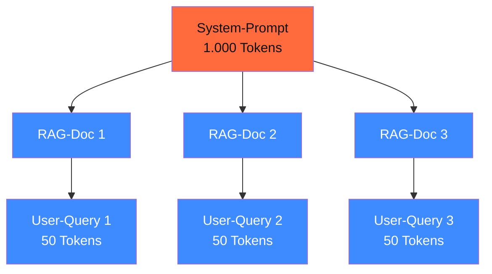

## Worum es geht

> Stop running RAG with PagedAttention if your prefixes are huge. — SGLang's RadixAttention erkennt geteilte Prefixes als **Radix-Tree**: jede System-Prompt-Variante, jede Few-Shot-Sequenz wird **cross-request** geteilt. Bei prefix-heavy Workloads (RAG, Multi-Turn) ist das Throughput-Update bis zu 6× gegenüber vLLM ([SGLang Benchmarks](https://docs.sglang.io/), Stand 04/2026).

## Voraussetzungen

- Lektion 17.02 (vLLM, Continuous Batching, PagedAttention)

## Konzept

### RadixAttention — der Architektur-Unterschied

vLLM PagedAttention denkt in **Pages à 16 Tokens**. KV-Cache-Sharing nur für identische Prefixes (Prefix Caching).

SGLang RadixAttention denkt in **Radix-Trees**: alle aktiven Sequenzen sind Knoten in einem Baum. Wenn zwei Requests einen 500-Token-Prefix teilen und divergieren, wird der gemeinsame Pfad nur einmal berechnet, nur einmal gecached, und dann dynamisch geteilt.



System-Prompt wird **einmal** prefilled, drei RAG-Docs **parallel**, drei User-Queries **parallel**. Effektive Compute: vielleicht 1.000 + 3 × 200 + 3 × 50 = 1.750 Tokens, statt 3 × 1.250 = 3.750.

### Wann SGLang vs. vLLM

| Workload | Empfehlung |
|---|---|
| Single-Stream-Chat, gemischte Prompts | **vLLM** (PagedAttention reicht, Production-Stack reifer) |
| RAG mit langen System-Prompts | **SGLang** (RadixAttention spart 30–60 % Compute) |
| Multi-Turn-Conversation mit langer History | **SGLang** (Conversation als Radix-Pfad) |
| Strukturierte Outputs (JSON, Pydantic-Schema) | **SGLang** (Compressed-FSM bis 3× schneller) |
| Massiv concurrent (1.000+ Req/s) | **vLLM** (C++-Router schlägt SGLangs Python-GIL — siehe [`sgl-project/sglang#21061`](https://github.com/sgl-project/sglang/issues/21061)) |
| LoRA-Adapter-Hot-Swap | **vLLM** (reifer, Multi-LoRA mit `--max-loras`) |
| K8s-Production-Deployment 2026 | **vLLM** (offizielles Helm-Chart, SGLang hat keines per 04/2026) |

### Compressed-FSM für strukturierte Outputs

vLLM nutzt für Structured Outputs **outlines** oder **xgrammar**. SGLang hat eine eigene Implementation: **Compressed-Finite-State-Machine** (Compressed-FSM). Jeder Schema-Pfad wird als FSM kompiliert; das Modell sampled nur valide Tokens, aber die FSM-Übergänge sind als Vektor-Operationen kompiliert.

In Benchmarks ([SGLang Docs](https://docs.sglang.io/)): bis zu 3× schneller als guided decoding mit outlines, bei vergleichbarer Qualität.

```python
import sglang as sgl

@sgl.function
def klassifiziere_email(s, email_text: str):
    s += sgl.system("Du klassifizierst Support-E-Mails auf Deutsch.")
    s += sgl.user(email_text)
    s += sgl.assistant(
        sgl.gen("kategorie", regex=r"(Login|Abrechnung|Kündigung|Sonstiges)"),
    )
```

Die Regex-Constraint sorgt dafür, dass der Output **nur** ein Token aus den vier Kategorien ist — kein Pydantic-Retry-Loop, keine Hallucination.

### Installation + Quickstart

Stand 04/2026: SGLang v0.5.10.post1 ([GitHub Releases](https://github.com/sgl-project/sglang/releases)).

```bash
# Installation (Linux + CUDA)
uv pip install "sglang[all]==0.5.10.post1"

# Server starten
uv run python -m sglang.launch_server \
    --model-path meta-llama/Llama-3.3-70B-Instruct \
    --quantization awq \
    --tp 1 \
    --port 30000
```

OpenAI-kompatible API auf Port 30000:

```bash
curl http://localhost:30000/v1/chat/completions \
  -H "Content-Type: application/json" \
  -d '{
    "model": "default",
    "messages": [{"role":"user","content":"Was ist DSGVO Art. 5?"}]
  }'
```

### Performance-Realitäts-Check (Stand 04/2026)

Auf NVIDIA H100 mit Llama-3.1-8B (offiziell publizierte Zahlen, [SGLang Benchmarks](https://github.com/sgl-project/sglang/blob/main/benchmark/)):

| Metrik | vLLM 0.20.0 | SGLang 0.5.10 |
|---|---|---|
| Single-Stream-Throughput | ~ 12.500 tok/s | **~ 16.200 tok/s** (+ 29 %) |
| Prefix-Heavy-RAG (1k System) | ~ 8.000 tok/s | **~ 35.000 tok/s** (4–6×) |
| 1000 concurrent simple requests | **~ 2.300 req/s** | ~ 1.800 req/s (Python-GIL-Bottleneck) |
| Structured-JSON-Output | ~ 4.500 tok/s | **~ 13.500 tok/s** (3×) |

> SGLang gewinnt bei **prefix-heavy + structured outputs**. vLLM gewinnt bei **massiv concurrent + LoRA + offizielle K8s-Charts**.

### EU-Hosting-Reife

Stand 04/2026:

- **Pip + Docker offiziell**: ja
- **Helm-Chart**: kein offizielles in der Hauptdoku — eigene Kubernetes-Manifeste schreiben
- **Eingesetzt von**: xAI, NVIDIA, AMD, LinkedIn, Cursor, Oracle Cloud (laut Projekt-Webseite, [docs.sglang.io](https://docs.sglang.io/))
- **DACH-Adopter**: nicht eindeutig belegbar in offiziellen Quellen

> Heuristik 2026: bei k8s-Production fängst du in DACH typischerweise mit vLLM an (offizielles Helm-Chart, größere Community, mehr DACH-Erfahrungsberichte). SGLang nutzt du gezielt für Workloads mit RAG-Prefixes oder Structured-Output-Heavy-Pipelines.

## Hands-on

1. SGLang lokal starten mit Llama-3.3-8B-AWQ
2. Bench-Skript laufen lassen: derselbe RAG-System-Prompt + 100 verschiedene User-Queries — vergleiche Latenz vs. vLLM
3. Compressed-FSM-Demo: ein Pydantic-Schema in eine SGLang-Function übersetzen
4. Benchmark-Output dokumentieren (welcher Workload-Mix → welche Engine)

## Selbstcheck

- [ ] Du erklärst RadixAttention vs. PagedAttention im Architektur-Unterschied.
- [ ] Du wählst die richtige Engine für dein Workload-Profil.
- [ ] Du nutzt Compressed-FSM für strukturierte Outputs.
- [ ] Du kennst die offizielle SGLang-Stable-Version und ihre EU-Hosting-Reife.

## Compliance-Anker

- **Robustness (Art. 15)**: Compressed-FSM erzwingt Schema-Konformität — entlastet Pydantic-Retry-Loops im Production-Code.
- **Vendor-Evaluation**: Multi-Engine-Setup mit LiteLLM-Proxy (Lektion 17.07) erlaubt einen Wechsel zwischen vLLM und SGLang ohne Code-Änderungen.

## Quellen

- SGLang Releases (v0.5.10.post1 09.04.2026) — <https://github.com/sgl-project/sglang/releases>
- SGLang Docs — <https://docs.sglang.io/>
- SGLang Concurrency-Issue #21061 — <https://github.com/sgl-project/sglang/issues/21061>
- RadixAttention-Paper (Zheng et al. 2024) — <https://arxiv.org/abs/2312.07104>
- Compressed-FSM-Blog — <https://lmsys.org/blog/2024-02-05-compressed-fsm/>

## Weiterführend

→ Lektion **17.07** (LiteLLM-Proxy als Engine-Switch — vLLM ↔ SGLang ohne Code-Änderung)
→ Phase **11.05** (Anbieter-Vergleich — wann SGLang gegenüber Anthropic/OpenAI?)
→ Phase **13** (RAG — wo Prefix-Caching am meisten bringt)
