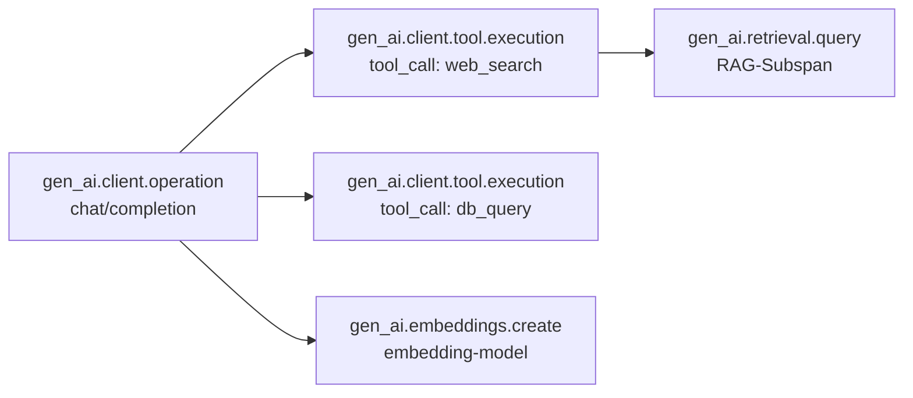

## Worum es geht

> Stop debugging in production with print-statements. — 2026 ist GenAI-Observability ausgereift: OpenTelemetry GenAI Semantic Conventions, Phoenix v14.15 (Stand 04/2026), Langfuse v3.171, plus offizielle Helm-Charts. Ohne Tracing kein AI-Act-Compliance, kein DSFA-tauglicher Audit-Trail.

## Voraussetzungen

- Phase 11.10 (OTel GenAI + Phoenix Basics)
- Lektion 17.07 (LiteLLM als Trace-Source)

## Konzept

### OpenTelemetry GenAI Semantic Conventions

Stand 04/2026: die **GenAI-Spans-Spec** ist W3C-Convention für LLM-Calls und Agent-Operations ([opentelemetry.io/docs/specs/semconv/gen-ai/](https://opentelemetry.io/docs/specs/semconv/gen-ai/)). Was getraced wird:



Wichtigste Attribute (Stand W3C-Spec):

| Attribut | Beispiel |
|---|---|
| `gen_ai.system` | `anthropic` / `openai` / `mistral` |
| `gen_ai.request.model` | `claude-sonnet-4-6` |
| `gen_ai.request.temperature` | `0.7` |
| `gen_ai.usage.input_tokens` | `1234` |
| `gen_ai.usage.output_tokens` | `567` |
| `gen_ai.usage.cache_read_input_tokens` | `890` |
| `gen_ai.response.id` | `msg_01abc...` |
| `gen_ai.response.finish_reasons` | `["stop"]` |
| `gen_ai.tool.call.id` | `toolu_01...` |
| `gen_ai.tool.name` | `freie_termine` |

### Phoenix vs. Langfuse — wann was?

| Feld | Phoenix v14.15 | Langfuse v3.171 |
|---|---|---|
| **Self-Host-Komplexität** | niedrig (Docker / Helm + Postgres) | mittel (Postgres + ClickHouse + Redis + S3) |
| **Managed EU-Region** | nein (nur self-hosted) | ja (Frankfurt / AWS eu-central-1) |
| **Eval-Tools** | reif: Promptfoo, Ragas, RAG-Eval | gut: Ragas-Integration, eigene Evals |
| **Annotation-UX** | sehr gut (Notebook-zentriert) | gut (Web-UI) |
| **Cost-Tracking** | rudimentär | reif (mit Modell-Preistabelle) |
| **DACH-Hosting** | self-hosted EU-K8s | EU-Managed (Frankfurt) ODER Helm self-hosted |
| **DSGVO/AVV (managed)** | n/a | DPA + ISO 27001 + SOC 2 Type II |
| **Framework-Integration** | OpenInference (alle), inkl. Pydantic AI, MCP, LangGraph | native Wrapper für OpenAI, Anthropic, Pydantic AI, LangGraph |
| **Wann?** | Eval + Notebook + Self-Hosted | Production-Ops + Cost-Dashboards + Managed EU |

Kombinieren ist möglich (beide tracen denselben Stack), aber meistens entscheidest du dich für eines.

### Phoenix v14 — Setup

Stand 04/2026: arize-phoenix v14.15.0 (26.04.2026), arize-phoenix-evals v3.0.0 (Eval-2.0-Rewrite vom 07.04.2026). v14.0.0 brachte Breaking Changes (CLI-Restruktur, Legacy-Client-Removal).

**Helm-Install:**

```bash
helm repo add arize https://docs.arize.com/phoenix-helm
helm install phoenix arize/phoenix \
    --namespace observability --create-namespace \
    --set storage.postgresql.enabled=true \
    --set ingress.enabled=true \
    --set ingress.host=phoenix.example.de
```

App-Side: Auto-Instrumentation:

```python
import os
os.environ["PHOENIX_COLLECTOR_ENDPOINT"] = "https://phoenix.example.de"

from phoenix.otel import register
tracer_provider = register(
    project_name="ki-engineering-werkstatt-prod",
    auto_instrument=True,
)
```

Das war's — alle nachfolgenden Calls (Pydantic AI, LangGraph, OpenAI, Anthropic, MCP via Context-Propagation) werden automatisch ge-traced.

**Pydantic AI explizit:**

```python
# pip install openinference-instrumentation-pydantic-ai
from openinference.instrumentation.pydantic_ai import PydanticAIInstrumentor
PydanticAIInstrumentor().instrument(tracer_provider=tracer_provider)
```

**LangGraph:**

```python
# pip install openinference-instrumentation-langchain
from openinference.instrumentation.langchain import LangChainInstrumentor
LangChainInstrumentor().instrument(tracer_provider=tracer_provider)  # deckt LangGraph
```

### Langfuse v3 — Setup

Stand 04/2026: Backend v3.171.0 (27.04.2026), Python-SDK v4.5.1.

**Managed EU (einfachster Pfad):**

1. Account auf <https://cloud.langfuse.com> (EU-Region wählen, Frankfurt)
2. DPA signieren ([Langfuse DPA](https://langfuse.com/security/dpa))
3. API-Keys generieren, in `.env`

```python
from langfuse import Langfuse

langfuse = Langfuse(
    secret_key="sk-lf-...",
    public_key="pk-lf-...",
    host="https://cloud.langfuse.com",  # EU-Region: Frankfurt
)
```

**Pydantic AI:**

```python
# Langfuse v3 nutzt OTel-Bridge via Logfire
import logfire
logfire.configure(send_to_logfire="if-token-present")

# Pydantic AI loggt automatisch zu Logfire → Langfuse via OTel-Export
```

**LangGraph:**

```python
from langfuse.callback import CallbackHandler

handler = CallbackHandler(public_key="...", secret_key="...", host="...")
graph.invoke(state, config={"callbacks": [handler]})
```

**Self-Hosting via Helm:**

→ siehe Lektion 17.06 — Beachte Bitnami-Image-Restruktur (28.08.2025).

### Was tracen, was nicht

| Trace-Pflicht (AI-Act Art. 12) | Trace-optional |
|---|---|
| Modell-Aufrufe (Provider, Model, Tokens, Latency) | Healthchecks |
| Tool-Calls (Tool-Name, Args, Response) | Cache-Hits (aggregierte Metriken reichen) |
| User-/Mandant-Pseudonym (Hash) | Internal-Requests zwischen Microservices |
| Errors mit Stack-Trace + Context | Debug-Logs mit personenbezogenen Daten |
| Multi-Agent-Sub-Span-Struktur | Synthetische Smoke-Test-Calls |

### PII-Filter im OTel-Processor

Phoenix selber hat **keinen** dedizierten PII-Filter (Stand 04/2026 — Enterprise-Feature in Arize AX). DIY-Pattern via OTel-Span-Processor:

```python
from opentelemetry.sdk.trace import SpanProcessor
from hashlib import sha256

class PIIRedactionProcessor(SpanProcessor):
    def on_end(self, span):
        for key, value in list(span.attributes.items()):
            if key.endswith(".prompt") or key.endswith(".content"):
                # Hash statt Klartext
                hashed = sha256(str(value).encode()).hexdigest()[:16]
                span._attributes[key] = f"<redacted:{hashed}>"

# Bei tracer_provider registrieren
tracer_provider.add_span_processor(PIIRedactionProcessor())
```

> **Wichtig (DSGVO Art. 25 — Privacy by Design)**: PII-Redaction muss **vor** Export passieren, nicht nachträglich auf dem Backend. Sonst landen Klartext-Prompts auf Phoenix-Postgres.

### Aufbewahrungsfrist + Rotation

Stand 04/2026 für DACH-Hochrisiko-KI:

| Datenart | Aufbewahrung |
|---|---|
| Audit-Logs (AI-Act Art. 12) | **mindestens 6 Monate**, in Praxis 12–24 Monate |
| User-Pseudonym-Mapping | bis Right-to-be-Forgotten-Request |
| Aggregierte Metriken | 5 Jahre (TCO + Modell-Vergleichs-Lernen) |
| Eval-Datasets | unlimited (Reproducibility) |

```yaml
# Phoenix-Postgres: Daily-Cron für Spans älter als 12 Monate
DELETE FROM spans WHERE start_time < NOW() - INTERVAL '12 months';
```

### Observability-Checkliste vor Production

- [ ] Self-hosted Phoenix oder Langfuse-EU-Region verfügbar
- [ ] Auto-Instrumentation für Pydantic AI / LangGraph / vLLM-Server
- [ ] PII-Redaction-Span-Processor aktiv
- [ ] Aufbewahrungsfristen + Rotation konfiguriert
- [ ] Cost-Dashboard verlinkt (Lektion 17.09)
- [ ] Alert-Routing zu Slack / PagerDuty
- [ ] Eval-Suite mit Promptfoo / Ragas (Lektion 11.08, 11.09)

## Hands-on

1. Phoenix v14 self-hosted via Docker-Compose oder Helm aufsetzen
2. Pydantic-AI-App auto-instrumentieren — drei Calls schicken
3. Phoenix-UI öffnen — Spans + Token-Counts + Latenzen sichtbar
4. PII-Redaction-Processor implementieren — Klartext-Prompts dürfen nicht im Span landen
5. Langfuse-Cloud-EU-Account erstellen, parallel die gleiche App tracen
6. Vergleich der UIs dokumentieren — Stärken / Schwächen für deinen Stack

## Selbstcheck

- [ ] Du erklärst die OpenTelemetry GenAI Semantic Conventions.
- [ ] Du wählst Phoenix oder Langfuse je nach Use-Case (Self-Host vs. Managed-EU).
- [ ] Du auto-instrumentierst Pydantic AI, LangGraph und vLLM.
- [ ] Du implementierst PII-Redaction im OTel-Processor.
- [ ] Du kennst die Aufbewahrungsfristen für AI-Act-konformes Audit-Logging.

## Compliance-Anker

- **Audit-Trail (AI-Act Art. 12)**: Tracing ist Pflicht für Hochrisiko-KI, Aufbewahrung ≥ 6 Monate.
- **Privacy by Design (DSGVO Art. 25)**: PII-Redaction **vor** Export.
- **TOM (Art. 32)**: Audit-DB encryptet at-rest, Backup-Strategie dokumentiert.
- **Transparenz (AI-Act Art. 13)**: Cost + Latenz pro User sind Teil der Information-Pflicht.

## Quellen

- OpenTelemetry GenAI Spec — <https://opentelemetry.io/docs/specs/semconv/gen-ai/>
- OpenTelemetry GenAI Spans — <https://opentelemetry.io/docs/specs/semconv/gen-ai/gen-ai-spans/>
- Phoenix Releases (v14.15.0 26.04.2026) — <https://github.com/Arize-ai/phoenix/releases>
- Phoenix Self-Hosting — <https://arize.com/docs/phoenix/self-hosting>
- Phoenix MCP-Tracing — <https://arize.com/docs/phoenix/integrations/python/mcp-tracing>
- OpenInference — <https://github.com/Arize-ai/openinference>
- Langfuse Releases (v3.171.0 27.04.2026) — <https://github.com/langfuse/langfuse/releases>
- Langfuse Self-Hosting — <https://langfuse.com/self-hosting/deployment/kubernetes-helm>
- Langfuse Data Regions — <https://langfuse.com/security/data-regions>
- Langfuse DPA — <https://langfuse.com/security/dpa>
- Langfuse Pydantic AI — <https://langfuse.com/integrations/frameworks/pydantic-ai>

## Weiterführend

→ Lektion **17.09** (Cost-Monitoring mit Grafana — was Phoenix/Langfuse füttern)
→ Phase **11.10** (OTel-GenAI Basics, falls noch nicht durch)
→ Phase **20.05** (Audit-Logging-Pipeline mit OTel + JSON-Lines)
