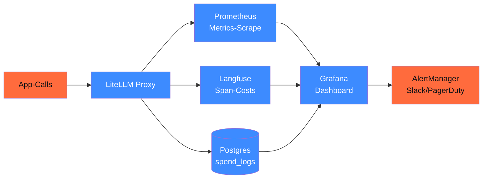

## Worum es geht

> Stop discovering 4-stelliger Token-Bills im nächsten Quartal. — Cost-Monitoring ist 2026 Pflicht für AI-Act Quality Management (Art. 17). Plus: 70 % der DACH-LLM-Pilotprojekte scheitern am Skalierungs-Cost. Ein Grafana-Dashboard mit klaren Budget-Lines hält den Stack bezahlbar.

## Voraussetzungen

- Lektion 17.07 (LiteLLM Cost-Tracking)
- Lektion 17.08 (Langfuse / Phoenix Observability)

## Konzept

### Cost-Pipeline-Architektur



### Drei Daten-Quellen, drei Granularitäten

| Quelle | Granularität | Use-Case |
|---|---|---|
| **Prometheus / LiteLLM `/metrics`** | Real-Time, aggregiert | Live-Dashboards, Alerts |
| **Postgres `spend_logs`** | Per-Call, transactional | Audit-Trail, Mandanten-Abrechnung |
| **Langfuse-Spans** | Per-Call, mit Trace-Context | Eval, Debugging, A/B-Vergleich |

### LiteLLM Prometheus Metrics

Stand v1.83.10 ([LiteLLM Prometheus](https://docs.litellm.ai/docs/proxy/prometheus)):

| Metrik | Bedeutung |
|---|---|
| `litellm_total_tokens` | Tokens pro Modell + User |
| `litellm_spend_metric` | EUR / USD / Cent pro Modell + User |
| `litellm_remaining_budget_metric` | Restbudget pro Virtual-Key |
| `litellm_request_total_latency_metric` | Latenz-Histogramm |
| `litellm_proxy_failed_requests_metric` | Fehler-Counter |
| `litellm_cache_hits_metric` | Cache-Hit-Counter |

### Grafana-Dashboard — der Mandanten-Stack

Empfohlene Panels:

```mermaid
flowchart TB
    Top["Header: Heute / 30 Tage / 90 Tage"]
    P1["Panel 1: EUR-Verbrauch pro Mandant<br/>(Time-Series)"]
    P2["Panel 2: Top-10-Modelle nach Spend<br/>(Bar-Chart)"]
    P3["Panel 3: Cache-Hit-Rate Mandant × Modell<br/>(Heatmap)"]
    P4["Panel 4: P95-Latency pro Modell<br/>(Time-Series)"]
    P5["Panel 5: EU vs. US-Routing-Anteil<br/>(Stacked Area)"]
    P6["Panel 6: Restbudget Top-10-Mandanten<br/>(Gauge-Reihe)"]
    P7["Panel 7: Anomalie-Alert-Log<br/>(Table)"]

    classDef p fill:#FF6B3D,color:#0E1116
    class P1,P2,P3,P4,P5,P6,P7 p
```



### Sample-Query: EUR-Verbrauch pro Mandant (Prometheus + LiteLLM)

```promql
# Heute, in EUR, pro Team
sum by (team_alias) (
    rate(litellm_spend_metric[24h])
) * 86400  # in absolut, nicht pro-Sekunde
```

```promql
# 7-Tages-Trend pro Mandant
sum by (team_alias) (
    increase(litellm_spend_metric[7d])
)
```

### Sample-Query: Cache-Hit-Rate

```promql
sum by (model) (rate(litellm_cache_hits_metric[5m]))
/
sum by (model) (rate(litellm_total_requests[5m]))
```

> Erwartung: bei einem stabilen Stack mit Anthropic Prompt-Cache + Redis-Semantic ist die Hit-Rate für Repeat-Use-Cases (Newsletter, Klassifikation) **> 60 %**. Wenn dauerhaft < 20 %: Cache-Strategie überprüfen (Lektion 17.10).

### Sample-Query: EU vs. US-Routing

LiteLLM-Metadata-Field `metadata.eu_compliant` durchreichen, dann:

```promql
sum by (eu_compliant) (rate(litellm_spend_metric[24h]))
```

Zielwert für DACH-Stack: **> 90 % EU**.

### Anomalie-Detection — drei Patterns

#### 1. Spend-Spike

```yaml
# Grafana / AlertManager-Rule
- alert: SpendSpike1h
  expr: |
    sum(increase(litellm_spend_metric[1h]))
    > 2 * sum(increase(litellm_spend_metric[1h] offset 24h))
  for: 5m
  labels:
    severity: warning
  annotations:
    summary: "Token-Spend ist 2× höher als gestern zur gleichen Zeit"
```

#### 2. Cache-Miss-Rate-Drift

```yaml
- alert: CacheHitRateDrop
  expr: |
    (
      sum(rate(litellm_cache_hits_metric[1h]))
      / sum(rate(litellm_total_requests[1h]))
    ) < 0.3
  for: 30m
  labels:
    severity: warning
```

#### 3. Provider-Mix-Drift (US-Routing-Anstieg)

```yaml
- alert: USRoutingShare
  expr: |
    (
      sum by () (rate(litellm_spend_metric{eu_compliant="false"}[24h]))
      / sum by () (rate(litellm_spend_metric[24h]))
    ) > 0.20
  for: 1h
  labels:
    severity: warning
  annotations:
    summary: "US-Routing-Anteil > 20 % — Compliance-Review nötig"
```

### TCO-Modell für DACH-Mittelstand

Faustregel-Modell für eine SaaS-App mit 500 aktiven Usern und ~ 50 LLM-Calls pro User pro Tag:

| Item | Kosten / Monat |
|---|---|
| 25.000 Tokens × 25.000 Calls × 30 Tage = ~ 18,75M Tokens | — |
| Default-Tier `claude-sonnet-4-6` ($ 3/$ 15 / 1M, EUR-Eq.) | ~ 280 € |
| Cache-Hit-Rate 50 % (Anthropic Prompt Cache 90 % Rabatt) | ~ 170 € (–40 %) |
| Plus: 20 % Fallback zu OVHcloud Llama 3.3 70B (€ 0,67 / 1M) | + 5 € |
| Plus: LiteLLM-Hosting (Hetzner CX-22) | + 4 € |
| Plus: Phoenix-Self-Hosted (Hetzner CX-32) | + 8 € |
| **Total** | **~ 200 €/Monat** |

> Vergleichsbasis ohne Cache + ohne Fallback: ~ 450 €/Monat. Cache + Routing-Disziplin sparen 55 % — das ist der ROI von Lektion 17.07 + 17.10.

### Audit-fähige Cost-Reports

Für AI-Act Quality Management (Art. 17) brauchst du monatliche Cost-Reports pro Use-Case. Pattern:

```python
# scripts/cost_report.py — wird per cron monatlich getriggert
import psycopg2
from datetime import datetime, timedelta
from pathlib import Path
import json

def monthly_cost_report(month: str) -> dict:
    conn = psycopg2.connect(LITELLM_DB_URL)
    cur = conn.cursor()
    cur.execute("""
        SELECT
            team_alias,
            model,
            COUNT(*) as call_count,
            SUM(total_tokens) as tokens,
            SUM(spend) as spend_eur,
            AVG(latency_ms) as avg_latency,
            SUM(CASE WHEN cache_hit THEN 1 ELSE 0 END)::float / COUNT(*) as cache_rate
        FROM spend_logs
        WHERE date_trunc('month', created_at) = %s
        GROUP BY team_alias, model
        ORDER BY spend_eur DESC
    """, (month,))
    rows = cur.fetchall()
    return [
        {
            "team": r[0], "model": r[1], "calls": r[2],
            "tokens": r[3], "spend_eur": float(r[4]),
            "avg_latency_ms": float(r[5]), "cache_rate": float(r[6]),
        }
        for r in rows
    ]

# Output als JSON-Lines für Audit-Aufbewahrung
out = Path(f"audits/cost-{datetime.now():%Y-%m}.jsonl")
out.write_text("\n".join(json.dumps(r) for r in monthly_cost_report("2026-04-01")))
```

## Hands-on

1. Grafana zur Docker-Compose-Stack hinzufügen (aus Lektion 17.05)
2. LiteLLM `/metrics`-Endpoint an Prometheus anbinden
3. Dashboard mit den 7 Panels bauen
4. Drei Alert-Rules deployen (Spend-Spike, Cache-Miss, US-Routing)
5. Cost-Report-Skript schreiben + via cron monatlich triggern
6. Mit dem Team einen Monats-Cost-Review-Termin etablieren

## Selbstcheck

- [ ] Du baust ein Grafana-Dashboard mit Mandanten-Granularität.
- [ ] Du setzt Token-Budgets pro Virtual-Key durch.
- [ ] Du alertest auf Spend-Spike, Cache-Miss-Drift, US-Routing-Anstieg.
- [ ] Du generierst monatliche Cost-Reports im Audit-Format (JSONL).
- [ ] Du kennst dein TCO-Modell (Token-Verbrauch + Cache + Fallback).

## Compliance-Anker

- **Quality Management (AI-Act Art. 17)**: Cost-Effektivität ist Teil von Quality Management.
- **Mandanten-Transparenz**: pro-Mandant-Cost-Reports sind kontraktuell oft Pflicht.
- **TOM (DSGVO Art. 32)**: Cost-Caps verhindern DoS-via-Tokens (Lektion 14.08, OWASP LLM10).

## Quellen

- LiteLLM Prometheus — <https://docs.litellm.ai/docs/proxy/prometheus>
- LiteLLM Cost-Tracking — <https://docs.litellm.ai/docs/proxy/cost_tracking>
- Grafana LLM-Plugin — <https://grafana.com/grafana/plugins/grafana-llm-app/>
- Prometheus AlertManager — <https://prometheus.io/docs/alerting/latest/alertmanager/>

## Weiterführend

→ Lektion **17.10** (Caching deep-dive — wo die Hit-Rate herkommt)
→ Phase **20.05** (Audit-Logging — Cost-Reports als JSONL-Pipeline)
→ Phase **11.07** (Caching auf drei Schichten, falls noch nicht durch)
