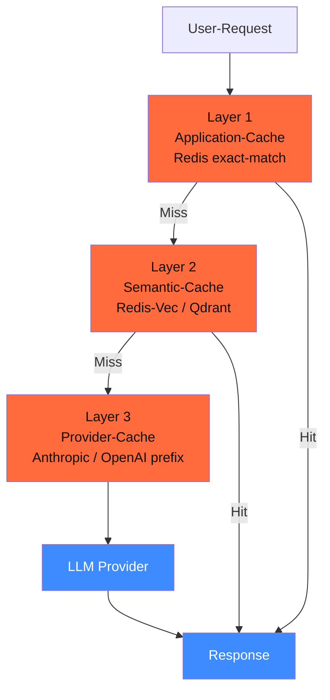

## Worum es geht

> Stop paying for the same prompt twice. — bei einem typischen DACH-Mittelstands-Stack mit 50 % Wiederholungs-Anteil sparen drei Cache-Schichten zusammen 40–70 % der Token-Kosten. Welche Schicht wann — und wie du das DSGVO-konform machst.

## Voraussetzungen

- Phase 11.07 (Caching-Basics auf drei Schichten — Repetition mit Production-Fokus)
- Lektion 17.07 (LiteLLM-Caching-Setup)

## Konzept

### Die drei Cache-Schichten



| Layer | Hit-Rate | Latenz-Ersparnis | EUR-Ersparnis | Wann |
|---|---|---|---|---|
| **Application** (exact-match) | 5–15 % | 100 % | 100 % | identische Prompts (Newsletter, Health-Checks) |
| **Semantic** (fuzzy-match cosine) | 10–30 % | 100 % | 100 % | paraphrasierte Anfragen, Long-Tail-Support |
| **Provider** (Anthropic / OpenAI) | 40–80 % | 80 % (Read schneller als Write) | 90 % (Anthropic) / 50 % (OpenAI) | lange System-Prompts, Few-Shot, RAG-Context |

**Total realistisch**: ~ 60–80 % effektive Ersparnis bei stabilen RAG-Workloads.

### Layer 3 — Anthropic Prompt-Cache

Stand 04/2026: Anthropic Prompt-Cache ist der größte Sparhebel im Stack. Pricing ([Anthropic Pricing](https://platform.claude.com/docs/en/about-claude/pricing)):

- **Cache Write** (5-min-TTL): 1,25× Standard-Input
- **Cache Write** (1-h-TTL): 2× Standard-Input
- **Cache Read**: **0,1×** Standard-Input — **90 % Rabatt**

Setup mit Pydantic AI:

```python
from pydantic_ai import Agent
from pydantic_ai.models.anthropic import AnthropicModel

system_prompt_cached = """
Du bist Bürger-Service-Assistent für Hannover.
[... 5.000 Tokens Behörden-FAQ ...]
"""

model = AnthropicModel(
    model_name="claude-sonnet-4-6",
    extra_headers={"anthropic-beta": "prompt-caching-2024-07-31"},
)

agent = Agent(
    model,
    system_prompt=system_prompt_cached,
    # Cache-Control wird via system-prompt-block gesetzt
)
```

Auf Raw-API-Ebene (für Doku):

```python
import anthropic

client = anthropic.Anthropic()
response = client.messages.create(
    model="claude-sonnet-4-6",
    system=[
        {
            "type": "text",
            "text": "Du bist Bürger-Service-Assistent...",
            "cache_control": {"type": "ephemeral"}  # 5-min-TTL
        }
    ],
    messages=[{"role": "user", "content": "..."}]
)
```

### Layer 3 — OpenAI Cached Input

Stand 04/2026 ([OpenAI Pricing](https://platform.openai.com/docs/pricing)):

- **Cached Input** (≥ 1.024 Tokens, automatisch): 0,5× Standard-Input — **50 % Rabatt**
- Keine explizite `cache_control` — automatisch via Prefix-Match

```python
from openai import OpenAI
client = OpenAI()
response = client.chat.completions.create(
    model="gpt-5-4",
    messages=[
        {"role": "system", "content": "Du bist Bürger-Service-Assistent... (>1024 Tokens)"},
        {"role": "user", "content": "..."}
    ],
)
# response.usage.prompt_tokens_details.cached_tokens enthält Cache-Hit
```

### Layer 2 — Redis Semantic Cache

Wann: paraphrasierte Anfragen (z. B. „Wie funktioniert die Wohnsitz-Anmeldung?" vs. „Wie melde ich meinen Wohnsitz an?"). LiteLLM-Setup (aus Lektion 17.07):

```yaml
litellm_settings:
  cache: true
  cache_params:
    type: "redis-semantic"
    similarity_threshold: 0.92  # cosine-Sim ≥ 0.92 = Hit
    embedding_model: "openai/text-embedding-3-small"
    host: "redis"
    port: 6379
    ttl: 3600
```

| Threshold | Verhalten |
|---|---|
| 0.85 | aggressiv — auch grob ähnliche Anfragen werden geteilt (Vorsicht: falsche Antworten möglich) |
| **0.92** | empfohlener Default — paraphrasierte Anfragen werden geteilt, aber nicht „Apfel vs. Birne" |
| 0.97 | konservativ — fast nur identische Anfragen werden geteilt |

### Layer 2 — Qdrant Semantic Cache (EU-Bonus)

Qdrant Cloud läuft in Berlin / Frankfurt — DSGVO-Bonus gegenüber Redis Cloud (US):

```yaml
litellm_settings:
  cache: true
  cache_params:
    type: "qdrant-semantic"
    qdrant_api_base: "https://your-cluster.eu-central.aws.cloud.qdrant.io"
    qdrant_api_key: os.environ/QDRANT_API_KEY
    qdrant_collection_name: "litellm_cache"
    similarity_threshold: 0.92
    embedding_model: "ollama/nomic-embed-text"  # lokales Embedding!
    ttl: 7200
```

> **DSGVO-Bonus**: lokales Embedding-Model (Ollama Nomic) bedeutet, dass User-Prompts **nie** an einen externen Embedding-Provider gehen — Cache-Layer komplett DSGVO-vertraeglich.

### Layer 1 — Application-Cache (exact-match)

Trivial via Redis mit SHA-256 als Key:

```python
import hashlib
import json
import redis

r = redis.from_url("redis://redis:6379")

def cached_completion(messages: list[dict], **kwargs):
    key = hashlib.sha256(json.dumps(messages).encode()).hexdigest()
    if cached := r.get(f"litellm:exact:{key}"):
        return json.loads(cached)
    result = litellm.completion(messages=messages, **kwargs)
    r.setex(f"litellm:exact:{key}", 3600, json.dumps(result.model_dump()))
    return result
```

Wann: identische Prompts (Newsletter-Generierung mit Template, Health-Check-Calls, Smoke-Tests).

### Cache-Strategie pro Use-Case

| Use-Case | Layer 1 | Layer 2 | Layer 3 | Erwarteter Ersparnis |
|---|---|---|---|---|
| **Newsletter / Marketing** | ✓ | ✗ | ✓ (Template-Cache) | 70–80 % |
| **Support-Klassifikator** | ✗ | ✓ (paraphrasiert) | ✓ (System-Prompt) | 50–65 % |
| **RAG mit langem Context** | ✗ | ✗ | ✓✓ (System + Docs) | 60–80 % |
| **Conversational Chat** | ✗ | ✗ | ✓ (System-Prompt) | 30–45 % |
| **Code-Generation** | ✗ | ✗ | ✓ (Codebase-Context) | 40–60 % |

> Kein „One-Size-Fits-All". Cache-Architektur ist Design-Entscheidung pro Use-Case.

### DSGVO-Aspekte

| Aspekt | Pattern |
|---|---|
| **Aufbewahrung (Art. 5 lit. e)** | Cache-TTL definieren (3.600 s — 7.200 s typisch); kein „forever" |
| **Datenminimierung (Art. 5 lit. c)** | nur das cachen, was wirklich wiederverwendbar ist (System-Prompts ja, User-Daten nein) |
| **Right-to-be-Forgotten (Art. 17)** | bei Lösch-Request: Cache-Key per User-Pseudonym löschen können |
| **Pseudonymisierung (Art. 25)** | Embedding-Model lokal halten (Ollama, BGE-EU) |
| **TOM (Art. 32)** | Cache-Backend mit At-Rest-Encryption (Redis-Enterprise / Qdrant-Cloud) |

### Cache-Hit-Tracking als Audit-Pflicht

LiteLLM trackt Cache-Hits, aber für AI-Act-Audit-Trail brauchst du strukturiertes Logging:

```python
# In jedem completion-Wrapper
logger.info("llm_call", extra={
    "user_pseudonym": hash_user_id(user_id),
    "model": model,
    "cache_layer": cache_layer,  # "exact" | "semantic" | "provider" | "miss"
    "tokens_input": usage.prompt_tokens,
    "tokens_output": usage.completion_tokens,
    "tokens_cached": usage.prompt_tokens_details.cached_tokens or 0,
    "spend_eur": calc_eur(usage),
    "ts": datetime.now(UTC).isoformat(),
})
```

Bei Behörden-Anfrage musst du belegen können:

- Wie hoch ist die Cache-Hit-Rate aktuell?
- Welche Anfragen wurden aus Cache beantwortet (Pseudonym + Hash der Frage)?
- Wann wurden Cache-Einträge gelöscht (Right-to-be-Forgotten)?

## Hands-on

1. Anthropic Prompt-Cache aktivieren — Test mit 5.000-Token-System-Prompt, drei Folge-Calls
2. LiteLLM mit Qdrant-Semantic-Cache einrichten + lokalem Ollama-Embedding
3. Bench: 100 paraphrasierte Anfragen — Hit-Rate dokumentieren
4. Layer-1-Wrapper bauen für Newsletter-Use-Case (exact-match)
5. DSGVO-Pattern: Cache-TTL setzen, Lösch-Funktion pro Pseudonym implementieren

## Selbstcheck

- [ ] Du erklärst die drei Cache-Schichten und wann welche zieht.
- [ ] Du nutzt Anthropic Prompt-Cache produktiv (90 % Rabatt auf Read).
- [ ] Du wählst Redis-Semantic vs. Qdrant-Semantic je nach DSGVO-Bedarf.
- [ ] Du implementierst Cache-Hit-Tracking für AI-Act-Audit.
- [ ] Du setzt Cache-TTL + Right-to-be-Forgotten-Lösch-Pattern.

## Compliance-Anker

- **Cost-Effektivität (AI-Act Art. 17)**: Caching ist Teil von Quality Management.
- **Aufbewahrungsbegrenzung (DSGVO Art. 5 lit. e)**: TTL Pflicht, kein Forever-Cache.
- **TOM (Art. 32)**: Cache-Backend muss At-Rest-Encryption und Audit-Logging haben.
- **Pseudonymisierung (Art. 25)**: lokales Embedding-Model schützt User-Prompts vor Drittanbieter-Embedding-Provider.

## Quellen

- Anthropic Prompt Caching — <https://docs.claude.com/en/docs/build-with-claude/prompt-caching>
- OpenAI Prompt Caching — <https://platform.openai.com/docs/guides/prompt-caching>
- LiteLLM Caching — <https://docs.litellm.ai/docs/proxy/caching>
- Redis Vector Library Semantic Cache — <https://docs.redisvl.com/en/latest/user_guide/04_llmcache.html>
- Qdrant Semantic Cache — <https://qdrant.tech/documentation/tutorials/llamaindex-with-qdrant/>
- GPTCache — <https://github.com/zilliztech/GPTCache>

## Weiterführend

→ Phase **11.07** (Caching-Basics — Theorie + Patterns)
→ Lektion **17.09** (Cost-Monitoring — Cache-Hit-Rate als KPI)
→ Phase **13** (RAG — wo Provider-Cache am meisten bringt)
