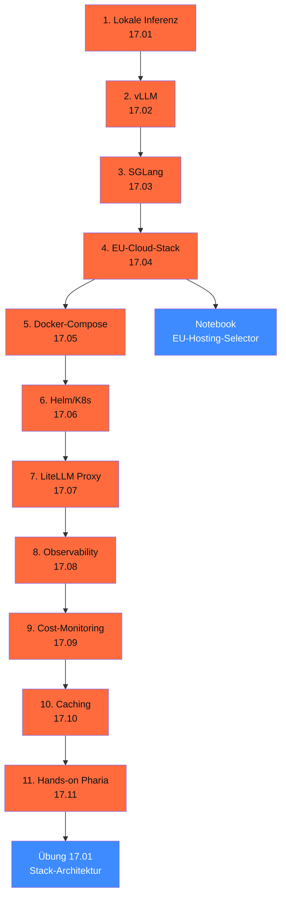

# Phase 17 · Production & EU-Hosting

> **Stop using OpenAI as default.** — die EU hat 2026 fünf produktiv-reife Cloud-Anbieter mit AI-Stack: STACKIT (BSI C5 Type 2), IONOS (BSI C5), OVHcloud (SecNumCloud läuft), Scaleway (HDS), Hetzner (klassisch günstig, aber kein H100). Plus: vier offizielle Helm-Charts und das Aleph-Alpha-Pharia-Ökosystem post-Cohere-Übernahme.

**Status**: ✅ vollständig ausgearbeitet · **Dauer**: ~ 16 h · **Schwierigkeit**: fortgeschritten

## 🎯 Was du in diesem Modul lernst

- **Lokale Inferenz** — Ollama / llama.cpp / MLX / TGI mit Quantisierung (Q4_K_M, FP8, AWQ)
- **vLLM v0.20.0** — Continuous Batching, PagedAttention, Prefix-Caching, LoRA-Hot-Swap, Production-Stack
- **SGLang v0.5.10** — RadixAttention, Compressed-FSM, wann statt vLLM
- **EU-Cloud-Stack** — STACKIT, IONOS, OVHcloud, Scaleway, Hetzner mit Pricing + Compliance (Stand 28.04.2026)
- **Docker-Compose** — vLLM + LiteLLM + Postgres + Phoenix als Single-Box-Stack
- **Helm + K8s** — vier offizielle Charts + NVIDIA GPU-Operator + ArgoCD
- **LiteLLM Proxy** — Multi-Provider, Cost-Tracking, EU-Routing-Disziplin, Caching
- **Observability** — OTel GenAI Spans, Phoenix v14.15, Langfuse v3.171, PII-Redaction
- **Cost-Monitoring** — Grafana-Dashboards, Spend-Spikes, US-Routing-Anomalien
- **Caching** — drei Schichten (Application, Semantic, Provider) mit 40–70 % Ersparnis
- **Hands-on Pharia-1 auf STACKIT** — End-to-End-Production-Stack inkl. Compliance-Pflicht-Checkliste

## 🧭 Wie du diese Phase nutzt



## 📚 Inhalts-Übersicht

| Lektion | Titel | Dauer | Datei |
|---|---|---|---|
| 17.01 | Lokale Inferenz — Ollama, llama.cpp, MLX, TGI | 60 min | [`lektionen/01-lokale-inferenz.md`](lektionen/01-lokale-inferenz.md) ✅ |
| 17.02 | vLLM — Continuous Batching, PagedAttention, Production-Stack | 75 min | [`lektionen/02-vllm.md`](lektionen/02-vllm.md) ✅ |
| 17.03 | SGLang als vLLM-Alternative | 50 min | [`lektionen/03-sglang.md`](lektionen/03-sglang.md) ✅ |
| 17.04 | **EU-Cloud-Stack** — STACKIT, IONOS, OVH, Scaleway, Hetzner | 75 min | [`lektionen/04-eu-cloud-stack.md`](lektionen/04-eu-cloud-stack.md) ✅ |
| 17.05 | Docker-Compose Multi-LLM-Stack | 60 min | [`lektionen/05-docker-compose.md`](lektionen/05-docker-compose.md) ✅ |
| 17.06 | Helm-Charts auf K8s — vLLM-Production-Stack, LiteLLM, Phoenix, Langfuse | 75 min | [`lektionen/06-helm-kubernetes.md`](lektionen/06-helm-kubernetes.md) ✅ |
| 17.07 | LiteLLM Proxy — Multi-Provider, Cost-Tracking, EU-Routing | 75 min | [`lektionen/07-litellm-proxy.md`](lektionen/07-litellm-proxy.md) ✅ |
| 17.08 | Observability — OTel GenAI, Phoenix v14, Langfuse v3 | 90 min | [`lektionen/08-observability.md`](lektionen/08-observability.md) ✅ |
| 17.09 | Cost-Monitoring — Grafana, Token-Budgets, Anomalie-Alerts | 60 min | [`lektionen/09-cost-monitoring.md`](lektionen/09-cost-monitoring.md) ✅ |
| 17.10 | Caching — Anthropic Prompt-Cache, Redis-Semantic, Qdrant-Semantic | 60 min | [`lektionen/10-caching.md`](lektionen/10-caching.md) ✅ |
| 17.11 | **Hands-on: Pharia-1 auf STACKIT mit vLLM + LiteLLM + Langfuse** | 180 min | [`lektionen/11-pharia-auf-stackit.md`](lektionen/11-pharia-auf-stackit.md) ✅ |

## 💻 Hands-on-Projekt

**EU-Hosting-Stack-Selector**: Marimo-Notebook, das basierend auf Token-Volumen, Latenz-Budget, Compliance-Tier und Modell-Klasse den passenden EU-Stack empfiehlt. Pricing-Daten Stand 28.04.2026 aus den Anbieter-Pages.

[](https://colab.research.google.com/github/s-a-s-k-i-a/ki-engineering-werkstatt/blob/main/dist-notebooks/phasen/17-production-und-eu-hosting/code/01_eu_hosting_selector.ipynb)

```bash
uv run marimo edit phasen/17-production-und-eu-hosting/code/01_eu_hosting_selector.py
```

Plus die [Übung 17.01](uebungen/01-aufgabe.md): Vollständige Stack-Architektur für ein konkretes Profil (Bürger-Service, Steuerkanzlei, Code-Assistent) mit deployment-fähiger `docker-compose.yml`, TCO-Modell und Compliance-Checkliste ([Lösungs-Skelett](loesungen/01_loesung.py)).

## 🧱 Stack-Wahl 2026 (Faustregel)

| Use-Case | Empfohlener Stack |
|---|---|
| < 5M Tokens/Monat, AVV-Pflicht | **STACKIT AI Model Serving** oder **IONOS AI Model Hub** |
| 70B-Klasse + günstigster EU-Preis | **OVHcloud AI Endpoints** (Llama 3.3 70B ≈ € 0,67 / 1M) |
| Self-Hosted vLLM auf K8s | **STACKIT SKE** + GPU-Operator + production-stack-Helm |
| Single-Box-Production (1–4 GPUs) | **Hetzner GEX131** (96 GB VRAM) + Docker-Compose |
| Multi-Provider-Routing | **LiteLLM Proxy** als Gateway, EU-First-Default |
| Tracing + Eval (self-hosted) | **Phoenix v14** auf eigenem K8s |
| Tracing + Cost-Dashboards (managed-EU) | **Langfuse Cloud Frankfurt** mit DPA |
| Caching | Anthropic Prompt-Cache (90 % Rabatt) + Qdrant-Semantic (EU) |

## ✅ Voraussetzungen

- Phase 11 (LLM-Engineering) — Pydantic AI Basics, Pricing, Eval, Caching-Theorie
- Phase 14 (Agenten & MCP) — Multi-Agent + MCP-Tooling
- Optional: STACKIT- / IONOS- / OVHcloud-Test-Account; NVIDIA-GPU für vLLM-lokal

## ⚖️ DACH-Compliance-Anker

→ [`compliance.md`](compliance.md): Server-Standort-Doku, BSI C5 / ISO 27001 / SecNumCloud, NIS2 + KritisDachG, Cost-Monitoring (AI-Act Art. 17), Drittland-Routing-Disziplin.

Phasen-spezifisch:

- **Pharia / Aleph Alpha** — post-Cohere-Merger-Status (April 2026), Open-Weights-Pharia-1-7B bleibt verfügbar
- **NIS2** — Inkrafttreten 04/2026, 24-h-Incident-Notification
- **AVV-Self-Service** — STACKIT, IONOS, OVH, Scaleway, Hetzner, Langfuse haben Self-Service-AVV

## 📖 Quellen (Auswahl)

- vLLM v0.20.0 — <https://docs.vllm.ai/>
- SGLang v0.5.10 — <https://docs.sglang.io/>
- LiteLLM v1.83.14-stable — <https://docs.litellm.ai/>
- Phoenix v14.15 — <https://arize.com/docs/phoenix/>
- Langfuse v3.171 — <https://langfuse.com/>
- STACKIT AI Model Serving — <https://stackit.com/en/products/data-ai/stackit-ai-model-serving>
- IONOS AI Model Hub — <https://cloud.ionos.com/managed/ai-model-hub>
- OVHcloud AI Endpoints — <https://www.ovhcloud.com/en/public-cloud/ai-endpoints/catalog/>
- Vollständig in [`weiterfuehrend.md`](weiterfuehrend.md).

## 🔄 Wartung

Stand: 29.04.2026 · Reviewer: Saskia Teichmann ([@s-a-s-k-i-a](https://github.com/s-a-s-k-i-a)) · Nächster Review: 07/2026 (Pricing-Refresh, vLLM-/SGLang-Versions-Update, Pharia-Status nach Cohere-Merger). **Pricing ist volatil** — bei Produktiv-Einsatz immer im Anbieter-Portal re-verifizieren.
