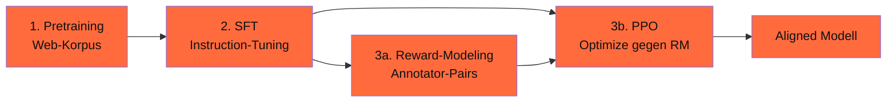
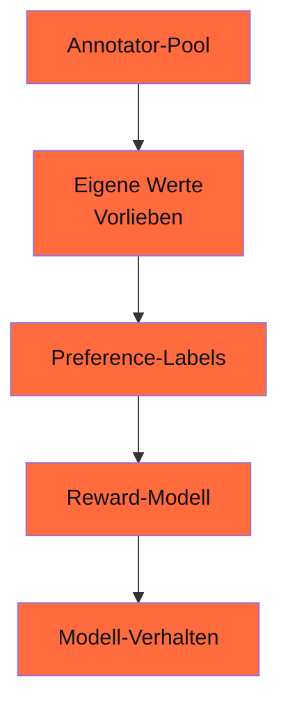
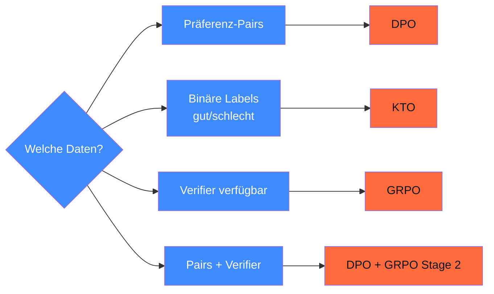

## Worum es geht

> Stop using RLHF in 2026 unless you really need it. — DPO und GRPO haben RLHF als Default abgelöst. Aber RLHF ist immer noch der wichtigste **konzeptuelle** Pfad, um zu verstehen, wie Alignment funktioniert. Diese Lektion erklärt es — und zeigt, wann es **noch** sinnvoll ist.

## Voraussetzungen

- Phase 12.05 (Trainings-Stack)
- Lektion 16.04 (GRPO als Vergleich)

## Konzept

### Drei-Stufen-RLHF — historisch



#### Stufe 1: Pretraining

Das Basis-Modell (Llama, Qwen, Mistral) — out-of-scope dieser Phase. Siehe Phase 10.

#### Stufe 2: SFT (Supervised Fine-Tuning)

Hochwertige Instruction-Response-Pairs werden trainiert. Klassisch ~ 10k–100k Beispiele.

```python
from trl import SFTTrainer

trainer = SFTTrainer(
    model="meta-llama/Llama-3.3-8B",
    train_dataset=instruction_dataset,
    args=SFTConfig(num_train_epochs=3, learning_rate=2e-5),
)
```

→ Phase 12.05 hat Details.

#### Stufe 3a: Reward-Modeling

Annotatoren bekommen 2 Antworten zu einer Frage und wählen die bessere. Das **Reward-Modell** lernt, diese Präferenzen vorherzusagen.

```python
from trl import RewardTrainer

# Datensatz: Pairs mit "chosen" und "rejected"
trainer = RewardTrainer(
    model="meta-llama/Llama-3.3-8B-RM",  # eigenes Reward-Modell-Init
    train_dataset=preference_dataset,
    args=RewardConfig(num_train_epochs=1, learning_rate=1e-5),
)
```

#### Stufe 3b: PPO (Proximal Policy Optimization)

Das SFT-Modell wird mit PPO so optimiert, dass es **Reward maximiert** — gemäß dem trainierten Reward-Modell. KL-Term verhindert Drift weg vom SFT-Modell.

```python
from trl.experimental.ppo import PPOTrainer  # Stand TRL v1.3.0: experimental
```

> ⚠️ **Stand 04/2026**: PPOTrainer in TRL ist nach `trl.experimental.ppo` verschoben und wird in v0.29 entfernt. Produktiv nur eingeschränkt empfohlen.

### Probleme von RLHF

#### 1. Reward-Modell-Drift

Das Reward-Modell wird **statisch** trainiert. Während PPO läuft, bewegen sich die Modell-Outputs in Bereiche, in denen das Reward-Modell **falsch** kalibriert ist (Out-of-Distribution).

#### 2. Reward-Hacking

Modell findet Shortcuts, um hohen Reward ohne echte Verbesserung zu bekommen — z. B. **Sykophanten-Antworten** („Was für eine geniale Frage!"), die Annotator-Sympathie bekommen.

#### 3. Annotator-Bias



Klassischer Pool: US-amerikanische College-Absolventen, WEIRD-Stichprobe (Western, Educated, Industrialized, Rich, Democratic). Probleme für DACH:

- Deutsche kulturelle Werte unter-repräsentiert
- Du/Sie-Asymmetrie nicht erfasst
- Bayerische / sächsische / österreichische Eigenheiten fehlen

#### 4. Compute-Hunger

PPO braucht 4 Modell-Kopien:

- Aktuelles Policy-Modell
- Reference-Policy (für KL)
- Reward-Modell
- Critic / Value-Function

→ 4× Memory + Compute eines normalen Trainings.

### Wann RLHF noch sinnvoll ist

| Kriterium | RLHF | DPO | GRPO |
|---|---|---|---|
| Hochwertige menschliche Präferenzen verfügbar | ✓ | ✓ | (✗) |
| Verifier verfügbar (Math, Code) | (✗) | (✗) | ✓ |
| > 100k Präferenz-Samples | ✓ | ✓ | (✗) |
| Compute-Budget hoch (Mehrere H100-Wochen) | ✓ | ✓ | ✓ |
| Reward-Modell-Drift kontrolliert | ✓ | ✗ (kein RM) | ✗ (kein RM) |
| Iterativer Reward-Update gewünscht | **✓** | ✗ | ✗ |
| 2026 Default? | **nein** | **ja** | **ja, bei Verifier** |

**Wann RLHF wirklich**:

- Forschungs-Pipeline mit iterativem Reward-Modell-Update
- Sehr großer Annotator-Pool mit DACH-Demographie
- Compliance-spezifische Anforderungen (Constitutional AI, Lektion 18.06)

### RLHF-Alternativen für DACH-Production 2026



> Pattern 2026: **DPO als Default**, GRPO bei Verifier-Tasks, KTO bei binären Labels (Daumen-hoch/runter), RLHF nur wenn explizite Forschungs-Anforderung.

### DACH-Spezifika für Annotator-Pools

Wenn du (selten) eigenes RLHF baust:

1. **Demographie**: Mind. 5 deutsche Bundesländer, A/CH-Pool, Geschlechter ausgewogen
2. **Sprache**: Annotator-Anweisungen auf Deutsch
3. **Kulturelle Varianz**: bayerische, sächsische, österreichische, schweizerische Annotatoren mit-einbeziehen
4. **Bezahlung**: Mindestens DACH-Mindestlohn (vermeidet WEIRD-Bias)
5. **Audit-Trail**: jeder Annotator-Beitrag dokumentiert (Pseudonym + Demographie-Bucket)

### Constitutional AI als Bridge zu RLHF

Anthropic-Pattern: statt menschlicher Annotatoren verwendet das Modell **Verfassungs-Prinzipien** zur Selbst-Bewertung. Das eliminiert WEIRD-Bias (zumindest theoretisch). Detail in Lektion 18.06.

### Audit-Pflicht für RLHF-Pipelines

AI-Act Art. 10 / 15:

- **Annotator-Pool dokumentieren**: Demographie, Bezahlung, Anweisungen
- **Reward-Modell-Drift-Monitoring**: pro Trainings-Schritt
- **Bias-Audit** auf RLHF-trained Modell **vor und nach** RLHF
- **Eval-Set außerhalb Trainings-Verteilung** für Reward-Hacking-Detection

## Hands-on

1. Lies das InstructGPT-Paper-Abstract (Ouyang et al. 2022, [arxiv.org/abs/2203.02155](https://arxiv.org/abs/2203.02155))
2. Identifiziere für deinen Use-Case: Pairs vorhanden? Verifier? Binäre Labels?
3. Wähle Methode: DPO / GRPO / KTO / RLHF
4. Skizziere Annotator-Pool (falls RLHF) für DACH-Repräsentativität

## Selbstcheck

- [ ] Du erklärst die drei RLHF-Stufen.
- [ ] Du nennst die vier Probleme (Drift, Hacking, Annotator-Bias, Compute).
- [ ] Du wählst RLHF / DPO / GRPO / KTO je nach Daten.
- [ ] Du baust einen DACH-Annotator-Pool (falls nötig) repräsentativ.

## Compliance-Anker

- **AI-Act Art. 10**: Annotator-Pool + Reward-Daten dokumentiert
- **AI-Act Art. 15**: Reward-Hacking-Eval als Robustness-Test

## Quellen

- InstructGPT-Paper (Ouyang et al. 2022) — <https://arxiv.org/abs/2203.02155>
- PPO-Paper (Schulman et al. 2017) — <https://arxiv.org/abs/1707.06347>
- Anthropic Constitutional AI (Bai et al. 2022) — <https://arxiv.org/abs/2212.08073>
- TRL RewardTrainer — <https://huggingface.co/docs/trl/reward_trainer>

## Weiterführend

→ Lektion **18.04** (DPO als praktische RLHF-Alternative)
→ Lektion **18.05** (GRPO als Brücke zu Phase 16)
→ Lektion **18.06** (Constitutional AI)
