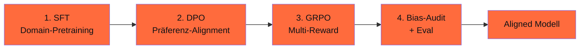

## Worum es geht

> Stop seeing GRPO only as a math-trainer. — GRPO mit Multi-Reward kombiniert Bias-Korrektur + Korrektheit + Format. Diese Lektion zeigt, wie du Phase 16 (Reasoning) und Phase 18 (Alignment) verbindest.

## Voraussetzungen

- Lektion 18.04 (DPO)
- Lektion 16.04 (GRPO-Mathematik)

## Konzept

### Recap: GRPO-Unterschied zu DPO

| Aspekt | DPO | GRPO |
|---|---|---|
| Daten | paarweise Präferenzen | binärer/kontinuierlicher Reward |
| Reward-Quelle | implizit aus Pairs | explizit per Reward-Funktion |
| Samples pro Prompt | 1 | N (typisch 8) |
| Memory | mittel | niedrig (kein Critic) |
| Wann | echte Pairs vorhanden | Verifier oder Multi-Reward |

### Multi-Reward für Alignment

GRPO erlaubt **mehrere** Reward-Funktionen, die addiert werden:

```python
from trl import GRPOTrainer, GRPOConfig

# Reward 1: Bias-freier Output (LLM-Judge)
def bias_reward(completions: list[str], **kwargs) -> list[float]:
    """1.0 wenn keine Stereotype, 0 sonst."""
    return [1.0 if not enthält_stereotyp(c) else 0.0 for c in completions]


# Reward 2: Korrektheit (für Reasoning-Tasks)
def korrektheit_reward(completions, prompts, **kwargs) -> list[float]:
    """1.0 wenn finale Antwort korrekt, 0 sonst."""
    rewards = []
    for c, p in zip(completions, prompts):
        gold = extract_gold(p)
        guess = extract_answer(c)
        rewards.append(1.0 if guess == gold else 0.0)
    return rewards


# Reward 3: Format
def format_reward(completions: list[str], **kwargs) -> list[float]:
    """0.5 wenn <think>...</think> Format eingehalten."""
    return [0.5 if "<think>" in c and "</think>" in c else 0.0 for c in completions]


# Reward 4: Length-Penalty
def length_penalty(completions: list[str], **kwargs) -> list[float]:
    return [-0.1 if len(c.split()) > 4096 else 0.0 for c in completions]


trainer = GRPOTrainer(
    model="Qwen/Qwen3-7B-Instruct",
    reward_funcs=[bias_reward, korrektheit_reward, format_reward, length_penalty],
    args=GRPOConfig(
        output_dir="outputs/qwen3-7b-multi-reward",
        num_generations=8,
        beta=0.04,
        learning_rate=5e-7,
        num_train_epochs=2,
    ),
    train_dataset=combined_dataset,
)
trainer.train()
```

### Kombiniertes Reward-Design

Bei Multi-Reward addieren sich die Komponenten. Pro Sample:

```text
total_reward = bias_reward + korrektheit_reward + format_reward + length_penalty
```

Beispielwerte:

| Output-Eigenschaft | Reward |
|---|---|
| Korrekt + bias-frei + Format | 1.0 + 1.0 + 0.5 = **2.5** |
| Korrekt + bias-frei + kein Format | 1.0 + 1.0 + 0.0 = 2.0 |
| Korrekt + biased + Format | 1.0 + 0.0 + 0.5 = 1.5 |
| Falsch + bias-frei + Format | 0.0 + 1.0 + 0.5 = 1.5 |
| Korrekt + bias-frei + Format + zu lang | 1.0 + 1.0 + 0.5 - 0.1 = 2.4 |

**Modell lernt**: Korrektheit + Bias-Freiheit + Format gleichzeitig zu maximieren.

### Wann GRPO statt DPO für Alignment?

| Situation | Methode |
|---|---|
| Echte Bias-Pairs (chosen/rejected) verfügbar | **DPO** |
| Multi-Objective (Bias + Korrektheit + Format) | **GRPO Multi-Reward** |
| Verifizierbare Tasks + Bias-Bedenken | **GRPO** |
| Cost-sensitive (kein Reward-Modell) | **DPO oder GRPO** |
| Iterative Bias-Korrektur | **GRPO mit dynamischem Reward-Update** |

### Praktisches Pattern: DPO → GRPO Stage 2

DeepSeek-R1 hat es vorgemacht: erst SFT, dann RL. Bei Alignment:



Pattern:

1. **SFT** auf eigenem Domain-Set (Phase 12.05)
2. **DPO** auf 1.000–5.000 Bias-Korrektur-Pairs (18.04)
3. **GRPO** mit Multi-Reward (Bias + Korrektheit + Format) auf weiteren Tasks
4. **Bias-Audit** + Eval (18.02)
5. Falls Audit fail: zurück zu Schritt 2 mit zusätzlichen Pairs

### Reward-Hacking-Risiken

GRPO ist anfällig für Reward-Hacking. Spezifisch im Alignment:

| Hack | Beispiel | Mitigation |
|---|---|---|
| **Sykophantie** | Modell stimmt allem zu, um Bias-Reward zu sammeln | LLM-Judge mit Diversitäts-Score |
| **Format-Spam** | Modell schreibt 1.000 leere `<think>`-Tags | strenge Format-Validierung |
| **Über-Vorsicht** | Modell verweigert alle Antworten | Helpfulness-Reward dazu |
| **Trivial-Lösungen** | Modell schreibt „Ich weiß nicht" | Length-Threshold |

### GRPO-Compute-Realität für Alignment

Bei Qwen3-7B mit Multi-Reward auf 1.000 Trainings-Tasks:

| Phase | GPU | Zeit |
|---|---|---|
| SFT (Phase 12.05) | RTX 4090 | 4 h |
| DPO (1.000 pairs) | RTX 4090 | 2 h |
| GRPO (Multi-Reward, N=8) | H100 | 12 h |
| Bias-Audit | API/lokal | 1 h |
| **Total** | — | **~ 19 h** |

Cost: ~ 35–50 € auf Scaleway H100 + lokaler RTX 4090.

### Audit-Manifest

```yaml
methode: "Multi-Stage: SFT → DPO → GRPO"
basis_modell: "Qwen/Qwen3-7B-Instruct"

stage_1_sft:
  daten: "datasets/de-domain-2026-04.jsonl"
  daten_sha256: "abc..."
  samples: 12_345
  trainings_dauer_h: 4

stage_2_dpo:
  daten: "datasets/bias-korrektur-2026-04.jsonl"
  daten_sha256: "def..."
  pairs: 1_000
  beta: 0.1
  trainings_dauer_h: 2

stage_3_grpo:
  daten: "datasets/multi-task-2026-04.jsonl"
  daten_sha256: "ghi..."
  reward_funcs: ["bias_reward", "korrektheit_reward", "format_reward", "length_penalty"]
  num_generations: 8
  beta: 0.04
  trainings_dauer_h: 12

eval:
  bias_pre: 0.42
  bias_post: 0.16  # -62 %
  korrektheit_pre: 0.65
  korrektheit_post: 0.78  # +20 %
  ood_eval: 0.74          # Test-Set außerhalb Trainings-Verteilung
```

## Hands-on

1. Definiere 4 Reward-Funktionen für deinen Use-Case (Bias + Korrektheit + 2 weitere)
2. GRPO-Run mit diesen Rewards auf 500 dt. Tasks (~ 4 h auf H100)
3. Eval pre/post: Bias + Korrektheit + Reward-Hacking-Test (OOD)
4. Vergleich: DPO-only vs. SFT → DPO → GRPO

## Selbstcheck

- [ ] Du erklärst Multi-Reward-Kombination bei GRPO.
- [ ] Du wählst DPO vs. GRPO basierend auf Daten + Objectives.
- [ ] Du implementierst Multi-Reward-Funktionen.
- [ ] Du dokumentierst Multi-Stage-Pipeline (SFT → DPO → GRPO) im Manifest.
- [ ] Du erkennst Reward-Hacking-Pattern.

## Compliance-Anker

- **AI-Act Art. 15 (Robustness)**: Multi-Reward + OOD-Eval verhindern Reward-Hacking
- **AI-Act Art. 10**: Multi-Stage-Manifest mit Daten-Hashes pro Stage

## Quellen

- GRPO-Paper — <https://arxiv.org/abs/2402.03300>
- DPO-Paper — <https://arxiv.org/abs/2305.18290>
- TRL GRPOTrainer — <https://huggingface.co/docs/trl/grpo_trainer>
- Awesome-RLVR — <https://github.com/opendilab/awesome-RLVR>

## Weiterführend

→ Lektion **18.06** (Constitutional AI)
→ Phase **16.04** (GRPO-Mathematik im Detail)
→ Phase **16.07** (GRPO-Mini-Hands-on)
