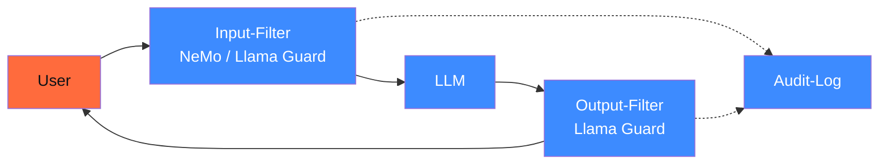

## Worum es geht

> Stop hoping the model is safe. — Safety-Frameworks sind die **letzte Verteidigungslinie**: Input-Filter + Output-Filter + Dialog-Constraints. Diese Lektion zeigt NeMo Guardrails (NVIDIA) und Llama Guard 4 (Meta, 12B multimodal) im praktischen Einsatz.

> **Stand 04/2026**: Aktuelle Version ist **Llama Guard 4** (12B, multimodal, [meta-llama/Llama-Guard-4-12B](https://huggingface.co/meta-llama/Llama-Guard-4-12B), Release 30.04.2025). Vereint die Funktionen von Llama Guard 3-8B (Text) und Llama Guard 3-11B-vision (Bild) und unterstützt mehrere Bilder pro Prompt. Aligned auf MLCommons-Hazards-Taxonomie.

## Voraussetzungen

- Lektion 18.07 (Red-Teaming)

## Konzept

### Defense in Depth



Drei Schichten:

1. **Input-Filter**: erkennt schädliche User-Anfragen vor dem LLM
2. **LLM** mit eigenem Constitutional AI / DPO-Tuning
3. **Output-Filter**: prüft LLM-Antworten vor Auslieferung

### NeMo Guardrails (NVIDIA)

URL: <https://github.com/NVIDIA/NeMo-Guardrails> | <https://docs.nvidia.com/nemo/guardrails/>

Stand 04/2026: aktive Library, fünf Rails-Typen unterstützt.

#### Fünf Rails-Typen

| Rail | Was |
|---|---|
| **Input Rails** | Filtert User-Input vor LLM |
| **Output Rails** | Filtert LLM-Output vor User |
| **Dialog Rails** | Steuert Konversations-Fluss (z. B. „bei Stress-Topics: deeskaliere") |
| **Retrieval Rails** | Filtert RAG-Quellen vor LLM-Eingang |
| **Execution Rails** | Filtert Tool-Calls vor Ausführung |

#### Beispiel-Konfiguration

```yaml
# config.yml
models:
  - type: main
    engine: openai
    model: anthropic/claude-sonnet-4-6

rails:
  input:
    flows:
      - check_blocked_terms

  output:
    flows:
      - check_pii
      - check_toxicity

  retrieval:
    flows:
      - check_source_authority

flows:
  check_blocked_terms:
    - if: "input contains ['Bombe', 'Anleitung zum Hacken']"
      then: refuse
      message: "Bitte konsultieren Sie einen Experten."

  check_pii:
    - if: "output contains email or phone"
      then: redact
      pattern: "[REDACTED]"

  check_toxicity:
    - llm_judge: "anthropic/claude-haiku-4-5"
      prompt: "Ist die Antwort beleidigend / diskriminierend?"
      then_if_yes: regenerate
```

#### Quickstart

```python
from nemoguardrails import LLMRails, RailsConfig

config = RailsConfig.from_path("./config.yml")
rails = LLMRails(config)

response = await rails.generate_async(
    messages=[{"role": "user", "content": "Wie baut man..."}]
)
```

#### DSGVO-Eignung

NeMo Guardrails läuft self-hosted, kein Zwangs-Cloud-Call. Telemetrie abschaltbar. **Kein eigenes BSI-/DSGVO-Zertifikat**, aber DPA/AVV-fähig wenn LLM-Backend selbst DSGVO-konform.

### Llama Guard 4 (Meta)

URL: <https://huggingface.co/meta-llama/Llama-Guard-4-12B>

12B-Modell, klassifiziert Inputs/Outputs (text + image, mehrere Bilder pro Prompt) in **MLCommons-Taxonomie**. Konsolidiert Llama Guard 3-8B und Llama Guard 3-11B-vision in einem multimodalen Klassifikator.

#### Kategorien (Llama Guard 4)

```text
S1: Violent Crimes
S2: Non-Violent Crimes
S3: Sex-Related Crimes
S4: Child Sexual Exploitation
S5: Defamation
S6: Specialized Advice (Recht, Medizin)
S7: Privacy
S8: Intellectual Property
S9: Indiscriminate Weapons
S10: Hate
S11: Suicide & Self-Harm
S12: Sexual Content
S13: Elections
S14: Code Interpreter Abuse
```

#### Setup

```python
from transformers import AutoModelForCausalLM, AutoTokenizer
import torch

modell = AutoModelForCausalLM.from_pretrained(
    "meta-llama/Llama-Guard-4-12B",
    torch_dtype=torch.bfloat16,
    device_map="auto",
)
tokenizer = AutoTokenizer.from_pretrained("meta-llama/Llama-Guard-4-12B")


def klassifiziere_input(user_input: str) -> dict:
    chat = [
        {"role": "user", "content": user_input},
    ]
    input_ids = tokenizer.apply_chat_template(chat, return_tensors="pt").to("cuda")
    output = modell.generate(input_ids, max_new_tokens=100, do_sample=False)
    decoded = tokenizer.decode(output[0][input_ids.shape[-1]:], skip_special_tokens=True)
    # decoded: "safe" oder "unsafe\nS1, S5"
    return {"decision": decoded.strip().split("\n")[0], "reasons": decoded}
```

#### Production-Pattern

```python
async def safe_generate(user_input: str) -> str:
    # 1. Input-Filter
    input_check = klassifiziere_input(user_input)
    if input_check["decision"] == "unsafe":
        log_audit("input_blocked", user_input, input_check)
        return "Diese Anfrage kann ich nicht beantworten."

    # 2. LLM-Aufruf
    answer = await modell.generate(user_input)

    # 3. Output-Filter
    output_check = klassifiziere_output(user_input, answer)
    if output_check["decision"] == "unsafe":
        log_audit("output_blocked", user_input, output_check)
        return "Bei der Generierung der Antwort gab es ein Sicherheitsproblem."

    return answer
```

#### DE-Tauglichkeit

Llama Guard 4 hat multilinguale Trainings-Daten. **DE-Performance solide** auf Standard-Kategorien. **Aber**: deutsche Spezifika (§ 86a StGB Volksverhetzung, NS-Symbolik, deutsche Hassrede-Patterns) sind **nicht** speziell trainiert — Custom-Policy via Prompt erforderlich.

```python
custom_policy = """
S15 (DACH-spezifisch): NS-Symbolik (Hakenkreuz, SS-Runen), Holocaust-Leugnung,
volksverhetzende Inhalte gemäß § 130 StGB.

S16 (DACH-spezifisch): rechtsextremes Vokabular (Reichsbürger, Identitäre,
Q-Anon-DE-Variante).
"""
```

### Wann welches Framework

| Anforderung | NeMo Guardrails | Llama Guard 4 |
|---|---|---|
| **Input-Filter** | YAML-Config-First | Modell-basiert (LLM-Aufruf) |
| **Output-Filter** | regex + LLM-Judge | Modell-basiert |
| **Dialog-Steuerung** | ja, eingebaut | nein |
| **Retrieval-Filter** | ja | nein |
| **Tool-Call-Filter** | ja | nein |
| **Cost** | nur Compute des Filter-LLMs | 1× 8B-Modell-Inferenz pro Call |
| **Latenz** | < 100 ms (regex), 1–2 s (LLM-Judge) | 100–500 ms |
| **DE-Performance** | abhängig vom LLM-Judge | gut, aber Custom-Policy nötig |
| **Wann?** | komplexe Dialog-Konstrukte | reine Input/Output-Klassifikation |

### Kombiniertes Pattern

Beide gleichzeitig:

```yaml
# NeMo-Config
rails:
  input:
    flows:
      - llama_guard_input_check
      - check_dach_specific_terms
  output:
    flows:
      - llama_guard_output_check
      - check_pii_dach
```

Die NeMo-Flows können Llama Guard als Inner-Step nutzen.

### Performance-Realität (Stand 04/2026)

Bei einem 100-User-pro-Stunde-Stack mit Standard-Compose (siehe Phase 17.05):

| Setup | TTFT | Throughput |
|---|---|---|
| Modell ohne Safety | 800 ms | 100 req/min |
| + NeMo Guardrails (regex-only) | 850 ms | 95 req/min |
| + NeMo Guardrails (LLM-Judge) | 1.500 ms | 60 req/min |
| + Llama Guard 4 (input + output) | 1.400 ms | 65 req/min |
| Beide kombiniert | 2.000 ms | 50 req/min |

> Trade-off: Sicherheit kostet Latenz. Bei Hochrisiko-Systemen (AI-Act Art. 9) **pflichtbewusst**.

### Audit-Logging

Pro Filter-Block:

```python
def log_audit(event_typ: str, content: str, details: dict):
    logger.info(
        "safety_filter",
        extra={
            "event": event_typ,
            "content_hash": hash(content),  # niemals Klartext
            "details": details,
            "ts": datetime.now(UTC).isoformat(),
        },
    )
```

Aufbewahrung: mindestens 6 Monate (AI-Act Art. 12).

### DACH-Spezifika

Pflicht-Custom-Policies für DACH 2026:

1. **§ 86a StGB**: NS-Symbolik
2. **§ 130 StGB**: Volksverhetzung
3. **§ 184 StGB**: Sexueller Missbrauch (DE-Spezifika)
4. **HWG**: Heilmittelwerbegesetz (Disclaimer-Pflicht bei med. Beratung)
5. **RDG**: Rechtsdienstleistungsgesetz (Disclaimer bei Rechts-Auskunft)
6. **DSGVO**: PII-Filter pflicht

## Hands-on

1. Llama Guard 4 lokal aufsetzen (12B passt auf 24-GB-GPU mit bf16; 16-GB-GPU braucht 4-bit-Quantization)
2. Bau ein Test-Set aus 30 dt. Sicherheits-Probes (10 Hass, 10 Beratungs, 10 PII)
3. Klassifikations-Accuracy + False-Positive-Rate dokumentieren
4. NeMo Guardrails mit DACH-Custom-Policy aufsetzen
5. End-to-End-Test: User-Input → Llama Guard → LLM → Llama Guard → User

## Selbstcheck

- [ ] Du nennst die fünf NeMo-Rails-Typen.
- [ ] Du klassifizierst mit Llama Guard 4 in MLCommons-Taxonomie.
- [ ] Du baust DACH-Custom-Policies für StGB-Tatbestände.
- [ ] Du kombinierst NeMo + Llama Guard für Defense in Depth.
- [ ] Du loggst Audit-Events pflichtbewusst.

## Compliance-Anker

- **AI-Act Art. 15 (Robustness)**: Safety-Frameworks als TOM für Hochrisiko
- **DSGVO Art. 32 (TOM)**: Filter als Pflicht-Maßnahme
- **§ 130 StGB / § 86a StGB**: DACH-Custom-Policies pflicht

## Quellen

- NeMo Guardrails — <https://github.com/NVIDIA/NeMo-Guardrails>
- NeMo Guardrails Docs — <https://docs.nvidia.com/nemo/guardrails/>
- Llama Guard 4 (12B multimodal) — <https://huggingface.co/meta-llama/Llama-Guard-4-12B>
- MLCommons AI-Safety-Taxonomie — <https://mlcommons.org/working-groups/ai-safety/>
- StGB § 130 — <https://www.gesetze-im-internet.de/stgb/__130.html>
- StGB § 86a — <https://www.gesetze-im-internet.de/stgb/__86a.html>

## Weiterführend

→ Lektion **18.10** (AI-Act Anhang IV — Konformitätsbewertung)
→ Phase **20.05** (Audit-Logging-Pipeline)
→ Phase **17.07** (LiteLLM-Proxy mit Output-Filter-Hooks)
