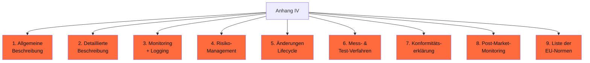
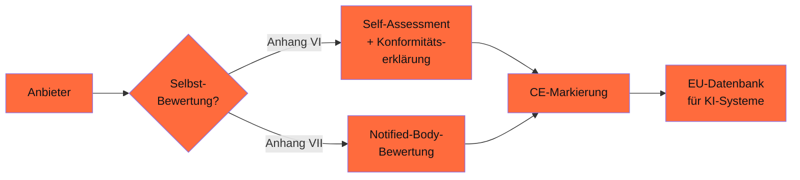

## Worum es geht

> Stop treating AI-Act as „läuft schon noch". — Anhang IV ist die **technische Dokumentation**, die Hochrisiko-KI-Anbieter Behörden vorlegen müssen. Diese Lektion zeigt, was wirklich drin sein muss — und wie Phasen 11/12/14/16/17/18 zusammen das Material liefern.

## Voraussetzungen

- Lektion 18.02 (Bias-Audit)
- Lektion 18.07 (Red-Teaming)
- Lektion 18.09 (Safety-Frameworks)

## Konzept

### Was ist Anhang IV?

[VO 2024/1689 Anhang IV](https://eur-lex.europa.eu/eli/reg/2024/1689/oj) listet **9 Pflicht-Inhalte** der technischen Dokumentation für Hochrisiko-KI:



### Pflicht-Inhalte mit Mapping zu unseren Phasen

#### 1. Allgemeine Beschreibung

- **Zweck und Use-Case** (Phase 20.01 AI-Act-Klassifikation)
- **Anbieter, ggf. Bevollmächtigter** in EU
- **Modell-Familie + Versionen**

#### 2. Detaillierte Beschreibung des Systems

- **Architektur-Diagramm** (Mermaid aus Phasen 11/14/17)
- **Trainings-Daten + Filter** (Phase 12.03 + 12.04)
- **Modell-Card + Manifest** (Phase 12.06)
- **Tools / MCP-Server** (Phase 14.03)
- **Inference-Stack** (Phase 17.01–17.06)

#### 3. Monitoring + Logging

- **OpenTelemetry GenAI Spans** (Phase 17.08)
- **Phoenix / Langfuse** Tracing
- **Audit-Trail-Aufbewahrung** ≥ 6 Monate
- **PII-Redaction-Pipeline** (Phase 17.08)

#### 4. Risiko-Management-System (Art. 9)

- **Risikoanalyse** für Use-Case
- **Bias-Audit-Reports** (Phase 18.02)
- **Red-Team-Reports** (Phase 18.07)
- **Self-Censorship-Audit** (falls asiatische Modelle, Phase 18.08)
- **Mitigation-Plan** + Implementierungs-Status

#### 5. Änderungen während des Lifecycle

- **Versionierungs-Strategie** (Git-Tags, HF-Hub-Tags, Phase 12.06)
- **Change-Management-Prozess** (PR-Review, Phase 17.06)
- **Re-Audit-Kadenz** (quartalsweise pflichtbewusst)

#### 6. Mess- und Test-Verfahren

- **Eval-Suite mit Promptfoo** (Phase 11.08)
- **Ragas-Eval** für RAG (Phase 11.09)
- **Bias-Audit-Pipeline** (Phase 18.02)
- **Verifier-Loops** (Phase 16.06)
- **CI-Integration** (Phase 18.07)

#### 7. Konformitätserklärung

- **EU-Konformitätserklärung** unterzeichnet vom Anbieter
- **Konformitätsbewertungs-Verfahren** (Anhang VI oder VII gewählt)
- **Bei Hochrisiko**: ggf. Notified-Body-Bewertung

#### 8. Post-Market-Monitoring

- **Production-Metriken** + Alerting (Phase 17.09)
- **Incident-Response** + NIS2-Notifikation (Phase 17 compliance)
- **User-Feedback-Loop** + Beschwerde-Pfad

#### 9. Liste angewandter EU-Normen

- ISO/IEC 42001 (AI Management System)
- ISO/IEC 27001 (ISMS)
- ISO/IEC 27018 (Cloud-PII)
- BSI C5 / AIC4
- IEEE 7000-Serie (AI Ethics)

### BSI-Bridges

Stand 04/2026 sind diese **deutschen** Standards praktikable Bridges zu AI-Act:

#### BSI AIC4 (AI Cloud Compliance Criteria Catalogue)

URL: <https://www.bsi.bund.de/AIC4>

Etablierter Katalog seit 2021, deckt Cloud-AI-Compliance ab:

- Datenschutz + DSGVO-Konformität
- Cybersicherheit + Incident-Response
- Transparenz + Erklärbarkeit
- Robustheit + Eval-Verfahren

> AIC4-Konformität deckt ~ 70 % der AI-Act-Anhang-IV-Pflichten. Plus: AIC4 hat akzeptierte Audit-Verfahren, die Behörden anerkennen.

#### ISO/IEC 42001 (AI Management System)

URL: <https://www.iso.org/standard/81230.html>

Internationaler Standard seit Ende 2023, deckt:

- AI-Risk-Assessment
- AI-Lifecycle-Management
- Daten-Governance
- Stakeholder-Engagement

> Stand 04/2026: ISO 42001-Zertifizierung läuft bei großen Anbietern (Anthropic, OpenAI, Aleph Alpha). Für DACH-KMU oft Aufwand-zu-hoch — AIC4 ist näher dran.

### ENISA-Framework als zusätzliche Bridge

ENISA „Multilayer Framework for Good Cybersecurity Practices for AI" — <https://www.enisa.europa.eu/publications/multilayer-framework-for-good-cybersecurity-practices-for-ai>

EU-Cybersecurity-Behörden-Sicht. Komplementär zu BSI AIC4.

### Konformitätsbewertungs-Pfad



**Anhang VI (Self-Assessment)**: für die meisten Hochrisiko-Use-Cases möglich.

**Anhang VII (Notified Body)**: bei besonders kritischen Systemen (z. B. biometrische Identifikation in Echtzeit) oder wenn Anbieter selbst nicht alle Anforderungen mit harmonisierten Normen erfüllt.

### EU-Datenbank für KI-Systeme (Art. 71)

Hochrisiko-Anbieter müssen ihr System in der **EU-Datenbank** registrieren — öffentlich einsehbar. Stand 04/2026 ist die Datenbank im Aufbau, eGovernment-DE pflichtet sich an.

### DACH-Konformitätserklärung — Template

```yaml
# konformitaets-erklaerung-v1.0.yaml
anbieter:
  name: "Beispiel GmbH"
  hrb: "HRB 12345 B"
  adresse: "Musterstraße 1, 80331 München"
  bevollmaechtigter_eu: "selbst"  # bei DE-Anbieter

system:
  name: "Beispiel-KI-Stack v1.0"
  zweck: "DACH-Bürger-Service-Bot mit RAG"
  klassifikation: "begrenztes Risiko"  # (oder "hoch")
  klassifikation_begruendung: "Chat-Bot ohne automatisierte Entscheidung über Personen"

modelle:
  - name: "Pharia-1-LLM-7B-control"
    version: "1.0"
    lizenz: "open-aleph-license"
    sha256_weights: "abc..."
  - name: "Llama-Guard-4-12B (Output-Filter)"
    version: "4.0"
    lizenz: "Llama-Community-License"

trainings_daten:
  basis: "Web-Pretraining (Aleph Alpha)"
  finetune: "datasets/de-domain-2026-04.jsonl, sha256=def..."
  filter: "Pipeline aus Phase 12.04 + Audit-Log"

eval:
  bias_audit: "audits/bias-2026-04-29.json"
  red_team: "audits/redteam-2026-04-29.json"
  safety_test: "audits/llamaguard-2026-04-29.json"
  promptfoo_score: 0.92

monitoring:
  tracing: "Phoenix self-hosted (Phase 17.08)"
  alerting: "Grafana + AlertManager (Phase 17.09)"
  audit_aufbewahrung_monate: 12

compliance:
  iso_27001: "in Vorbereitung"
  bsi_aic4: "geprüft 2026-Q1"
  iso_42001: "geplant Q3/2026"
  dsgvo_dpa: "ja, mit allen Subprocessors"
  nis2_relevant: "nein"

konformitaets_pfad: "Anhang VI (Self-Assessment)"

unterzeichnet_durch:
  name: "Geschäftsführung"
  datum: "2026-04-29"
```

### EU AI Office — GPAI Code of Practice

Stand 04/2026: das **EU AI Office** ([digital-strategy.ec.europa.eu/en/policies/ai-office](https://digital-strategy.ec.europa.eu/en/policies/ai-office)) hat den **GPAI Code of Practice** am **10.07.2025 finalisiert** ([Final Version](https://code-of-practice.ai/)) und am **01.08.2025** durch Kommission + AI Board (Adäquanzentscheidung) gebilligt. GPAI-Pflichten gelten seit **02.08.2025**; Kommissions-Enforcement (Auskunfts­ersuchen, Modell-Zugriffe, Recalls) startet **02.08.2026**. Drei Kapitel:

- **Transparency** — Modell-Karte + Trainings-Daten-Zusammenfassung öffentlich
- **Copyright** — TDM-Opt-out-Respekt (UrhG § 44b), Lizenzkette dokumentiert
- **Safety & Security** — nur für **Systemic-Risk-Anbieter** (>10²⁵ FLOPs): Risk-Assessment, Cybersecurity, Incident-Reporting

> Der CoP ist **freiwillig**, aber faktisch State-of-the-Art-Compliance-Beleg. Wer ihn unterzeichnet, signalisiert AI-Act-Konformität. Für DACH-Anbieter, die **eigene** Foundation-Modelle bauen, ist er die einfachste Compliance-Schiene; Bereitsteller (Anbieter, die GPAI nur nutzen) haben Anhang IV-Pflichten für das eigene Hochrisiko-System.

### Konkrete BSI-Vorlage Stand 04/2026

> ⚠️ **Stand 04/2026**: Eine **offizielle, AI-Act-Anhang-IV-spezifische BSI-Vorlage** auf Deutsch ist mir nicht eindeutig bekannt. AIC4 + ISO/IEC 42001 sind die praktikable Brücke. Status laufend prüfen: <https://www.bsi.bund.de/KI>.

### Compliance-Pipeline-Übersicht

Was du **mindestens** im Repo haben solltest, um Anhang IV zu erfüllen:

```text
docs/konformitaet/
├── konformitaets-erklaerung-v1.0.yaml
├── system-architektur-diagramm.md      # Mermaid
├── risk-assessment-2026-Q1.md
├── bias-audit-2026-04-29.json          # aus Phase 18.02
├── red-team-report-2026-04-29.json     # aus Phase 18.07
├── safety-frameworks-config.yaml       # NeMo + Llama Guard (Phase 18.09)
├── trainings-daten-manifest.yaml       # aus Phase 12.03
├── eval-suite/
│   ├── promptfoo-results.json
│   └── ragas-results.json
└── post-market-monitoring/
    ├── grafana-dashboards/
    └── incident-response-runbook.md
```

## Hands-on

1. Erstelle für einen deiner Use-Cases die Konformitätserklärung (YAML-Template)
2. Mappe Phase-Doks zu Anhang-IV-Punkten 1–9
3. Identifiziere Lücken — welche Audit-Reports / Manifeste fehlen?
4. Plane den Konformitäts-Pfad (Anhang VI Self-Assessment vs. Anhang VII)

## Selbstcheck

- [ ] Du nennst die 9 Pflicht-Inhalte des Anhang IV.
- [ ] Du mappst diese zu konkreten Phasen (11–18) im Werkstatt-Curriculum.
- [ ] Du kennst BSI AIC4 + ISO 42001 als Bridges.
- [ ] Du erstellst eine Konformitätserklärung als YAML-Template.
- [ ] Du planst den Konformitäts-Pfad (Self-Assessment vs. Notified Body).

## Compliance-Anker

- **AI-Act Art. 9 / 10 / 12 / 13 / 14 / 15 / 43 / 47**: alle in Anhang IV referenziert
- **BSI AIC4**: Bridge zu AI-Act-Anhang-IV
- **ISO/IEC 42001**: international anerkanntes AI Management System

## Quellen

- VO (EU) 2024/1689 (AI Act, Anhang IV) — <https://eur-lex.europa.eu/eli/reg/2024/1689/oj>
- BSI AIC4 — <https://www.bsi.bund.de/AIC4>
- BSI KI — <https://www.bsi.bund.de/KI>
- ENISA AI Cybersecurity Framework — <https://www.enisa.europa.eu/publications/multilayer-framework-for-good-cybersecurity-practices-for-ai>
- ISO/IEC 42001 — <https://www.iso.org/standard/81230.html>
- EU AI Office — <https://digital-strategy.ec.europa.eu/en/policies/ai-office>
- BfDI KI — <https://www.bfdi.bund.de/>

## Weiterführend

→ Phase **20.01** (AI-Act-Risikoklassifizierung als Vor-Stufe)
→ Phase **20.05** (Audit-Logging-Pipeline)
→ Phase **17** (Production-Stack als Beleg-Material)
