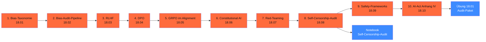

# Phase 18 · Ethik, Safety, Alignment

> **Stop assuming bias is solved.** — auf Deutsch wird's gerade erst spannend. Diese Phase baut den **kompletten Audit-Stack** für DACH-2026: Bias-Taxonomie, Bias-Audit-Pipeline, DPO/GRPO als Korrektur, Constitutional AI, Red-Teaming, Self-Censorship-Audit, Safety-Frameworks und AI-Act Anhang IV.

**Status**: ✅ vollständig ausgearbeitet · **Dauer**: ~ 14 h · **Schwierigkeit**: fortgeschritten

## 🎯 Was du in diesem Modul lernst

- **Bias-Taxonomie**: 6 DACH-Dimensionen + Test-Patterns
- **Bias-Audit-Pipeline**: Probes / Pairs / Open-End mit DIR + Equalized Odds
- **Alignment-Methoden**: RLHF (historisch) / DPO (Default 2026) / GRPO (Verifier-Tasks) / KTO (binäre Labels)
- **Constitutional AI**: Anthropic-Pattern + eigene DACH-Verfassung
- **Red-Teaming**: Garak, PyRIT, promptfoo, eigenes DACH-Set
- **Self-Censorship-Audit**: 50 dt. Geopolitik-Prompts gegen DeepSeek, Qwen, GLM, Kimi
- **Safety-Frameworks**: NeMo Guardrails (5 Rails-Typen) + Llama Guard 3 + DACH-StGB-Policies
- **AI-Act Anhang IV**: Konformitätsbewertung praktisch + Bridge zu BSI AIC4 / ISO 42001

## 🧭 Wie du diese Phase nutzt



## 📚 Inhalts-Übersicht

| Lektion | Titel | Dauer | Datei |
|---|---|---|---|
| 18.01 | Bias-Taxonomie für deutsche Modelle | 60 min | [`lektionen/01-bias-taxonomie.md`](lektionen/01-bias-taxonomie.md) ✅ |
| 18.02 | **Bias-Audit-Pipeline** (DIR, Equalized Odds) | 75 min | [`lektionen/02-bias-audit-pipeline.md`](lektionen/02-bias-audit-pipeline.md) ✅ |
| 18.03 | RLHF (SFT → Reward → PPO) | 60 min | [`lektionen/03-rlhf.md`](lektionen/03-rlhf.md) ✅ |
| 18.04 | **DPO als RLHF-Alternative** | 60 min | [`lektionen/04-dpo.md`](lektionen/04-dpo.md) ✅ |
| 18.05 | GRPO im Alignment-Kontext | 45 min | [`lektionen/05-grpo-alignment.md`](lektionen/05-grpo-alignment.md) ✅ |
| 18.06 | Constitutional AI (Anthropic) | 60 min | [`lektionen/06-constitutional-ai.md`](lektionen/06-constitutional-ai.md) ✅ |
| 18.07 | **Red-Teaming auf Deutsch** | 75 min | [`lektionen/07-red-teaming.md`](lektionen/07-red-teaming.md) ✅ |
| 18.08 | **Self-Censorship-Audit** (DeepSeek, Qwen, GLM, Kimi) | 90 min | [`lektionen/08-self-censorship-audit.md`](lektionen/08-self-censorship-audit.md) ✅ |
| 18.09 | Safety-Frameworks (NeMo + Llama Guard 3) | 60 min | [`lektionen/09-safety-frameworks.md`](lektionen/09-safety-frameworks.md) ✅ |
| 18.10 | **AI-Act Anhang IV** — Konformitätsbewertung | 60 min | [`lektionen/10-ai-act-anhang-iv.md`](lektionen/10-ai-act-anhang-iv.md) ✅ |

## 💻 Hands-on-Projekt

**Self-Censorship-Audit-Notebook**: 50 dt. Geopolitik-Prompts in 5 Kategorien (Tiananmen, Taiwan, Xinjiang, Xi, Hongkong) gegen 7 Modelle (DeepSeek, Qwen, GLM, Pharia, Mistral, Claude, GPT). Aggregierte Studien-Daten Stand 04/2026.

[](https://colab.research.google.com/github/s-a-s-k-i-a/ki-engineering-werkstatt/blob/main/dist-notebooks/phasen/18-ethik-safety-alignment/code/01_self_censorship_audit.ipynb)

```bash
uv run marimo edit phasen/18-ethik-safety-alignment/code/01_self_censorship_audit.py
```

Plus die [Übung 18.01](uebungen/01-aufgabe.md): Vollständiges Audit-Paket (Bias + Self-Censorship + Red-Team + Safety-Stack + Konformitätserklärung) für ein konkretes DACH-Modell ([Lösungs-Skelett](loesungen/01_loesung.py)).

## 🧱 Alignment-Wahl 2026 (Faustregel)

| Daten verfügbar | Methode |
|---|---|
| Paarweise Präferenzen (chosen/rejected) | **DPO** |
| Binäre Labels (gut/schlecht, Daumen-hoch/runter) | **KTO** |
| Verifier (Math, Code, Schema) | **GRPO** |
| Mehrere Rewards (Bias + Korrektheit + Format) | **GRPO Multi-Reward** |
| Skalierte Werte-Definition | **Constitutional AI** + DPO |
| Klassische RLHF (Reward-Modell + PPO) | **selten** — meist überkomplex |

## ⚖️ DACH-Compliance-Anker

→ [`compliance.md`](compliance.md): Bias-Audit-Pflicht (AI-Act Art. 10 + 15), DSGVO Art. 22 bei automatisierten Entscheidungen, AI-Act Anhang IV als Konformitätsbewertung.

Phasen-spezifisch:

- **Bias-Audit pro Quartal** für Hochrisiko-KI
- **Self-Censorship-Disclaimer** bei asiatischen Modellen pflicht
- **DACH-StGB-Policies** (§ 86a, § 130) im Safety-Stack
- **Konformitätserklärung** als YAML committed im Repo
- **Re-Audit-Kadenz** quartalsweise + Jahresreport

## ✅ Voraussetzungen

- Phase 11 (LLM-Engineering) — Pydantic AI + Promptfoo
- Phase 12 (LoRA + DPO/GRPO-Training)
- Phase 14.08 (Sicherheit + OWASP LLM Top 10)
- Phase 16 (GRPO-Mathematik, Reasoning-Modelle)

## 📖 Quellen (Auswahl)

- BBQ-Paper — <https://arxiv.org/abs/2110.08193>
- DPO-Paper — <https://arxiv.org/abs/2305.18290>
- GRPO-Paper — <https://arxiv.org/abs/2402.03300>
- Constitutional AI — <https://arxiv.org/abs/2212.08073>
- AI Act Anhang IV — <https://eur-lex.europa.eu/eli/reg/2024/1689/oj>
- BSI AIC4 — <https://www.bsi.bund.de/AIC4>
- Llama Guard 3 — <https://huggingface.co/meta-llama/Llama-Guard-3-8B>
- NeMo Guardrails — <https://github.com/NVIDIA/NeMo-Guardrails>
- Garak — <https://github.com/leondz/garak>
- Vollständig in [`weiterfuehrend.md`](weiterfuehrend.md).

## 🔄 Wartung

Stand: 29.04.2026 · Reviewer: Saskia Teichmann ([@s-a-s-k-i-a](https://github.com/s-a-s-k-i-a)) · Nächster Review: 07/2026 (Llama Guard 4 Verfügbarkeit, Self-Censorship-Audit-Refresh, BSI AIC4-Updates). **Audit-Methodik entwickelt sich quartalsweise** — bei Production-Einsatz Audit-Stand pflichtbewusst dokumentiert.
