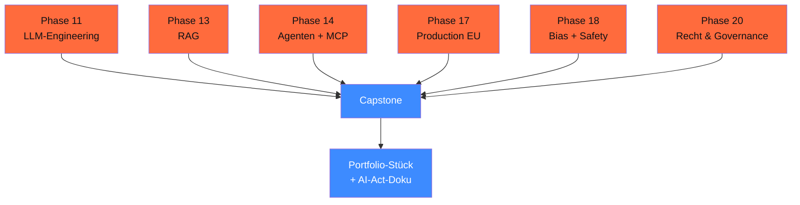

# Phase 19 · Abschlussprojekte — 5 echte DACH-Capstones

> **Stop building toy projects.** — wähle einen echten Use-Case mit DACH-Bezug, baue ihn End-to-End, dokumentiere ihn AI-Act-konform.

**Status**: ✅ alle 5 Capstones ausgearbeitet (Skelette + Stub-Notebooks + Compliance-Doku).

## 🎯 Was du in diesem Modul baust

Wähle 1 aus 5 Capstones. Jeder 8–15 h, jeweils mit eigener `compliance.md`, AI-Act-Klassifikation, DSFA-Light, lauffähigem Code-Skelett.

## Capstones-Übersicht

| # | Capstone | Status | Schwierigkeit | Phasen-Bezug |
|---|---|---|---|---|
| 19.A | **WP-Plugin-Helfer-RAG** | ✅ ausgearbeitet | experte | 11/13/14/17/18/20 |
| 19.B | **DSGVO-Compliance-Checker** | ✅ ausgearbeitet | mittel | 11/13/20 |
| 19.C | **Charity-Adoptions-Bot** | ✅ ausgearbeitet | fortgeschritten | 11/13/14/17/20 |
| 19.D | **Aktiengesetz-RAG** | ✅ ausgearbeitet | experte | 11/13/16/17/20 |
| 19.E | **Mehrsprachiger Voice-Agent** | ✅ ausgearbeitet | experte | 06/11/14/17 |

## 19.A — WP-Plugin-Helfer-RAG ✅

**Ziel**: Multilinguales Plugin-Doku-RAG mit Code-Search + Issue-Triage + PR-Vorschlägen.

**Stack**: Pydantic AI + Qdrant + WP-REST-API + tree-sitter-php

**Verzeichnis**: [`projekte/19-A-wp-plugin-helfer-rag/`](../../projekte/19-A-wp-plugin-helfer-rag/)

**Kern-Idee**: drei Sub-Agents (Doku / Code / Issue) hinter einem Supervisor. Real-World-Use-Case für Saskias citelayer®-Plugin-Familie (oder beliebige WP-Plugin-Familie).

→ [Capstone 19.A README](../../projekte/19-A-wp-plugin-helfer-rag/README.md)

## 19.B — DSGVO-Compliance-Checker ✅

**Ziel**: Webseiten-Crawler analysiert Cookie-Banner, AVV-Links, Tracker → DSFA-Light-Bericht.

**Stack**: Playwright + Pydantic AI + Mistral oder Pharia-1

**Compliance-Bezug**: AI-Act + DSGVO + TTDSG § 25 + EuGH Planet49

**Verzeichnis**: [`projekte/19-B-dsgvo-compliance-checker/`](../../projekte/19-B-dsgvo-compliance-checker/)

## 19.C — Charity-Adoptions-Bot ✅

**Ziel**: End-to-End-Voice-Chatbot: Adoptionsprozess, Termine buchen, Tierprofile.

**Stack**: Pharia/Mistral + Whisper-large-v3 + F5-TTS + LangGraph mit HITL

**Compliance-Bezug**: vollständige DSGVO-Pipeline (Pattern aus Phase 14.09 als Vollausbau)

**Verzeichnis**: [`projekte/19-C-charity-adoptions-bot/`](../../projekte/19-C-charity-adoptions-bot/)

## 19.D — Aktiengesetz-RAG ✅

**Ziel**: Legal-RAG auf AktG-Volltext mit Paragraf-genauer Quellen-Attribution + § RDG-Disclaimer.

**Stack**: Pharia-1 oder Opus 4.7 + Qdrant Hybrid (BM25+Dense) + bge-reranker-v2-m3

**Compliance-Bezug**: AI-Act Art. 50.4 (Quellen-Pflicht), § RDG, möglicherweise Hochrisiko (Anhang III Nr. 8)

**Verzeichnis**: [`projekte/19-D-aktiengesetz-rag/`](../../projekte/19-D-aktiengesetz-rag/)

## 19.E — Mehrsprachiger Voice-Agent ✅

**Ziel**: DeepL + Whisper + F5-TTS-Pipeline für DE↔EN↔TR Live-Übersetzung mit Kontext-Memory.

**Stack**: Whisper-large-v3 + DeepL Pro + F5-TTS + LangGraph + Postgres-Memory

**Compliance-Bezug**: DSGVO Art. 9 (Voice = biometrisch!), Auto-Lösch-Pipeline, Phase 06 als Voraussetzung

**Verzeichnis**: [`projekte/19-E-voice-agent-multi/`](../../projekte/19-E-voice-agent-multi/)

## ⚖️ DACH-Compliance-Anker (alle Capstones)

→ [`compliance.md`](compliance.md): Pflicht-Pattern für jedes Capstone.

Pro Capstone:

- **AI-Act-Klassifizierung** (Phase 20.01)
- **DSFA-Light** (Phase 20.03)
- **AVV mit allen Cloud-Providern** (Phase 20.02)
- **Audit-Logging** mit Phoenix (Phase 17.08)
- **Bias-Audit** auf 30 Test-Probes (Phase 18.02)
- **Konformitätserklärung** als YAML (Phase 18.10)

## Lerneffekt

Capstones führen die **alle** vorherigen Phasen praktisch zusammen:

## 🔄 Wartung

Stand: 29.04.2026 · Reviewer: Saskia Teichmann ([@s-a-s-k-i-a](https://github.com/s-a-s-k-i-a)) · Nächster Review: 07/2026 (weitere Capstones 19.B–19.E iterativ ausarbeiten).
