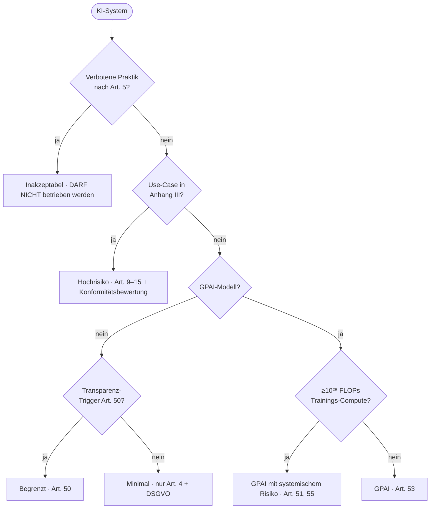

<!-- colab-badge:begin -->
[](https://colab.research.google.com/github/s-a-s-k-i-a/ki-engineering-werkstatt/blob/main/dist-notebooks/phasen/20-recht-und-governance/code/01_ai_act_demo.ipynb)
<!-- colab-badge:end -->

## Worum es geht

> Stop building before you classify. — die Risikoklasse bestimmt, welche Pflichten du erfüllen musst.

Der EU AI Act definiert vier Risiko-Klassen plus zwei GPAI-Sonderfälle:



## Voraussetzungen

- Phase 0 (Werkstatt + `uv sync`)
- Lust, AI-Act mal nicht abstrakt zu lesen, sondern als Entscheidungsbaum

## Konzept

### Inakzeptabel (Art. 5) — verboten ab 02.02.2025

Acht Kategorien sind verboten, u. a.:

- **Social Scoring** durch Behörden (lit. c)
- **Kognitive Manipulation** (subliminal, irreführend) (lit. a)
- **Ausnutzung vulnerabler Gruppen** (Kinder, Ältere) (lit. b)
- **Wahllose Gesichtserkennungs-DBs aus Internet/CCTV** (lit. e)
- **Echtzeit-Fernidentifikation in öffentlich zugänglichen Räumen für Strafverfolgung** (lit. h, eng definierte Ausnahmen)
- **Emotionserkennung am Arbeitsplatz/in Bildung** (lit. f)
- **Biometrische Kategorisierung nach sensiblen Merkmalen** (lit. g)
- **Predictive Policing rein auf Profiling** (lit. d)

Verstoß = bis 35 Mio. € oder 7 % Jahresumsatz.

### Hochrisiko (Anhang III + Anhang I)

Anhang III nennt acht Use-Case-Bereiche:

1. Biometrie (Identifikation/Kategorisierung außerhalb Art. 5)
2. Kritische Infrastruktur (Verkehr, Wasser, Gas, Strom)
3. Bildung & Prüfung
4. Beschäftigung (HR, Performance)
5. Wesentliche private/öffentliche Dienste (Kreditscoring, Versicherung, Sozialleistungen)
6. Strafverfolgung
7. Migration, Asyl, Grenzkontrolle
8. Justiz & Demokratie

Pflichten Art. 9–15: Risk Management, Daten-Governance, Tech-Doku, Logging, Transparenz, Human Oversight, Accuracy/Robustness/Cybersecurity. Plus Konformitätsbewertung und CE-Kennzeichnung.

### Begrenzt (Art. 50) — Transparenz-Pflichten ab 02.08.2026

- **Chatbot**: Hinweis, dass KI im Spiel ist
- **Synthetische Inhalte**: maschinenlesbar markieren (C2PA)
- **Deepfakes**: deutlich als KI-generiert kenntlich machen
- **Emotionserkennung/Biometrische Kategorisierung** (zulässige Fälle): Information

### Minimal

Alles andere. Keine direkten AI-Act-Pflichten — aber DSGVO bleibt voll anwendbar, und **Art. 4 AI-Literacy gilt für alle Bereitsteller seit 02.02.2025**.

### GPAI-Sonderregime

- **GPAI-Anbieter** (Art. 53): Tech-Doku, Information an Bereitsteller, Copyright-Policy, Trainingsdaten-Zusammenfassung
- **GPAI mit systemischem Risiko** (Art. 51, 55): zusätzliche Eval-, Cybersecurity-, Incident-Reporting-, Energie-Doku-Pflichten ab Trainings-Compute ≥10²⁵ FLOPs

### Volatilität (Stand 04/2026)

- **Digital Omnibus on AI** (Vorschlag 19.11.2025): Hochrisiko-Stichtag evtl. von 02.08.2026 → 02.12.2027 verschoben. Trilog läuft. Für Compliance trotzdem nicht aufschieben.
- **CEN-CENELEC harmonisierte Normen**: erste Q3 2026 erwartet — schaffen Konformitätsvermutung.

## Code-Walkthrough

```bash
# Klassifiziere ein KI-System per Modell-Karte
ki-act-classifier --modell-karte vorlagen/model-card-adoption-bot.yaml
```

Im Notebook [`code/01_ai_act_demo.py`](../code/01_ai_act_demo.py) gehen wir die Klassifizierung Schritt für Schritt durch — mit drei Beispielen:

1. **Charity-Adoptions-Bot** → Begrenzt (Chatbot-Transparenz)
2. **HR-Screening für Kreditbank** → Hochrisiko (Anh. III Nr. 4 + 5)
3. **Behördliches Social-Scoring** → Inakzeptabel

## Hands-on

Bearbeite [`uebungen/01-aufgabe.md`](../uebungen/01-aufgabe.md):

1. Schreibe eine `model-card.yaml` für dein eigenes Projekt
2. Lasse `ki-act-classifier` laufen
3. Vergleiche Ergebnis mit deiner Erwartung
4. Schreibe einen 200-Wort-Compliance-Plan mit den genannten Pflichten

## Selbstcheck

- [ ] Du kennst die acht Verbote nach Art. 5
- [ ] Du kennst die acht Hochrisiko-Bereiche nach Anhang III
- [ ] Du erklärst, warum GPAI ≥10²⁵ FLOPs Sonderpflichten triggert
- [ ] Du nutzt `ki-act-classifier` ohne Spickzettel

## Compliance-Anker

- Master-Anker — alle anderen Phasen verlinken hierher

## Quellen

- VO (EU) 2024/1689 (AI Act) — <https://eur-lex.europa.eu/legal-content/DE/ALL/?uri=CELEX:32024R1689>
- BMDS Durchführung KI-VO — <https://bmds.bund.de/service/gesetzgebungsverfahren/gesetz-zur-durchfuehrung-der-ki-verordnung>
- Bundestag KI-MIG 1. Lesung 20.03.2026 — <https://www.bundestag.de/dokumente/textarchiv/2026/kw12-de-kuenstliche-intelligenz-1151800>
- TÜV Consulting — Digital Omnibus 2026 — <https://consulting.tuv.com/aktuelles/ki-im-fokus/eu-ai-act-2026-zwischenstand>
- Bitkom Leitfaden KI & Datenschutz 2.0 (08/2025) — <https://www.bitkom.org/sites/main/files/2025-08/bitkom-leitfaden-kuenstliche-intelligenz-und-datenschutz-auflage-2.pdf>

## Weiterführend

→ Lektion 20.02 (AVV-Muster), 20.03 (DSFA), 20.05 (Audit-Logging)
