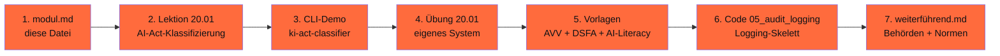

# Phase 20 · Recht & Governance — der DACH-Layer

> **Stop hoping no one notices.** — Compliance ist 2026 das größte Risiko für KI-Projekte im Mittelstand.

**Status**: ✅ Showcase-Modul, vollständig ausgearbeitet · **Dauer**: ~ 12 h · **Schwierigkeit**: mittel

> Das Compliance-Modul ist das Herzstück der Werkstatt. Hier wird aus „KI-Engineering" *EU-konformes* KI-Engineering — mit CLI-Tools, Templates und Pattern, nicht mit Floskeln.

> [!IMPORTANT]
> **Dieser Block ist keine juristische Beratung.** Er macht Compliance praktisch — mit CLI-Tools, Templates und Pattern. Bei konkreten Fällen: Datenschutzbeauftragte:n oder Kanzlei einschalten. Disclaimer in [`docs/rechtliche-perspektive/disclaimer.md`](../../docs/rechtliche-perspektive/disclaimer.md).

## 🎯 Was du in diesem Modul lernst

- Ein KI-System nach AI-Act in unter 5 Min. klassifizieren (CLI: `ki-act-classifier`)
- Einen AVV anhand eines Mustertemplates für deinen Use-Case erstellen
- Eine DSFA-Light durchführen
- Ein 4-h-AI-Literacy-Onboarding für Mitarbeitende aufbauen
- Audit-Logs nach AI-Act Art. 12 strukturieren
- ai.txt / robots.txt für deine Domain generieren (CLI: `ki-ai-txt`)
- Lizenz-Scanner über deine Modelle und Datasets laufen lassen

## 🧭 Wie du diese Phase nutzt



## 📚 Inhalts-Übersicht

| Lektion | Titel | Dauer | Datei |
|---|---|---|---|
| 20.01 | AI-Act-Risk-Klassifizierung mit Entscheidungsbaum | 90 min | [`lektionen/01-ai-act-risk.md`](lektionen/01-ai-act-risk.md) ✅ |
| 20.02 | AVV-Muster für die wichtigsten Cloud-LLM-Anbieter | 60 min | [`vorlagen/avv-checkliste.md`](vorlagen/avv-checkliste.md) ✅ |
| 20.03 | DSFA-Workflow am Beispiel „Charity-Adoptions-Bot" | 90 min | [`vorlagen/dsfa-template.md`](vorlagen/dsfa-template.md) ✅ |
| 20.04 | AI-Literacy-Curriculum (Art. 4) | 60 min | [`vorlagen/ai-literacy-onboarding.md`](vorlagen/ai-literacy-onboarding.md) ✅ |
| 20.05 | Audit-Logging-Code-Skelett (OpenTelemetry GenAI) | 60 min | [`code/05_audit_logging.py`](code/05_audit_logging.py) ✅ |
| 20.06 | ai.txt + robots.txt-Generator (UrhG § 44b) | 30 min | *siehe Werkzeug `ki-ai-txt`* |
| 20.07 | Lizenz-Scanner für Modelle/Datasets/Deps | 60 min | *geplant* |
| 20.08 | Sektor-Special: BaFin (Finance), MDR (Medizin), KritisDachG (KRITIS) | 90 min | *geplant* |

## 💻 CLI-Werkzeuge (Pflicht-Demo)

```bash
# 1) AI-Act-Risk-Klassifizierung
ki-act-classifier --modell-karte vorlagen/model-card-adoption-bot.yaml

# 2) ai.txt + robots.txt für eine Domain
ki-ai-txt --domain example.de -o ./output/

# 3) Compliance-Schema-Validierung über alle Phasen
ki-compliance-lint phasen/
```

[](https://colab.research.google.com/github/s-a-s-k-i-a/ki-engineering-werkstatt/blob/main/dist-notebooks/phasen/20-recht-und-governance/code/01_ai_act_demo.ipynb)

## ✅ Voraussetzungen

- Phase 00 (Werkstatt)
- Empfehlenswert: Phase 11 (LLM-Engineering) und Phase 18 (Ethik)

## ⚖️ Compliance-Layer-Verzeichnis

Dieses Modul ist der zentrale Compliance-Layer. Alle anderen Phasen verlinken hierher:

- [`docs/rechtliche-perspektive/ai-act-tracker.md`](../../docs/rechtliche-perspektive/ai-act-tracker.md) — Inkrafttretens-Stufen
- [`docs/rechtliche-perspektive/dsgvo-checklisten.md`](../../docs/rechtliche-perspektive/dsgvo-checklisten.md)
- [`docs/rechtliche-perspektive/avv-musterklauseln.md`](../../docs/rechtliche-perspektive/avv-musterklauseln.md)
- [`docs/rechtliche-perspektive/urheberrecht-trainingsdaten.md`](../../docs/rechtliche-perspektive/urheberrecht-trainingsdaten.md)
- [`docs/rechtliche-perspektive/asiatische-llms.md`](../../docs/rechtliche-perspektive/asiatische-llms.md)
- [`docs/rechtliche-perspektive/disclaimer.md`](../../docs/rechtliche-perspektive/disclaimer.md)

## 📖 Quellen (Auswahl)

- VO (EU) 2024/1689 (AI Act) — <https://eur-lex.europa.eu/legal-content/DE/ALL/?uri=CELEX:32024R1689>
- BfDI Kurzpapier KI — <https://www.bfdi.bund.de/SharedDocs/Kurzmeldungen/DE/2024/AI-Act.html>
- DSK Orientierungshilfe KI 06.05.2024 — <https://www.datenschutzkonferenz-online.de/media/oh/20240506_DSK_Orientierungshilfe_KI_und_Datenschutz.pdf>
- TÜV Consulting Digital Omnibus 2026 — <https://consulting.tuv.com/aktuelles/ki-im-fokus/eu-ai-act-2026-zwischenstand>
- Bundestag KI-MIG 1. Lesung 20.03.2026 — <https://www.bundestag.de/dokumente/textarchiv/2026/kw12-de-kuenstliche-intelligenz-1151800>
- Vollständig in [`weiterfuehrend.md`](weiterfuehrend.md).

## 🔄 Wartung

Stand: 28.04.2026 · Reviewer: Saskia Teichmann ([@s-a-s-k-i-a](https://github.com/s-a-s-k-i-a)) · Nächster Review: 05/2026 (AI-Act-Tracker monatlich).
