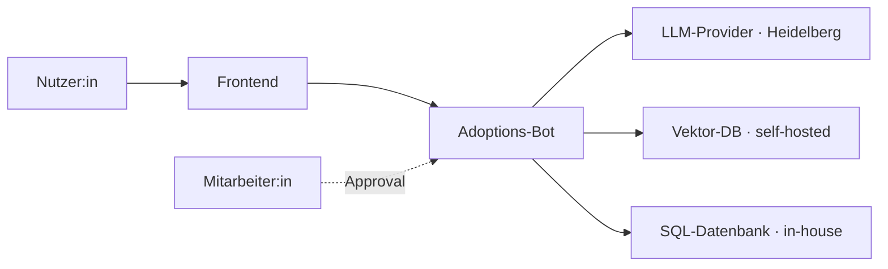

# DSFA-Template (Art. 35 DSGVO) für KI-Systeme

> **Disclaimer**: Vorlage zur strukturierten Selbstprüfung, nicht abschließend. Bei Hochrisiko-Systemen: Datenschutzbeauftragte:n oder Aufsichtsbehörde einbeziehen.

## 1. Beschreibung der Verarbeitung

| Feld | Inhalt |
|---|---|
| Verfahrensbezeichnung | _z. B. Charity-Adoptions-Bot v1.0_ |
| Verantwortlicher | _Organisation, Anschrift_ |
| Datenschutzbeauftragte:r | _Name, Kontakt_ |
| Auftragsverarbeiter | _LLM-Provider, Vector-DB-Provider, Hosting_ |
| Stand | _YYYY-MM-DD_ |

### Zweck

_Was soll das System bewirken?_

### Datenkategorien

- _z. B. Stammdaten (Name, E-Mail, Telefon)_
- _z. B. Anfragen-Inhalt (kann sensitive Themen enthalten)_
- _besondere Kategorien (Art. 9): nein/ja_

### Betroffene Personen

- _z. B. Adoptions-Interessent:innen_

### Empfänger / Datenfluss

## 2. Notwendigkeit & Verhältnismäßigkeit

| Frage | Antwort |
|---|---|
| Datenminimierung erfüllt? | _Welche Felder werden warum erhoben?_ |
| Speicherdauer | _z. B. 90 Tage Anfragen-Logs_ |
| Anonymisierung möglich? | _ja/nein, warum_ |
| Rechtsgrundlage | _z. B. Art. 6 Abs. 1 lit. f (berechtigtes Interesse)_ |
| Interessenabwägung | _Kurz dokumentieren_ |

## 3. Risiken für Betroffene

| Risiko | Eintrittswahrscheinlichkeit | Schwere | Maßnahme |
|---|---|---|---|
| Falsch-Beratung durch Halluzination | mittel | mittel | RAG mit Quellen-Attribution + Disclaimer |
| Personenbezug im LLM-Training | gering | hoch | Prompt-Sanitization + Zero-Retention-Header |
| Schatten-Mitlesen Cloud-Provider | gering | hoch | EU-Provider mit AVV |
| Leakage über Vektor-DB | gering | hoch | self-hosted, kein öffentliches Endpoint |
| Re-Identifikation aus Embeddings | gering | mittel | Pseudonymisierung vor Embedding |

## 4. Abhilfemaßnahmen

- **Technisch**: Verschlüsselung in Transit (TLS 1.3), at-rest (AES-256), Zugriffs-Logs, Audit-Logging-Modul
- **Organisatorisch**: AI-Literacy-Schulung für Mitarbeitende, Rollen-Konzept, dokumentierter Lösch-Prozess
- **Vertraglich**: AVV mit allen Providern, SCCs für US-Provider, TIA quartalsweise
- **AI-Act-spezifisch**: Risk-Management-Plan (Art. 9), Modell-Karte, Human-in-the-Loop bei Aktion-relevanten Outputs

## 5. Prüfung & Freigabe

- [ ] Datenschutzbeauftragte:r konsultiert
- [ ] Aufsichtsbehörde konsultiert (bei Restrisiko)
- [ ] Genehmigung durch Geschäftsleitung
- [ ] DSFA in Verzeichnis von Verarbeitungstätigkeiten eingetragen
- [ ] Re-Review-Termin: _YYYY-MM-DD_

## Quellen

- [DSK Kurzpapier Nr. 5 — DSFA](https://www.datenschutzkonferenz-online.de/media/kp/dsk_kpnr_5.pdf)
- [BfDI DSFA-Leitfaden](https://www.bfdi.bund.de/)
- [DSK Orientierungshilfe KI 06.05.2024](https://www.datenschutzkonferenz-online.de/media/oh/20240506_DSK_Orientierungshilfe_KI_und_Datenschutz.pdf)
