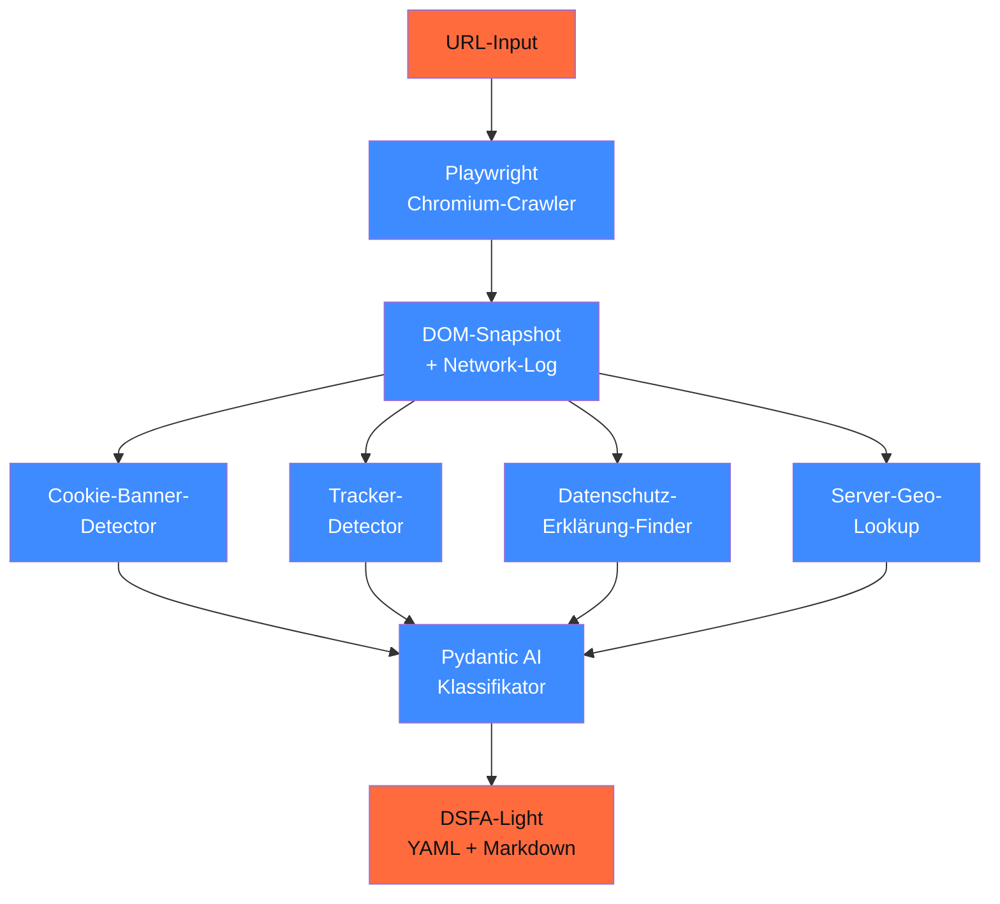

# Capstone 19.B — DSGVO-Compliance-Checker

> Webseiten-Crawler analysiert Cookie-Banner, AVV-Links, Tracker → liefert DSFA-Light-Bericht. **KMU-relevant**: Mandanten:innen wollen genau das vor ihrem Online-Auftritt wissen.

## Ziel

Ein **CLI / Web-Tool**, das eine URL nimmt und ausgibt:

1. **Cookie-Banner-Audit**: TTDSG-konform? Reject-All-Button vorhanden? Versteckte Pre-Selection?
2. **Tracker-Inventar**: Google Analytics, Meta Pixel, TikTok Pixel, Hotjar — was läuft ohne Einwilligung?
3. **Datenschutz-Erklärung-Check**: existiert? AVV-Hinweise auf Sub-Processors? Drittland-Transfer dokumentiert?
4. **Server-Standort**: WHOIS + Reverse-DNS — EU oder Drittland?
5. **DSFA-Light-Bericht** als YAML + Markdown-Export

## Architektur



## Voraussetzungen

- Phase **11** (Pydantic AI + Eval)
- Phase **13** (RAG für Datenschutz-Erklärungs-Check)
- Phase **20** (DSGVO-Checklisten + DSFA-Workflow)

## Komponenten

### 1. Playwright-Crawler

```python
from playwright.async_api import async_playwright


async def crawl_seite(url: str) -> dict:
    async with async_playwright() as p:
        browser = await p.chromium.launch(headless=True)
        page = await browser.new_page()

        # Network-Log aufzeichnen
        requests = []
        page.on("request", lambda r: requests.append({
            "url": r.url, "method": r.method, "resource_type": r.resource_type
        }))

        await page.goto(url, wait_until="networkidle")

        # DOM-Snapshot vor Banner-Klick
        dom_pre = await page.content()
        cookies_pre = await page.context.cookies()

        # Cookie-Banner detektieren + ablehnen-Versuch
        reject_button = await page.query_selector("text=/Alle ablehnen|Reject all/i")
        wenn_reject_klar = reject_button is not None

        await browser.close()

        return {
            "url": url,
            "dom": dom_pre,
            "requests": requests,
            "cookies_pre_konsens": cookies_pre,
            "reject_all_vorhanden": wenn_reject_klar,
        }
```

### 2. Cookie-Banner-Detector

```python
from pydantic import BaseModel, Field
from pydantic_ai import Agent
from typing import Literal


class CookieBannerCheck(BaseModel):
    banner_vorhanden: bool
    reject_all_button: bool
    detail_einstellungen: bool
    pre_selected_checkboxes: bool
    ttdsg_konform: bool
    verstoesse: list[str]


cookie_agent = Agent(
    "anthropic:claude-haiku-4-5",
    output_type=CookieBannerCheck,
    system_prompt=(
        "Analysiere den HTML-DOM-Snapshot auf TTDSG-Konformität: § 25 TTDSG "
        "verlangt explizite Einwilligung, Reject-All gleichwertig zu Accept, "
        "keine Pre-Selection, klare Information über jeden Cookie-Zweck."
    ),
)
```

### 3. Tracker-Detector

```python
import re

# Bekannte Tracker-Endpoints (Stand 04/2026)
TRACKER_PATTERNS = {
    "google_analytics_4": re.compile(r"google-analytics\.com/g/collect|googletagmanager\.com/gtag"),
    "meta_pixel": re.compile(r"connect\.facebook\.net|facebook\.com/tr"),
    "tiktok_pixel": re.compile(r"analytics\.tiktok\.com"),
    "hotjar": re.compile(r"static\.hotjar\.com"),
    "matomo": re.compile(r"/matomo\.js|/piwik\.js"),
    "plausible": re.compile(r"plausible\.io"),
    "linkedin_insight": re.compile(r"snap\.licdn\.com"),
    "google_ads": re.compile(r"googleadservices\.com|doubleclick\.net"),
    "x_pixel": re.compile(r"static\.ads-twitter\.com"),
}


def detect_tracker(requests: list[dict]) -> dict:
    """Welche Tracker werden geladen — vor/nach Konsens?"""
    detected = {}
    for typ, pattern in TRACKER_PATTERNS.items():
        matches = [r for r in requests if pattern.search(r["url"])]
        if matches:
            detected[typ] = {
                "anzahl_requests": len(matches),
                "beispiel_url": matches[0]["url"],
                "kategorie": kategorisiere_tracker(typ),
            }
    return detected
```

### 4. Datenschutz-Erklärung-Finder + Audit

```python
class DSEAudit(BaseModel):
    url_gefunden: str | None
    avv_hinweis_vorhanden: bool
    sub_processors_genannt: bool
    drittland_transfer_dokumentiert: bool
    auskunfts_recht_kontakt: str | None
    speicherdauer_klar: bool
    fehlende_pflichtangaben: list[str]


dse_agent = Agent(
    "anthropic:claude-sonnet-4-6",
    output_type=DSEAudit,
    system_prompt=(
        "Du analysierst Datenschutz-Erklärungen auf DSGVO-Pflichtangaben "
        "(Art. 13 + 14): Verantwortlicher, Zweck, Rechtsgrundlage, Empfänger, "
        "Drittland, Speicherdauer, Betroffenenrechte, Beschwerderecht."
    ),
)
```

### 5. Server-Geo-Lookup

```python
import socket
import requests


def server_standort(domain: str) -> dict:
    """IP + WHOIS + Geo-Lookup."""
    ip = socket.gethostbyname(domain)
    geo = requests.get(f"https://ipapi.co/{ip}/json/").json()
    return {
        "ip": ip,
        "land": geo.get("country_name"),
        "land_code": geo.get("country_code"),
        "stadt": geo.get("city"),
        "isp": geo.get("org"),
        "ist_eu": geo.get("country_code") in EU_COUNTRY_CODES,
    }
```

### 6. DSFA-Light-Bericht

```yaml
# Output-Format
url: "https://beispiel.de"
audit_datum: "2026-04-29"

cookie_banner:
  vorhanden: true
  ttdsg_konform: false
  verstoesse:
    - "Pre-selected Checkboxes für Marketing-Cookies"
    - "Reject-All-Button kleiner als Accept-All-Button"

tracker_detected:
  vor_konsens:
    - google_analytics_4
    - meta_pixel
  nach_konsens:
    - google_analytics_4
    - meta_pixel
    - linkedin_insight

datenschutz_erklaerung:
  vorhanden: true
  fehlende_pflichtangaben:
    - "Speicherdauer"
    - "Drittland-Hinweise (US-Tracker)"

server_standort:
  ip: "1.2.3.4"
  land: "USA"
  ist_eu: false
  drittland_transfer: true

risiko_score: 7  # 1-10
empfohlene_massnahmen:
  - "Reject-All gleichwertig zu Accept-All gestalten (TTDSG § 25 + EuGH C-511/20)"
  - "Pre-Konsens-Tracker entfernen (Art. 6 DSGVO)"
  - "AVV mit Hosting-Provider in DE/EU prüfen oder migrieren"
  - "Speicherdauer in Datenschutz-Erklärung ergänzen (Art. 13 Abs. 2 lit. a)"

quellen:
  - https://eur-lex.europa.eu/legal-content/DE/TXT/?uri=CELEX:62020CJ0511  # Planet49
  - https://www.gesetze-im-internet.de/ttdsg/__25.html
  - https://www.bfdi.bund.de/
```

## Aufbau-Stufen

### Stufe 1 — MVP (3 h)

- Playwright-Setup
- Tracker-Pattern für 5 wichtigste Tracker
- Cookie-Banner-Heuristik (kein LLM)
- CLI-Output als JSON

### Stufe 2 — LLM-Augmented (3 h)

- Pydantic-AI für Cookie-Banner-Klassifikation
- DSE-RAG mit Qdrant über Datenschutz-Best-Practice-Korpus
- Server-Geo-Lookup
- YAML-Bericht

### Stufe 3 — Production (4 h)

- Web-UI mit Streamlit oder Marimo
- Multi-URL-Batch (für ganze Webseiten-Trees)
- PDF-Export mit weasyprint
- Phoenix-Tracing
- Bias-Audit der DSE-Klassifikation (Phase 18.02)

## Compliance-Checkliste

- [ ] Eigenes Tool darf **nur Webseiten crawlen, die freiwillig getestet werden** (kein massen-Crawl ohne Mandat)
- [ ] User-Agent-String identifiziert das Tool transparent
- [ ] Robots.txt respektiert
- [ ] Crawl-Rate-Limit (1 Request / 2 s pro Domain)
- [ ] Audit-Reports werden lokal gespeichert, nicht zentral aggregiert
- [ ] Kein Sammeln von User-Daten der gecrawlten Seiten

## Test-Set (Beispiel)

10 Test-URLs (keine echten — Beispiele):

- 3 DSGVO-konforme Seiten (Bitkom, Handelsblatt, eigene)
- 3 grenzwertige (Online-Shops mit Pre-Selection)
- 4 problematische (US-Tracker ohne Banner-Reject)

## Quellen

- TTDSG § 25 — <https://www.gesetze-im-internet.de/ttdsg/__25.html>
- EuGH Planet49 (C-673/17) — <https://eur-lex.europa.eu/legal-content/DE/TXT/?uri=CELEX:62017CJ0673>
- BfDI Cookie-Hinweise — <https://www.bfdi.bund.de/>
- Playwright Python — <https://playwright.dev/python/>
- ipapi.co — <https://ipapi.co/>
- Bitkom Leitfaden Cookies & Tracker — <https://www.bitkom.org/Themen/Datenschutz>

## Verwandte Phasen

- → Phase **11** (Pydantic AI Foundation)
- → Phase **13** (RAG für DSE-Audit)
- → Phase **20** (DSGVO-Checklisten + DSFA-Workflow)
