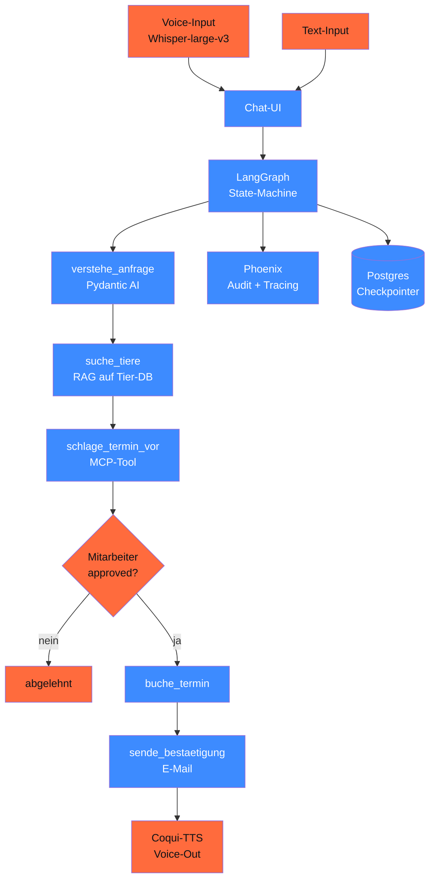

# Capstone 19.C — Charity-Adoptions-Bot

> End-to-End-Voice-Chatbot für deutsche Tierschutz-Organisation. Integriert **alle** Phasen 11–20 in einen Real-World-Use-Case. Pattern aus Lektion 14.09 als Vollausbau.

## Ziel

Eine Tierschutz-Org bekommt einen Bot, der:

1. **Voice + Chat** entgegennimmt (Whisper-large-v3 + Coqui-TTS)
2. **Adoptions-Anfrage** versteht (Pydantic AI extrahiert Vorlieben)
3. **Tier-Match** macht (RAG auf Tier-Profile-DB)
4. **Termin** vorschlägt + Mitarbeiter:in approved (HITL)
5. **Bestätigungs-E-Mail** sendet (mit Mitarbeiter-Approval)
6. **DSGVO-konform** loggt (Pseudonyme, keine Klartext-Namen)
7. **AI-Act-Klassifikation** als „begrenzt" mit transparentem Disclaimer

## Architektur



## Voraussetzungen

- Phase **11** (Pydantic AI + Pricing)
- Phase **13** (RAG für Tier-DB)
- Phase **14** (Multi-Agent + LangGraph + HITL — Hauptpattern in 14.05 + 14.09)
- Phase **17** (Production EU-Hosting)
- Phase **20** (DSFA + AVV)
- **Phase 06** (Audio) für Voice-Komponenten — falls noch nicht fertig: Skelett mit Whisper+Coqui-Stub

## Komponenten

### 1. MCP-Server für Tier-DB + Termine

`adoption_server.py`:

```python
from mcp.server import Server
from mcp.types import Tool

server = Server("adoption")


@server.tool()
async def freie_termine(woche: int, jahr: int) -> list[dict]:
    """Liefert freie Termin-Slots für die angegebene KW."""
    # In Production: Postgres-Abfrage + Mitarbeiter-Kalender
    return [
        {"woche": woche, "jahr": jahr, "tag": "Mo", "uhrzeit": "10:00"},
        {"woche": woche, "jahr": jahr, "tag": "Mi", "uhrzeit": "14:00"},
    ]


@server.tool()
async def tier_suche(art: str, alter_max: int, eigenschaften: list[str]) -> list[dict]:
    """RAG auf Tier-Profile mit Pydantic-AI-Filter."""
    # Qdrant-Query + Filter
    return [
        {"id": "bello-001", "art": "Hund", "alter": 8, "rasse": "Mischling",
         "eigenschaften": ["ruhig", "kindertauglich"]},
    ]


@server.tool()
async def buche_termin(termin_id: str, mitarbeiter_approval_token: str) -> dict:
    """Tatsächliche Buchung — nur mit Mitarbeiter-Approval-Token."""
    # ...
    return {"buchung_id": "buch-2026-04-001", "status": "bestaetigt"}
```

### 2. LangGraph-State-Machine

```python
from typing import Annotated, TypedDict
from langgraph.graph import StateGraph
from langgraph.types import interrupt
from langgraph.graph.message import add_messages


class AdoptionState(TypedDict):
    messages: Annotated[list, add_messages]
    user_pseudonym: str  # KEIN Klarname!
    tier_kandidaten: list[dict]
    termin_vorschlag: dict
    mitarbeiter_approved: bool
    bestaetigungs_id: str | None


def verstehe_anfrage(state: AdoptionState) -> dict:
    """Pydantic AI extrahiert TierVorlieben aus User-Anfrage."""
    user_msg = state["messages"][-1].content
    vorlieben = verstehe_agent.run_sync(user_msg).output
    kandidaten = tier_suche(vorlieben.art, vorlieben.alter_max, vorlieben.eigenschaften)
    return {"tier_kandidaten": kandidaten}


def schlage_termin_vor(state: AdoptionState) -> dict:
    """HITL: pausiert für Mitarbeiter-Approval."""
    termin = berechne_passenden_termin(state["tier_kandidaten"])
    bestaetigt = interrupt({
        "mitarbeiter_frage": (
            f"Termin {termin['datum']} {termin['uhrzeit']} für "
            f"{state['user_pseudonym']} ok? Tier: {termin['tier_id']}"
        ),
    })
    return {
        "termin_vorschlag": termin,
        "mitarbeiter_approved": bestaetigt,
    }


# State-Graph aufbauen
graph = StateGraph(AdoptionState)
graph.add_node("verstehe_anfrage", verstehe_anfrage)
graph.add_node("suche_tiere", suche_tiere)
graph.add_node("schlage_termin_vor", schlage_termin_vor)
graph.add_node("buche_termin", buche_termin)
graph.add_node("sende_email", sende_email)
# Edges + Conditional...
```

### 3. Pydantic-AI-Sub-Agent

```python
from pydantic import BaseModel, Field
from typing import Literal
from pydantic_ai import Agent


class TierVorlieben(BaseModel):
    art: Literal["Hund", "Katze", "Kleintier"]
    alter_max: int = Field(ge=0, le=20)
    eigenschaften: list[str] = Field(max_length=5)
    haus_groesse: Literal["klein", "mittel", "gross"] | None = None
    kinder_im_haushalt: bool | None = None


verstehe_agent = Agent(
    "anthropic:claude-sonnet-4-6",  # München-Office, EU-Datazone
    output_type=TierVorlieben,
    system_prompt=(
        "Extrahiere Tier-Vorlieben aus User-Anfrage. "
        "KEIN PERSONENBEZUG: keine Namen, Adressen, Telefon-Nr. "
        "Nur Vorlieben (Art, Alter, Eigenschaften, Haus, Kinder)."
    ),
)
```

### 4. Voice-Stack (Phase 06 als Voraussetzung)

```python
# Whisper-large-v3 für ASR
import whisper

asr_modell = whisper.load_model("large-v3")
text = asr_modell.transcribe("user_anfrage.wav", language="de")["text"]

# Coqui-TTS für Sprachausgabe
from TTS.api import TTS

tts = TTS("tts_models/de/thorsten/vits", progress_bar=False)
tts.tts_to_file(text=antwort, file_path="bot_antwort.wav")
```

> Stand 04/2026: Whisper-large-v3 ist stabil, Coqui-TTS hat Wartungs-Rückstand — alternativ **F5-TTS** (multilingual, MIT-Lizenz) oder **Sesame** (Anthropic). Phase 06 hat Detail-Vergleich.

### 5. Phoenix-Tracing

```python
import os
os.environ["PHOENIX_PROJECT_NAME"] = "adoption-bot-prod"

from phoenix.otel import register

register(
    project_name="adoption-bot-prod",
    auto_instrument=True,
)
```

Alle LangGraph-Nodes, Pydantic-AI-Calls, MCP-Tool-Calls werden ge-traced.

### 6. DSGVO-Pattern

| Anforderung | Implementation |
|---|---|
| **Datenminimierung** (Art. 5 lit. c) | nur `user_pseudonym`, `tier_id` (Hashes) |
| **AVV** (Art. 28) | Anthropic Enterprise + EU-Datazone |
| **Drittland-Schutz** (Art. 44) | Anthropic München + DPA + EU-Region |
| **Automatisierte Entscheidung** (Art. 22) | Mitarbeiter-Approval bei jedem Termin |
| **TOM** (Art. 32) | Audit-Logging, Postgres-Encryption, Token-Limits |
| **Right-to-be-Forgotten** (Art. 17) | Pseudonym-zu-Daten-Mapping deletbar |

## Aufbau-Stufen

### Stufe 1 — Text-Bot (4 h)

- LangGraph-State-Machine mit 6 Nodes
- Pydantic-AI-Verstehe-Agent
- Stub-Tier-DB (3 Tiere)
- HITL-Approval via interrupt()

### Stufe 2 — RAG-Augmented (4 h)

- Qdrant mit 50 echten Tier-Profilen
- Mistral-Large als Generator (oder Pharia-1)
- Phoenix-Tracing aktiv

### Stufe 3 — Voice + Production (7 h)

- Whisper-large-v3 + F5-TTS oder Coqui
- Web-UI mit Streamlit oder Marimo
- Docker-Compose-Stack (Phase 17.05)
- DSFA + AI-Act-Klassifikation dokumentiert

## Compliance-Checkliste

- [ ] AVV mit allen Cloud-Providern (Anthropic Enterprise, Phoenix-Hoster)
- [ ] DSFA durchgeführt (Phase 20.03)
- [ ] AI-Act-Klassifikation: begrenztes Risiko, Art.-50-Hinweis im UI
- [ ] PII-Filter im Audio-Transkript (Whisper-Output → PII-Redaction)
- [ ] Pseudonymisierung: `user_pseudonym` statt Klarname
- [ ] HITL-Approval für jede Termin-Buchung dokumentiert
- [ ] Audit-Logging mit Phoenix (mind. 12 Monate)
- [ ] Bias-Audit auf 30 Test-Anfragen (Phase 18.02)
- [ ] Konformitätserklärung (Phase 18.10) committed
- [ ] Backup-Pipeline für Postgres + Audio-Archiv
- [ ] Lösch-Workflow für Pseudonym-Daten (DSGVO Art. 17)

## Test-Set (Beispiel)

10 echte Adoptions-Dialoge (anonymisiert):

- 5 Standard-Anfragen ("Familie sucht Hund")
- 3 Edge-Cases ("Senior-Katze für Wohngemeinschaft")
- 2 Schwierige (Allergie-Fall, Erstadoption)

Output-Eval:

- Versteht der Bot die Anfrage korrekt?
- Sind die Tier-Matches sinnvoll?
- Pausiert der Bot bei kritischen Schritten?
- Ist die Bestätigungs-E-Mail freundlich + Du-Form-konsistent?

## Quellen

- LangGraph HITL — <https://langchain-ai.github.io/langgraph/concepts/human_in_the_loop/>
- Whisper-large-v3 — <https://huggingface.co/openai/whisper-large-v3>
- Coqui-TTS — <https://github.com/coqui-ai/TTS>
- F5-TTS (Alternative) — <https://github.com/SWivid/F5-TTS>
- Phoenix Self-Hosting — <https://arize.com/docs/phoenix/self-hosting>

## Verwandte Phasen

- → Phase **11** (Pydantic AI Foundation)
- → Phase **13** (RAG für Tier-DB)
- → Phase **14.05 + 14.09** (LangGraph + HITL — Pattern-Bauanleitung)
- → Phase **17** (Production-Stack)
- → Phase **18** (Bias-Audit + Self-Censorship-Check)
- → Phase **20** (DSFA + AI-Act-Klassifikation)
