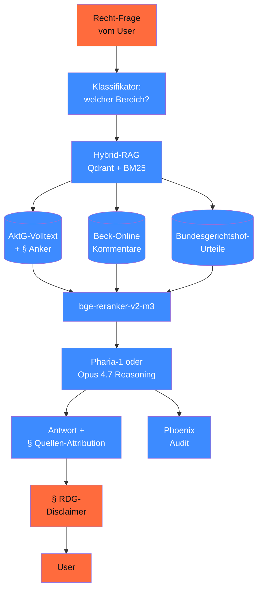

# Capstone 19.D — Aktiengesetz-Rechtsfrage-Beantworter

> Legal-RAG auf **Aktiengesetz (AktG)** + GermanLegal-Korpus. Mit **Quellen-Attribution** auf Paragraf-Ebene + § RDG-konformem Disclaimer. **Hochrisiko-Use-Case** mit voller AI-Act-Doku.

> ⚠️ **Wichtiger Hinweis**: dieses System gibt **keinen Rechtsrat** (§ 2 RDG). Es ist ein Recherche-Werkzeug — finale Beratung pflicht durch Anwält:in.

## Ziel

Ein **internes Tool für Kanzleien / Rechtsabteilungen**, das:

1. **AktG-Frage** entgegennimmt („Welche Pflichten hat der Aufsichtsrat bei § 111 AktG?")
2. **RAG-Suche** auf AktG-Volltext + Kommentaren (Beck-Online, juris — falls lizenziert)
3. **Antwort mit Paragraf-genauer Quellen-Angabe** generiert
4. **Reasoning** für Multi-Hop-Fragen (Verweise zwischen Paragrafen)
5. **§ RDG-Disclaimer** prominent anzeigt

## Architektur



## Voraussetzungen

- Phase **11** (Pydantic AI + Eval)
- Phase **13** (RAG, insb. Hybrid mit BM25 + ColBERT-Re-Ranking)
- Phase **16** (Reasoning-Modelle für Multi-Hop)
- Phase **20** (Recht & Governance — DSFA + AVV)

## Komponenten

### 1. AktG-Volltext-Ingestion

```python
# AktG ist Open-Source (Bundesgesetzblatt, Public Domain)
# Strukturierte Ingestion mit Paragraf-Anker
import re
from pathlib import Path


def ingest_aktg(text: str) -> list[dict]:
    """Splittet AktG in Paragrafen mit Anker."""
    paragraphen = re.split(r"^§ (\d+[a-z]?)", text, flags=re.MULTILINE)
    chunks = []
    for i in range(1, len(paragraphen), 2):
        nummer = paragraphen[i]
        inhalt = paragraphen[i + 1].strip()
        chunks.append({
            "paragraf": f"§ {nummer} AktG",
            "anker": f"aktg-{nummer}",
            "text": inhalt,
            "url": f"https://www.gesetze-im-internet.de/aktg/__{nummer}.html",
        })
    return chunks


aktg_text = Path("daten/aktg-volltext.txt").read_text()
aktg_chunks = ingest_aktg(aktg_text)
print(f"AktG ingestiert: {len(aktg_chunks)} Paragrafen")
```

### 2. Hybrid-RAG mit BM25 + Embedding

```python
from qdrant_client import QdrantClient
from qdrant_client.models import VectorParams, Distance, SparseVectorParams

client = QdrantClient(url="https://qdrant-eu.example.de", api_key="...")

client.create_collection(
    collection_name="aktg",
    vectors_config={"dense": VectorParams(size=1024, distance=Distance.COSINE)},
    sparse_vectors_config={"sparse": SparseVectorParams()},
)

# Ingest mit dense (multilingual-e5-large) + sparse (BM25)
for chunk in aktg_chunks:
    client.upsert(
        collection_name="aktg",
        points=[{
            "id": chunk["anker"],
            "vector": {
                "dense": embed_model.encode(chunk["text"]),
                "sparse": bm25_encoder.encode(chunk["text"]),
            },
            "payload": chunk,
        }]
    )
```

### 3. Pydantic-AI-Agent mit Quellen-Attribution

```python
from pydantic import BaseModel, Field
from typing import Literal


class RechtsAntwort(BaseModel):
    antwort_kurz: str = Field(min_length=20, max_length=500)
    antwort_lang: str = Field(min_length=50, max_length=3000)
    primaer_paragrafen: list[str] = Field(description="zitierte AktG-§§")
    rechtsgebiet: Literal["aktiengesellschaft", "vorstand", "aufsichtsrat",
                          "hauptversammlung", "kapital", "verschmelzung", "andere"]
    konfidenz: float = Field(ge=0.0, le=1.0)
    multi_hop_referenzen: list[dict]  # [{"von": "§ 111", "auf": "§ 116", "grund": "..."}]
    disclaimer_relevant: bool = True


legal_agent = Agent(
    "anthropic:claude-opus-4-7",  # mit Reasoning für Multi-Hop
    output_type=RechtsAntwort,
    system_prompt=(
        "Du bist Recherche-Assistent für AktG-Fragen. "
        "Zitiere immer Paragraf-genau (z. B. § 111 Abs. 2 AktG). "
        "Keine Beratungs-Empfehlung — nur Recherche-Ergebnis. "
        "Bei Multi-Hop-Fragen: alle relevanten Verweise dokumentieren."
    ),
)
```

### 4. § RDG-Disclaimer

Pflicht-Anzeige im UI:

```text
⚖️ Wichtiger Hinweis (§ 2 RDG)

Dieses System gibt KEINEN Rechtsrat. Es ist ein Recherche-Werkzeug, das
relevante Paragrafen + Kommentare findet. Eine rechtliche Beratung im
konkreten Fall erfolgt ausschließlich durch zugelassene Anwält:innen.

Für rechtsverbindliche Auskünfte konsultieren Sie bitte eine Kanzlei.
```

### 5. Audit-Trail mit Quellen-Hashes

Pflicht für Hochrisiko-System (AI-Act Art. 12):

```python
import hashlib
from datetime import datetime, UTC


def log_legal_query(user_pseudonym: str, frage: str, antwort: RechtsAntwort):
    audit = {
        "ts": datetime.now(UTC).isoformat(),
        "user_hash": hashlib.sha256(user_pseudonym.encode()).hexdigest()[:16],
        "frage_hash": hashlib.sha256(frage.encode()).hexdigest()[:16],
        "rechtsgebiet": antwort.rechtsgebiet,
        "primaer_paragrafen": antwort.primaer_paragrafen,
        "konfidenz": antwort.konfidenz,
        "modell_version": "claude-opus-4-7",
        "korpus_version": "aktg-2026-04-29",  # Datum des AktG-Snapshots
    }
    logger.info("legal_query", extra=audit)
```

## Aufbau-Stufen

### Stufe 1 — Vanilla AktG-RAG (4 h)

- AktG-Volltext (~ 410 Paragrafen) ingestieren
- Vanilla RAG mit Qdrant + multilingual-e5-large
- Pydantic-AI-Agent mit Quellen-Attribution
- 10 Test-Fragen aus AktG-Lehrbüchern

### Stufe 2 — Hybrid + Reranker (4 h)

- BM25 + Dense Hybrid (Phase 13.04)
- bge-reranker-v2-m3 als Re-Ranking
- Multi-Hop-Reasoning mit Opus 4.7

### Stufe 3 — Production (4 h)

- BGH-Urteile + Beck-Online-Kommentare (falls Lizenz)
- Web-UI mit Streamlit
- Phoenix-Tracing
- DSFA + Konformitätserklärung

## Compliance-Checkliste

- [ ] **§ RDG-Disclaimer** im UI prominent (rote Box, vor jeder Antwort)
- [ ] **AVV** mit Anthropic Enterprise (München) signiert
- [ ] **DSFA** durchgeführt — Use-Case ist „begrenzt-Hochrisiko" (Recht-Auskunft)
- [ ] **AI-Act-Klassifikation**: möglicherweise Hochrisiko bei rechtsbindenden Outputs (Anhang III Nr. 8)
- [ ] **Quellen-Attribution** AI-Act Art. 50.4-konform (§ AktG mit URL)
- [ ] **Audit-Logging** mit Phoenix (mind. 12 Monate, Pflicht für Hochrisiko)
- [ ] **Bias-Audit** auf 30 Test-Fragen (Phase 18.02)
- [ ] **Korpus-Version** dokumentiert (AktG-Snapshot-Datum)
- [ ] **Reasoning-Tokens** geloggt für Cost + Audit
- [ ] **Konformitätserklärung** (Phase 18.10) committed

## Test-Set (Beispiel, 10 AktG-Fragen)

1. „Welche Pflichten hat der Aufsichtsrat bei der Bestellung des Vorstands?"
2. „Was muss der Bericht des Aufsichtsrats nach § 171 AktG enthalten?"
3. „Wie lange darf ein Vorstandsvertrag maximal abgeschlossen werden?"
4. „Welche Sanktionen gibt es bei Verletzung der Sorgfaltspflicht?"
5. „Wer entscheidet über die Verschmelzung zweier AGs?"
6. „Was sind die Anfechtungsgründe gegen Hauptversammlungs-Beschlüsse?"
7. „Welche Rechte haben Vorzugsaktionäre?"
8. „Wann ist eine Kapitalerhöhung gegen Bareinlage ungültig?"
9. „Welche Geschäfte des Vorstands brauchen Aufsichtsrats-Zustimmung?"
10. „Welche Multi-Hop-Verweise gibt es zwischen § 111 + § 116 AktG?"

Eval-Kriterium: jede Antwort zitiert mindestens einen § AktG mit Absatz-Genauigkeit + verweist auf Disclaimer.

## Quellen

- AktG (Public Domain) — <https://www.gesetze-im-internet.de/aktg/>
- BGH-Rechtsprechung — <https://www.bundesgerichtshof.de/DE/Entscheidungen/entscheidungen_node.html>
- RDG (Rechtsdienstleistungsgesetz) — <https://www.gesetze-im-internet.de/rdg/>
- AI-Act Art. 50.4 (Quellen-Pflicht) — <https://artificialintelligenceact.eu/article/50/>
- AI-Act Anhang III Nr. 8 (Hochrisiko: Justiz/Demokratische Prozesse) — <https://artificialintelligenceact.eu/annex/3/>
- BAFA-Vertrauensdienst (Pharia-Zertifizierung) — <https://www.bafa.de/>
- bge-reranker-v2-m3 — <https://huggingface.co/BAAI/bge-reranker-v2-m3>

## Verwandte Phasen

- → Phase **11** (Pydantic AI + Eval)
- → Phase **13** (RAG mit Hybrid + Re-Ranking)
- → Phase **16** (Reasoning für Multi-Hop)
- → Phase **17** (Production-Stack)
- → Phase **18** (Bias-Audit + AI-Act-Anhang-IV)
- → Phase **20** (DSFA + AVV)
