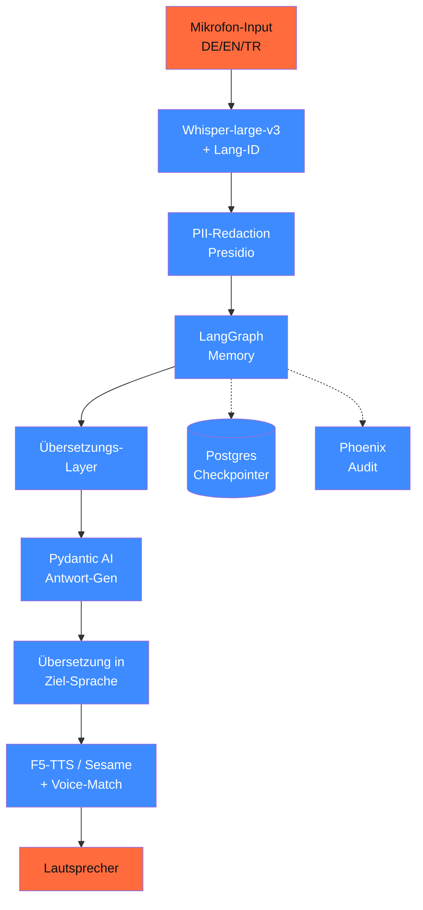

# Capstone 19.E — Mehrsprachiger Voice-Agent

> Live-Übersetzungs-Agent für **Deutsch ↔ Englisch ↔ Türkisch**. Real-World-Use-Case: Beratung von Familien mit Migrationshintergrund (Sozialarbeit, Behörden-Termine). Pflicht-Phase: **06 (Audio)**.

## Ziel

Ein Voice-Agent für Multi-Sprach-Settings:

1. **Sprach-Erkennung**: User spricht DE / EN / TR
2. **ASR**: Whisper-large-v3 transkribiert
3. **Übersetzungs-Layer**: DeepL oder Mistral-Large für Pivot-Sprache
4. **Kontext-Memory**: LangGraph mit Postgres-Checkpointer
5. **TTS**: F5-TTS oder Sesame in der Ziel-Sprache
6. **DSGVO**: PII-Redaction in Transkripten + Auto-Lösch nach Session

## Architektur



## Voraussetzungen

- **Phase 06** (Sprache & Audio) — **kritisch**, da die Audio-Komponenten dort ausgearbeitet werden
- Phase **11** (Pydantic AI)
- Phase **14** (LangGraph mit Memory)
- Phase **17** (Production EU-Hosting)

## Komponenten

### 1. Whisper-large-v3 mit Sprach-Erkennung

```python
import whisper

modell = whisper.load_model("large-v3")


def transkribiere(audio_path: str) -> dict:
    """ASR + Sprach-Detektion."""
    result = modell.transcribe(
        audio_path,
        task="transcribe",  # nicht "translate" — wir übersetzen separat
        language=None,  # auto-detect
        fp16=True,
    )
    return {
        "text": result["text"],
        "sprache": result["language"],  # de / en / tr
        "segments": result["segments"],  # mit Timestamps
        "konfidenz": min(s["avg_logprob"] for s in result["segments"]) if result["segments"] else None,
    }
```

> Whisper-large-v3 unterstützt 99 Sprachen mit guter Performance. Stand 04/2026 ist das die Stable-Version (Whisper-v4 nicht eindeutig veröffentlicht).

### 2. Übersetzungs-Layer

Drei Optionen, je nach Compliance-Anforderung:

| Provider | DE↔EN | DE↔TR | DSGVO | Pricing |
|---|---|---|---|---|
| **DeepL Pro API** | sehr gut | gut | EU-Server (DE) | € 5/$5 / 1M chars |
| **Mistral Large 3** | sehr gut | gut | FR-Server | $ 2/$ 6 / 1M tokens |
| **GPT-5.5 / Claude Sonnet 4.6** | sehr gut | sehr gut | mit AVV | teurer |
| **EuroLLM-22B-Instruct** (lokal) | gut | mittel | self-hosted | nur Compute |

> Empfehlung 2026: **DeepL Pro für DE/EN/TR** wegen Spezialisierung auf Übersetzung + DE-Server. Plus **Mistral Large 3** als Reasoning-Layer für Kontext-Antworten.

### 3. LangGraph-Memory

```python
from typing import TypedDict, Annotated
from langgraph.graph import StateGraph
from langgraph.graph.message import add_messages
from langgraph.checkpoint.postgres import PostgresSaver


class VoiceAgentState(TypedDict):
    messages: Annotated[list, add_messages]
    sprache_user: str  # de / en / tr
    sprache_target: str
    user_pseudonym: str
    audio_session_id: str


def transkribiere_node(state: VoiceAgentState) -> dict:
    transkript = transkribiere(state["aktueller_audio_pfad"])
    return {
        "sprache_user": transkript["sprache"],
        "messages": [{"role": "user", "content": transkript["text"]}],
    }


def antworte_node(state: VoiceAgentState) -> dict:
    """Generiert Antwort in der User-Sprache."""
    response = mistral_agent.run_sync(
        state["messages"][-1]["content"],
        message_history=state["messages"][:-1],
    )
    return {"messages": [{"role": "assistant", "content": response.output}]}


def sprich_node(state: VoiceAgentState) -> dict:
    """TTS in der User-Sprache."""
    text = state["messages"][-1]["content"]
    tts_in_sprache(text, sprache=state["sprache_user"])
    return {}


checkpointer = PostgresSaver.from_conn_string("postgresql://...")
graph = StateGraph(VoiceAgentState).compile(checkpointer=checkpointer)
```

### 4. F5-TTS oder Sesame für Multi-Sprache

```python
# F5-TTS (multilingual, MIT-Lizenz)
from f5_tts.api import F5TTS

tts = F5TTS()


def tts_in_sprache(text: str, sprache: str, ref_audio: str | None = None):
    """TTS mit Voice-Cloning vom Reference-Speaker."""
    tts.infer(
        gen_text=text,
        ref_audio_path=ref_audio,
        language=sprache,  # de / en / tr
        output_path=f"output_{sprache}.wav",
    )
```

> Stand 04/2026: F5-TTS ist Apache-2.0-lizenziert + multilingual. Sesame (Anthropic) als Alternative für premium-DE. Coqui-TTS hat Wartungs-Rückstand (2024 abgekündigt, community-fork läuft).

### 5. PII-Redaction im Transkript

```python
from presidio_analyzer import AnalyzerEngine
from presidio_anonymizer import AnonymizerEngine

analyzer = AnalyzerEngine(supported_languages=["de", "en", "tr"])
anonymizer = AnonymizerEngine()


def redact_pii(text: str, sprache: str) -> str:
    """PII-Redaktion vor Speicherung in Memory."""
    results = analyzer.analyze(text=text, language=sprache)
    anonymized = anonymizer.anonymize(text=text, analyzer_results=results)
    return anonymized.text
```

Pflicht: vor jedem Memory-Speichern, vor jedem Audit-Log.

### 6. Audio-Aufbewahrungs-Pflicht

DSGVO Art. 5 lit. e (Speicherbegrenzung):

```python
import asyncio
from datetime import datetime, UTC, timedelta


async def auto_loesch_session(session_id: str, max_alter_minuten: int = 60):
    """Automatischer Lösch-Job nach Session-Ende."""
    await asyncio.sleep(max_alter_minuten * 60)
    await delete_audio_files(session_id)
    await delete_transkripte(session_id)
    await delete_memory(session_id)
    log_audit("session_deleted", session_id)
```

> Pattern: Audio-Dateien max. 60 Min behalten (für In-Session-Korrektur). Nach Session-Ende: Auto-Lösch. Transkripte mit PII-Redaktion 7 Tage, dann gelöscht.

## Aufbau-Stufen

### Stufe 1 — DE↔EN MVP (5 h)

- Whisper-large-v3 für ASR
- DeepL-API für Übersetzung
- F5-TTS für Sprachausgabe
- LangGraph mit In-Memory-State (kein Postgres)

### Stufe 2 — DE↔EN↔TR + Memory (5 h)

- Türkisch hinzufügen
- LangGraph + Postgres-Checkpointer
- PII-Redaction-Pipeline
- 3-Turn-Konversation testen

### Stufe 3 — Production (4 h)

- Web-UI mit Streamlit / Gradio
- Phoenix-Tracing
- DSFA + AI-Act-Klassifikation
- Auto-Lösch-Pipeline + Audit

## Compliance-Checkliste

- [ ] **AVV** mit DeepL + Mistral / Whisper-Hoster
- [ ] **DSFA** durchgeführt (besonderer Fokus: Voice-Daten = biometrisches Datum)
- [ ] **AI-Act-Klassifikation**: möglicherweise Hochrisiko bei Behörden-Einsatz (Anhang III Nr. 5)
- [ ] **PII-Redaction** vor jeder Memory-Speicherung
- [ ] **Auto-Lösch-Pipeline** (Audio max. 60 Min, Transkripte max. 7 Tage)
- [ ] **Phoenix-Tracing** mit hashed Audio-IDs
- [ ] **Bias-Audit** auf TR-spezifischen Konversationen (Phase 18.02)
- [ ] **Konformitätserklärung** committed
- [ ] **Voice-Cloning-Disziplin**: nur Reference-Audio mit Einwilligung

## Test-Set (Beispiel)

3 Konversations-Szenarien, je 5 Turns:

1. **Behörden-Beratung**: deutsche Sozialarbeiterin ↔ türkisch-sprachige Familie
2. **Tech-Support**: englisch-sprachiger Kunde ↔ deutsche Hotline
3. **Mehrsprachiges Meeting**: Mix DE/EN/TR mit ständigem Sprach-Wechsel

Eval-Kriterium:

- ASR-Word-Error-Rate < 8 % auf DE/EN, < 12 % auf TR
- Übersetzungs-Qualität via BLEU + LLM-Judge
- TTS-Mean-Opinion-Score (MOS) ≥ 3.5 / 5.0
- Memory: nach 5 Turns Kontext noch korrekt (z. B. „Ich" → richtige Person)

## Quellen

- Whisper-large-v3 — <https://huggingface.co/openai/whisper-large-v3>
- DeepL Pro API — <https://www.deepl.com/pro-api>
- F5-TTS — <https://github.com/SWivid/F5-TTS>
- Sesame TTS — <https://github.com/SesameAILabs/csm>
- Presidio (PII) — <https://microsoft.github.io/presidio/>
- LangGraph Memory — <https://langchain-ai.github.io/langgraph/concepts/memory/>
- EuroLLM-22B-Instruct — <https://huggingface.co/utter-project/EuroLLM-22B-Instruct-2512>

## Verwandte Phasen

- → Phase **06** (Sprache & Audio) — **kritische Voraussetzung**
- → Phase **11** (Pydantic AI)
- → Phase **14** (LangGraph + Memory + HITL)
- → Phase **17** (Production EU-Hosting)
- → Phase **18** (Bias-Audit + Self-Censorship — speziell für TR-Outputs)
- → Phase **20** (DSFA — Voice = biometrisches Datum, höhere Hürde)
